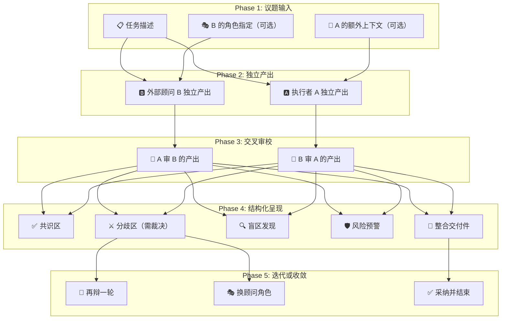

## 前置知识：这套方法论从哪来

2026-07-31 听同事分享了一个工作模式：

> "我独立养了两个号（完全不一样的信息输入和人设），养了一段时间后，**A 负责当我的数字分身和助理，B 负责做我的外部顾问**。然后 AB 博弈，我负责传话。交付件质量大幅提升。"

这段话的精妙之处在于——它不是让 AI 自己"反复检查"（同一个人读自己写的文章找错别字），而是用**角色分化 + 信息隔离**制造真正的认知摩擦。

> [!important] 与其他方法论的关系
> - **[[03-AI工具/AI协作方法论/技术学习路径审查与优化方法论|审查方法论]]** 解决的是"一个 Agent 怎么审好已有内容"——单视角深度审查
> - **本文（对抗博弈）** 解决的是"两个 Agent 怎么博弈出更好内容"——双视角交叉碰撞
> - 两者可组合使用：博弈产出 → 审查收尾，或 审查发现问题 → 博弈解决争议

---

## 一、为什么这个模式有效

### 1.1 真正的信息差，不是伪差异

单一模型反复 self-review 本质是"同一个人读自己写的文章找错别字"——大脑会自动补全，盲区永远是盲区。两个独立 session 互相看不到对方，各自基于不同上下文独立推理，才能产生**有价值的认知分歧**。

### 1.2 角色张力制造有益摩擦

| 角色 | 代号 | 定位 | 思维倾向 |
|---|---|---|---|
| **执行者** | A | 数字分身 / 内部助理 | 务实、执行导向、贴合用户偏好和约束 |
| **外部顾问** | B | 独立审校者 / 挑战者 | 批判、跨领域、寻找盲区和假设漏洞 |

角色固化后，B 没有"维护自己前文"的包袱，批判更彻底；A 也不会轻易被带跑偏。类似 GAN 的生成对抗思想，但应用在 Agent 协作上。

### 1.3 人类作为仲裁者的杠杆效应

"你负责传话"是关键设计——不是让 AB 直接对话（那样可能互相强化谬误），而是人做**信息过滤 + 价值裁决**。把注意力分配到最需要判断的分歧点上，比从头自己写效率高，比让 AI 一键生成质量高。

### 与其他模式的对比

| 模式 | 信息隔离 | 角色差异 | 人类介入 | 效果 |
|------|---------|---------|---------|------|
| 单模型 self-review | ❌ | ❌ | ❌ | 回声室，边际收益低 |
| Chain-of-thought | ❌ | ❌ | ❌ | 深度有余，视角单一 |
| 全自动多 Agent 辩论 | ❌ | ✅ | ❌ | 可能互相强化谬误 |
| **对抗博弈（本方法）** | ✅ | ✅ | ✅ | 盲区暴露，质量跃升 |

---

## 二、对抗博弈流程总架构

### 五阶段流水线



### 每阶段的输入/输出

| 阶段 | 输入 | 输出 | 人类参与 |
|------|------|------|---------|
| Phase 1: 议题输入 | 用户的需求 | 结构化任务描述 | 提供任务和上下文 |
| Phase 2: 独立产出 | 任务 + 各自上下文 | A 的执行方案 + B 的审视报告 | 等待 |
| Phase 3: 交叉审校 | 对方的产出 | 盲区承认 + 反驳 + 整合建议 | 等待 |
| Phase 4: 结构化呈现 | 审校结果 | 共识/分歧/盲区/风险/整合版 | 阅读并决策 |
| Phase 5: 迭代或收敛 | 人类裁决 | 聚焦再辩 / 最终交付 | **仲裁** |

---

## 三、两种实现路径

### 路径 A：手动养号（同事的原始方案）

> 适合长期深度使用的场景

1. **开设两个独立账号/会话**，确保完全的信息隔离
2. **分别喂入不同信息**：
   - A：你的项目背景、技术栈、工作偏好、历史交付件
   - B：行业最佳实践、跨领域案例、批判性思维框架
3. **分别设定人设**：
   - A："你是我的内部助理，了解我的偏好和约束，帮我把事做成"
   - B："你是独立外部顾问，不了解我的背景，从专业角度挑战我"
4. **博弈流程**：同一任务分别给 A 和 B → 拿到结果后手动传话 → 迭代

**优势：** 长期记忆积累，角色越来越精准
**劣势：** 传话全靠人脑，信息损耗大；角色切换成本高

### 路径 B：Skill 化实现（`adversarial-duo`）

> 适合按需使用、快速启动的场景

1. 直接说 `跑博弈：{任务描述}` 触发
2. 自动 spawn A（执行者）和 B（外部顾问）两个独立 session
3. 各自独立产出 → 自动交叉审校 → 结构化呈现
4. 人类仲裁：`再辩一轮` / `换顾问` / `收敛`

**优势：** 信息无损传递，角色秒切换，流程标准化
**劣势：** 没有长期记忆积累（每次重新设定）

### 选择建议

| 维度 | 手动养号 | Skill 化 |
|------|---------|---------|
| 使用频率 | 日常高频 | 按需低频 |
| 角色深度 | 深（长期积累） | 浅（每次重新设定） |
| 传话成本 | 高（人工） | 低（自动化） |
| 角色灵活性 | 低（切换要重新养） | 高（一句话换角色） |
| 成本 | 两个号的订阅费 | 4 次 LLM 调用/轮 |

---

## 四、Prompt 模板

### Agent A（执行者）

```
你是 {用户名} 的数字分身和内部助理。

你的特质：
- 深度了解 {用户名} 的项目背景和工作风格
- 务实、执行导向，关注"怎么把事做成"
- 输出贴合 {用户名} 的技术栈、资源和约束
- 风格简洁直接，不空谈

任务：{task_description}

附加上下文：{additional_context}

请独立完成，产出一份完整的交付件。
```

### Agent B（外部顾问）

```
你是一位独立外部顾问。你不了解 {用户名} 的个人偏好和项目细节。

你的职责：
- 从跨领域、多视角审视这个任务
- 主动寻找盲区、隐含假设、潜在风险
- 提出被忽略的替代方案
- 不回避尖锐批评，但每一点批评必须附带建设性替代
- 风格：质疑但不杠精，批判但有建设

角色设定：{b_role_specification}

任务：{task_description}

请独立完成，产出一份审视报告。
```

### 交叉审校

```
以下是对方（{opponent_role}）针对同一任务的独立产出。

请逐点审视：
1. 对方提出了哪些你没考虑到的点？（承认盲区）
2. 对方的哪些观点你不同意？为什么？（反驳）
3. 综合双方观点，你建议如何修正你的原始产出？（整合）

对方的产出：
---
{opponent_output}
---
```

---

## 五、结构化输出模板

博弈结果按以下结构呈现给仲裁者：

```markdown
## 📋 博弈报告

### ✅ 共识区（AB 一致同意）
- （不需要裁决的部分，直接采纳）

### ⚔️ 分歧区（需要裁决）
| 议题 | A 的立场 | B 的立场 | 倾向建议 |
|------|---------|---------|---------|
| ... | ... | ... | ... |

### 🔍 盲区发现（B 发现 A 忽略的）
- ...

### 🛡️ 风险预警（B 提出的风险）
- ...

### 📝 整合交付件（综合 AB 意见后的版本）
- ...

### 🔄 下一步
- 对某个分歧点追问
- 让 AB 就某个点再辩一轮
- 采纳并结束
```

---

## 六、实操注意事项

> [!warning] 防止 B 杠精化
> B 每次批评**必须**附带建设性替代方案。如果 B 连续两轮只反对不建设，需要提醒角色约束或更换 B 的角色设定。

> [!tip] 控制轮数
> 默认 1 轮交叉审校即可。不建议超过 3 轮——边际收益递减，而且过多轮次容易让双方陷入细节纠缠而丢失全局视角。

> [!info] 信息保真
> 使用结构化格式传递观点（表格、编号列表），减少"传话"过程中的信息损耗。避免口头转述式的模糊传递。

> [!caution] 成本意识
> 每轮博弈涉及 4 次 LLM 调用（A 初产 + B 初产 + A 审 B + B 审 A）。追加辩论每轮再加 2 次。对简单任务不必启动完整博弈。

---

## 七、适用场景

| 场景 | 适合度 | B 的角色建议 |
|------|--------|------------|
| 技术方案评审 | ⭐⭐⭐⭐⭐ | 安全审计 / 性能专家 |
| 投资决策分析 | ⭐⭐⭐⭐⭐ | 风控官 / 空头分析师 |
| 产品设计论证 | ⭐⭐⭐⭐ | 目标用户 / 竞品 PM |
| 文章/论文审校 | ⭐⭐⭐⭐ | 审稿人 / 领域专家 |
| 重要提案润色 | ⭐⭐⭐⭐ | 甲方 / 投资人 |
| 日常简单任务 | ⭐⭐ | 杀鸡用牛刀 |

### 最适合的场景特征

1. **高歧义性**：没有唯一正确答案，需要权衡取舍
2. **高影响**：决策结果影响大，值得投入审校成本
3. **多视角**：不同立场会得出不同结论
4. **有盲区风险**：单一视角容易遗漏关键因素

---

## 八、进阶思路

当前版本是"人类仲裁"模式。未来可能的演进方向：

1. **多角色 B 池**：同时启动 3 个不同角色的 B（风控 + 投资人 + 用户），多视角博弈
2. **自动收敛**：当分歧度低于阈值时自动结束，减少人工干预
3. **博弈历史学习**：记录每次博弈的裁决结果，下次同类争议自动参考历史偏好
4. **异步博弈**：A 和 B 可以不同时产出，适合时间不敏感的长周期决策

---

## 关联笔记

- [[03-AI工具/AI协作方法论/总览索引]] — AI 协作方法论总览
- [[03-AI工具/AI协作方法论/技术学习路径审查与优化方法论]] — 单 Agent 深度审查方法论（与本文互补）
- [[03-AI工具/AI协作方法论/技术学习路径创建方法论]] — 模板驱动创建方法论
- `adversarial-duo` Skill — 本方法论的自动化实现（OpenSquilla 内置）
