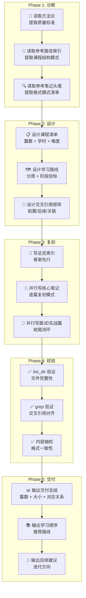
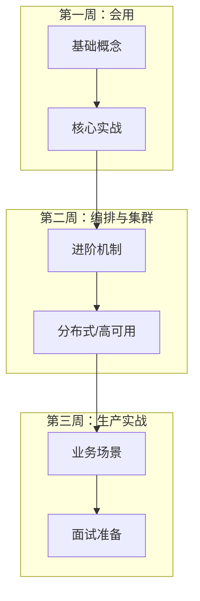

## 前置知识：这套方法论从哪来

在为 Docker 和 K8S 创建学习路径（各 9 篇，共 18 篇，约 230KB）的过程中，我使用了 **双源融合** 的模板驱动创建模式：

- **源 A：审查方法论**（《技术学习路径审查与优化方法论》）→ 提供"什么样的学习路径是好路径"的质量标准
- **源 B：Redis 学习路径**（10 篇成熟笔记）→ 提供"好路径长什么样"的具体格式和风格参考

这套方法论的目标是：**让你在为新项目创建学习路径时，能快速复刻成熟模式、融合多源优势、批量生成结构一致的高质量笔记集合。**

> [!important] 与审查方法论的关系
> • **审查方法论**解决的是"已有路径怎么改好"——先诊断，再动刀
> • **创建方法论**（本文）解决的是"从零开始怎么建好"——先学样，再量产
> • 两者配合使用：创建 → 审查 → 优化，构成完整闭环

---

## 一、双源融合创建流程总架构

### 五阶段流水线



### 各阶段耗时比例

| 阶段 | 耗时占比 | 关键产出 |
|------|---------|---------|
| Phase 1: 诊断 | 10% | 质量标准清单 + 格式模式清单 |
| Phase 2: 设计 | 15% | 课程清单 + 学习路线 + 引用矩阵 |
| Phase 3: 复刻 | 60% | 全部笔记文件 |
| Phase 4: 校验 | 10% | 验证报告 |
| Phase 5: 交付 | 5% | 交付总结 |

### 为什么用双源融合而不是从零设计

| 从零设计的问题 | 双源融合解决方案 |
|--------------|----------------|
| 需要反复试错确定笔记结构 | 复用已验证的 9 篇结构，边际成本趋近于零 |
| 风格不统一，每篇格式不同 | 每篇遵循从参考路径提取的统一格式规范 |
| 容易遗漏关键模块（如面试题、场景合集） | 参考路径自带"完整闭环"，9 篇覆盖基础→实战→面试→场景 |
| 交叉引用关系难建立 | 参考路径已有完整双向引用体系，直接迁移命名规则 |
| 质量检查无标准 | 方法论笔记提供结构/技术/体验三维质量检查维度 |

---

## 二、Phase 1：诊断——先学样，再动手

### 核心原则

> [!important] 先诊断，再动刀
> **绝对不要在没读过参考笔记的情况下就开始写。** 你需要先理解"好的学习路径长什么样"，然后才能复刻它。

### 诊断三步法

#### Step 1：读取方法论笔记，提取质量标准

从审查方法论中提取的检查维度将贯穿整个创建过程：

```text
从方法论中提取的质量标准：
├── 结构完整性：覆盖完整闭环？知识盲区？
├── 学习顺序合理性：依赖关系是否正确？有否先用后讲？
├── 难度递进：难度曲线是否合理？
├── 交叉引用有效性：相关笔记是否双向对齐？
├── 学时分配合理性：建议学时与内容量是否匹配？
├── 学完自检：🟢🟡🔴 三级标准
├── 常见易错点：每篇 6-7 个 [!warning] callout
└── 面试黄金三段式：先结论 → 再展开 → 再补充生产经验
```

#### Step 2：读取参考路径索引，提取课程结构模式

```text
从参考索引提取的结构模式：
├── frontmatter 格式（title/created/tags/description）
├── 课程清单表格（# | 笔记 | 核心内容 | 建议学时）
├── 学习路线 mermaid 图（分周 + 阶段目标）
├── 面试急救速查树
├── 场景速查表
└── 阶段检验标准表
```

#### Step 3：读取参考笔记的头部和尾部，提取内容模式

```text
头部模式：
├── 前置知识段（为什么需要这个知识）
├── mermaid 架构图
├── 对比表格（vs 竞品/替代方案）
├── 代码示例（可运行）
└── [!important] callout（核心概念）

尾部模式：
├── 常见易错点（6-7 个 [!warning]）
├── 🎯 本文学完自检（🟢🟡🔴）
├── 相关笔记（⬅️前置 / ➡️后续 / 🔗关联）
└── 最后更新时间
```

### 诊断输出物：模式清单

完成 Phase 1 后，你应该有一份**模式清单**，作为后续创建的格式基准：

```text
我需要复刻的模式清单：
1. frontmatter 四件套：title/created/tags/description
2. mermaid 图：每篇至少 1 张架构图
3. 对比表格：每篇至少 2 个对比表
4. 代码示例：每篇至少 3 个可运行代码块
5. callout：[!important] + [!tip] + [!warning]
6. 常见易错点：每篇 6-7 个，含"为什么错 + 解决方案"
7. 学完自检：🟢基础 / 🟡进阶 / 🔴挑战
8. 相关笔记：⬅️前置 / ➡️后续 / 🔗关联
9. 面试三段式：先结论 → 再展开 → 再补充生产经验
```

### 从 Redis 路径提取的 9 篇结构模板

```
[技术栈] 总览索引.md          ← 骨架：课程清单 + 路线图 + 面试树 + 场景速查
[技术栈] 基础与核心概念.md    ← 基础篇：前置知识 + 核心概念 + 对比表 + 常见易错点
[技术栈] 实战操作.md          ← 实战篇：工具链 + 完整代码 + 生产注意事项
[技术栈] 问题解决篇 A.md      ← 进阶篇：特定专题深度解析
[技术栈] 分布式/集群篇.md     ← 分布式篇：架构演进 + 方案对比
[技术栈] 问题解决篇 B.md      ← 进阶篇：另一个专题
[技术栈] 安全与优化篇.md      ← 生产篇：性能优化 + 安全最佳实践
[技术栈] 业务场景实战合集.md  ← 实战合集：10 大场景 + 完整代码 + 生产坑
[技术栈] 面试高频 20 问.md    ← 面试篇：黄金三段式 + 加分点 + 架构设计题
```

---

## 三、Phase 2：设计——骨架先行

### 课程清单设计

#### 篇数确定原则

| 因素 | 建议 |
|------|------|
| 技术复杂度 | 简单技术 5-7 篇，中等 8-10 篇，复杂 10-12 篇 |
| 参考路径篇数 | 尽量对齐，如参考 10 篇则新路径也 9-10 篇 |
| 学时总量 | 总学时控制在 18-25h，每篇 1.5-3h |

#### 篇目排列原则

```text
标准排列顺序（可裁剪）：
1. 总览索引          ← 必须，骨架
2. 基础与核心概念    ← 必须，入门
3. 核心实战（1-2篇） ← 必须，动手能力
4. 进阶机制（1-2篇） ← 必须，深入理解
5. 集群/分布式       ← 可选，生产级
6. 安全与最佳实践    ← 可选，生产级
7. 业务场景实战合集  ← 必须，综合应用
8. 面试高频 N 问     ← 必须，求职闭环
```

### 学习路线设计

采用**三周递进**结构：



| 阶段 | 目标 | 检验标准 |
|------|------|---------|
| **第一周** | 能独立使用核心技术 | 独立完成基础操作 |
| **第二周** | 理解集群和分布式 | 画得出架构图 |
| **第三周** | 能排查问题，面试对答 | 模拟回答全部面试题 |

### 交叉引用矩阵设计

在写笔记之前，先设计好引用关系：

```text
引用矩阵示例（Docker 路径）：

笔记1: 总览索引
  → 被所有笔记引用（⬅️前置）

笔记2: 基础概念
  ⬅️ 前置：总览索引
  ➡️ 后续：Dockerfile、网络存储
  🔗 关联：K8S 核心概念

笔记3: Dockerfile
  ⬅️ 前置：基础概念
  ➡️ 后续：Compose、Swarm
  🔗 关联：K8S Helm

...（逐篇设计，包含同路径内 + 跨路径关联）
```

---

## 四、Phase 3：复刻——逐篇量产

### 单篇笔记标准结构模板

```text
---
frontmatter（title/created/tags/description）
---

## 前置知识：[为什么需要这个知识]
  - 简短背景介绍
  - mermaid 图展示核心问题
  - [!important] callout 点明核心概念

## 核心概念 1
  - mermaid 架构图
  - 对比表格
  - 代码示例
  - [!tip] callout

## 核心概念 2 ~ N
  - ...

## 常见易错点
  > [!warning] **易错 N：[错误描述]**
  > 错误代码示例
  > **为什么错**：...
  > **解决方案**：...
  （重复 6-7 个）

## 🎯 本文学完自检
| 层次 | 检查项 |
|------|--------|
| 🟢 基础 | 能 [可验证的基础操作] |
| 🟡 进阶 | 能 [需要组合多个知识点的操作] |
| 🔴 挑战 | 能 [需要独立判断和创造性应用的操作] |

## 相关笔记
- ⬅️ 前置：[[笔记A]]
- ➡️ 后续：[[笔记B]]
- 🔗 关联：[[笔记C]]

---
*最后更新：YYYY-MM-DD*
```

### 格式要素速查

| 要素 | 格式 | 示例 |
|------|------|------|
| 架构图 | `mermaid flowchart` | `flowchart TD` / `flowchart LR` |
| 对比表 | Markdown 表格，3+ 列 | 特性 \| 方案A \| 方案B |
| 代码块 | 标注语言 | `bash` / `yaml` / `dockerfile` / `python` |
| 核心概念 | `[!important]` callout | 关键定义和原则 |
| 提示信息 | `[!tip]` callout | 实用技巧 |
| 易错点 | `[!warning]` callout | 错误 + 原因 + 解决方案 |
| 自检 | 表格 + 🟢🟡🔴 | 三级标准 |
| 引用 | `[[笔记名]]` 双向链接 | Obsidian 内部链接 |

### 批量写入策略

#### 策略 1：并行创建

```text
正确模式：
  总览索引 → 并行创建所有核心笔记 → 并行创建所有进阶笔记 → 并行创建面试/实战

错误模式：
  一篇一篇串行创建，容易遗漏交叉引用
```

#### 策略 2：先骨架，后血肉

```text
第一步：为每篇笔记写 frontmatter + 标题 + 相关笔记段
第二步：填充前置知识 + 核心概念
第三步：填充代码示例 + 对比表格
第四步：填充常见易错点 + 学完自检
```

#### 策略 3：同类内容批量写

```text
批量写所有"前置知识"段 → 批量写所有"常见易错点" → 批量写所有"学完自检"
```

### 文件写入方式

在约束环境下（如 coding mode 禁用 `write_file`），可使用 **stdin 管道写入**：

```bash
# 通过 Python 的 sys.stdin 管道写入文件
python -c "import sys; open(r'path/to/file.md', 'w', encoding='utf-8').write(sys.stdin.read())"

# 注意：Windows 下 cmd.exe 会在引号内的换行符处截断，
# 使用 stdin 管道可以避免此问题，因为内容通过 OS 管道传输
```

### 内容融合策略

当有多个参考源时，采用**择优融合**：

| 融合维度 | 策略 |
|---------|------|
| 结构 | 选最完整的结构 |
| 代码 | 选可运行性最高的代码 |
| 图表 | 选信息密度最高的图表 |
| 易错点 | 合并所有源，去重后保留最有价值的 |
| 面试题 | 合并所有源，按频率排序 |

---

## 五、Phase 4：校验——确保一致性

### 校验三步法

#### Step 1：文件完整性校验

```bash
# 检查所有文件是否创建成功
list_dir 目标目录

# 验证篇数是否符合设计
# 验证文件大小是否合理（过小说明内容不完整）
# 参考大小：基础篇 15-20KB，进阶篇 10-15KB，合集 15-25KB，面试 15-20KB，索引 7-10KB
```

#### Step 2：交叉引用对齐校验

```bash
# 搜索所有"相关笔记"段
grep -n "相关笔记" *.md

# 对每对引用，检查 A 引了 B 是否 B 也引了 A
# 格式标准化：⬅️前置 / ➡️后续 / 🔗关联
```

#### Step 3：格式一致性抽检

```text
抽检清单：
- frontmatter 是否完整（title/created/tags/description）
- mermaid 图是否可渲染
- 对比表格是否对齐
- 代码块是否指定语言
- callout 格式是否正确（[!important] / [!tip] / [!warning]）
- 学完自检是否三级（🟢🟡🔴）
- 相关笔记是否双向对齐
```

### 常见校验问题

| 问题 | 表现 | 对策 |
|------|------|------|
| 单向引用 | A 引了 B，但 B 没引 A | grep 矩阵检查，补全反向引用 |
| 学时不一致 | 索引说 2h，内容只有 1h | 重新估算或调整内容 |
| 难度断层 | 笔记 3 突然比笔记 2 难很多 | 添加过渡内容或调整顺序 |
| 格式不统一 | 有的用 `[!note]`，有的用 `[!tip]` | 统一为标准格式 |
| 易错点密度不均 | 有的笔记 3 个，有的 10 个 | 每篇至少 6 个，保持密度一致 |
| 自检标准空洞 | "能搭建一个集群" 不可验证 | 自检项必须包含可验证的操作 |

---

## 六、方法论注入：能审查的才能创建

### 从方法论笔记向创建流程注入的 6 大模式

| 方法论模式 | 创建时的落地方式 |
|-----------|----------------|
| 结构完整性审查 | 确保 9 篇覆盖完整闭环：基础→实战→进阶→安全→场景→面试 |
| 逻辑顺序递进 | 每篇"相关笔记"中标注 ⬅️前置 / ➡️后续，建立依赖链 |
| 自检清单 🟢🟡🔴 | 每篇笔记末尾追加三级自检，确保有验收标准 |
| 常见易错点 `[!warning]` | 每篇至少 6 个易错点，包含原因 + 解决方案 |
| 交叉引用双向对齐 | 每篇"相关笔记"与总览索引双向链接 |
| 面试黄金三段式 | 面试题采用"先结论 → 再展开 → 再补充生产经验" |

### 三种自检标准的创建原则

- **🟢 基础**：必须可独立完成，不可跳过。是"会不会"的判定。例如"能写出一个可运行的 Dockerfile"
- **🟡 进阶**：需要综合运用本篇多个知识点。是"熟不熟"的判定。例如"能画出多阶段构建的流程图并解释每层作用"
- **🔴 挑战**：需要跨篇知识或独立判断。是"能不能灵活运用"的判定。例如"能分析一个现有项目的 Dockerfile 并提出优化方案"

---

## 七、多发问题排查清单

### 1. 前置知识段设计

```text
检查清单：
- 是否解释了"为什么需要这个知识"？
- 是否有 mermaid 图展示核心问题？
- 是否有 [!important] callout 点明核心概念？
- 是否与上一篇笔记形成自然衔接？
```

### 2. mermaid 图设计

```text
检查清单：
- 每篇是否至少 1 张架构图？
- 图是否清晰展示核心概念关系？
- 是否使用 flowchart / graph / sequenceDiagram 等合适类型？
- 节点文字是否简洁（不超过 20 字）？
```

### 3. 对比表格设计

```text
检查清单：
- 每篇是否至少 2 个对比表？
- 对比维度是否覆盖核心差异？
- 是否有明确的"选/不选"结论？
- 是否包含适用场景说明？
```

### 4. 代码示例设计

```text
检查清单：
- 每篇是否至少 3 个可运行代码块？
- 是否指定语言（bash/python/yaml/dockerfile）？
- 是否有注释说明关键步骤？
- 是否覆盖基础用法 + 进阶用法？
```

### 5. 常见易错点设计

```text
检查清单：
- 每篇是否 6-7 个 [!warning]？
- 是否包含"错误代码示例"？
- 是否解释"为什么错"？
- 是否给出"解决方案"？
- 是否覆盖新手常犯 + 生产级坑？
```

### 6. 学完自检设计

```text
检查清单：
- 是否三级（🟢🟡🔴）？
- 🟢 是否可独立完成？
- 🟡 是否需要组合多个知识点？
- 🔴 是否需要独立判断和创造性应用？
- 每项是否可验证（不是"理解"而是"能做"）？
```

### 7. 交叉引用设计

```text
检查清单：
- 是否使用 ⬅️前置 / ➡️后续 / 🔗关联 格式？
- 是否双向对齐（A 引 B，B 也引 A）？
- 是否覆盖同一路径内 + 跨路径关联？
- 是否使用 [[笔记名]] 格式（Obsidian 内部链接）？
```

---

## 八、迁移到新项目的 Checklist

当你用这套方法论为新项目创建学习路径时，按以下顺序执行：

### Phase 1: 诊断（0.5-1h）

- [ ] 确定目标技术栈（如 Docker、K8S、Nginx、RabbitMQ、ElasticSearch）
- [ ] 选择一个已有的成熟学习路径作为模板（如 Redis 路径）
- [ ] 读取方法论笔记，提取质量标准
- [ ] 读取参考路径的总览索引，提取课程结构模式
- [ ] 读取参考笔记的头部和尾部，提取内容模式
- [ ] 输出"我需要复刻的模式清单"
- [ ] 确认目标技术栈的 9 个主题映射（对照 9 篇结构模板）

### Phase 2: 设计（1-2h）

- [ ] 设计课程清单（篇数 + 每篇核心内容 + 建议学时）
- [ ] 设计学习路线（三周递进 + 阶段目标 + 检验标准）
- [ ] 设计交叉引用矩阵（每篇的前置/后续/关联，含跨路径关联）
- [ ] 设计难度曲线（★/★★/★★★）
- [ ] 确定每篇笔记的 6+ 个常见易错点方向
- [ ] 确定每篇笔记的 🟢🟡🔴 自检项方向
- [ ] 确定场景合集中的 10 大场景选型

### Phase 3: 复刻（4-8h）

- [ ] 创建目标文件夹
- [ ] 写总览索引（包含课程清单、路线图、面试树、环境准备、架构图）
- [ ] 按基础→实战→进阶→收尾顺序批量创建笔记
- [ ] 每篇笔记严格遵循格式规范（frontmatter + mermaid + 对比表 + 代码 + callout + 自检 + 相关笔记）
- [ ] 保持每批笔记的格式一致
- [ ] 每 3 篇回顾第 1 篇，确保风格没有漂移

### Phase 4: 校验（0.5-1h）

- [ ] 用 `list_dir` 验证文件数量（应为 9 篇 × 技术栈数量）
- [ ] 检查每篇笔记的文件大小（参考大小范围见 Phase 4 Step 1）
- [ ] 抽查交叉引用：随机选 3 篇笔记，验证双向引用
- [ ] 检查总览索引中的课程清单是否与实际文件一一对应
- [ ] 检查每篇笔记是否包含所有 7 个格式要素
- [ ] 重新估算学时，确保与索引一致

### Phase 5: 交付（0.5h）

- [ ] 输出文件清单和大小汇总
- [ ] 给出推荐学习顺序（按周递进）
- [ ] 标注跨技术栈关联（如 Docker → K8S 的依赖关系）
- [ ] 输出后续建议（迭代方向）
- [ ] 保存方法论笔记（如果本次创建有新的经验）

---

## 九、关键教训

1. **先学样，再量产**：不要在没读过参考笔记的情况下就开始写，否则容易风格漂移
2. **模板不是束缚，是加速器**：从已有学习路径直接复制格式，省去了 80% 的"设计"时间，让精力集中在技术内容的准确性上
3. **骨架先行**：先写总览索引，再写具体笔记。索引中的课程清单和路线图会在写正文时反复提供"全局视角"的锚点
4. **并行创建**：同一批次的笔记并行写入，减少上下文切换，提高效率
5. **交叉引用矩阵**：在写笔记之前先设计好引用关系，否则容易单向引用。每写完一篇笔记，立即更新"相关笔记"段
6. **自检标准决定课程质量**：没有 🟢🟡🔴 自检的笔记只是阅读清单，不是学习路径。自检必须可操作、可验证
7. **易错点密度要均匀**：每篇至少 6 个易错点，不能有的 3 个、有的 10 个
8. **面试题的价值不在答案本身**：面试篇的精髓是"回答框架"——三段式 + 加分点 + 生产经验
9. **场景合集是学习路径的压舱石**：10 大场景覆盖了 80% 的生产需求，必须包含完整代码而非伪代码
10. **创建和审查是互补的**：本文档的"创建方法论"和已有的"审查方法论"形成完整闭环——先用本文档创建，再用审查方法论校验

---

## 十、此次 Docker + K8S 创建任务的实战数据

### 创建统计

| 指标 | 数据 |
|------|------|
| 总文件数 | 18 篇（Docker 9 篇 + K8S 9 篇） |
| 总大小 | ~230KB |
| 创建方式 | `exec_command` + Python stdin 管道 |
| 创建轮次 | 6 轮并行写入 |
| mermaid 图 | 16 张 |
| 对比表格 | 60+ 个 |
| 代码示例 | 100+ 个（bash/yaml/dockerfile/python） |
| `[!warning]` 易错点 | 100+ 个（每篇 6-7 个） |
| 交叉引用链接 | 100+ 个 `[[]]` 内部链接 |

### 文件清单

**Docker（9 篇）**：
Docker 总览索引 / 基础与核心概念 / Dockerfile 与镜像构建 / 网络与存储 / Compose 多容器编排 / Swarm 与集群编排 / 安全与最佳实践 / 业务场景实战合集 / 面试高频 20 问

**K8S（9 篇）**：
K8S 总览索引 / 核心概念与架构 / Pod 与工作负载管理 / Service 与网络 / 存储与配置管理 / 调度与自动扩缩容 / Helm 与 Operator / 业务场景实战合集 / 面试高频 20 问

### 融合来源

| 来源 | 提取内容 |
|------|---------|
| 审查方法论 | 多 Agent 审查维度、🟢🟡🔴 自检模式、常见易错点模式、交叉引用双向对齐、面试黄金三段式、阶段检验标准 |
| Redis 学习路径 | frontmatter 格式、mermaid 风格、对比表模式、代码块规范、callout 类型、9 篇结构模板、总览索引 5 模块 |

---

## 相关笔记

- [[技术学习路径审查与优化方法论]] -- 配套的审查方法论，创建后用此方法检验
- [[02-笔记与项目/Redis/Redis 总览索引]] -- 本次创建任务的模板源
- [[01-学习/Docker/Docker 总览索引]] -- 本次创建的 Docker 学习路径入口
- [[K8S/K8S 总览索引]] -- 本次创建的 K8S 学习路径入口

---

*最后更新：2026-07-21*