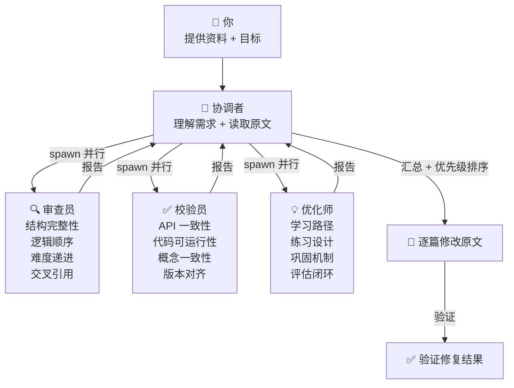

## 前置知识：这套方法论从哪来

在审查/优化 AgentScope 2.0 学习路径（9 篇笔记）的过程中，我使用了 **3 个专业 Agent 并行审查 + 1 个协调者汇总 + 逐篇文件编辑** 的模式，经历了多轮沙箱故障、子 Agent 只读限制、脱敏误报等实战问题。

这套方法论的目标是：**让你在新项目中建立学习路径时，能用同样的模式快速审查、校验、优化。**

---

## 一、多 Agent 审查协作模式

### 核心架构



### 三个 Agent 的职责分工

| Agent | 职责 | 关注维度 | 输出物 |
|-------|------|---------|--------|
| 🔍 审查员 | 结构审查 | 完整性、顺序、递进、引用、冗余 | 问题清单（P0/P1/P2） |
| ✅ 校验员 | 技术校验 | API 一致性、代码可运行性、概念对齐 | 问题清单（Critical/Major/Minor） |
| 💡 优化师 | 体验优化 | 练习设计、巩固机制、差异化路径、评估闭环 | 优化方案（P0/P1/P2） |

### 为什么用 3 个 Agent 而不是 1 个

| 单 Agent 问题 | 3 Agent 解决 |
|--------------|-------------|
| 上下文窗口不够（9 篇 × ~15KB = 135KB 原文） | 每个 Agent 各自读一遍，在自己上下文里分析 |
| 认知偏见：结构审查时容易忽略代码 bug | 审查员专注结构，校验员专注代码，互不干扰 |
| 遗漏：一个人很难同时覆盖 8 个维度 | 3 个 Agent 覆盖 7+7+8 = 22 个维度 |

---

## 二、提示词模板

### 审查员提示词模板

```
你是一位资深技术课程结构审查专家。请审查 [目录] 下 [N] 篇学习笔记。

## 第一步：读取文件
使用 read_file 完整阅读全部 [N] 篇。

## 第二步：审查维度
1. 结构完整性：是否覆盖完整闭环？知识盲区？
2. 学习顺序合理性：依赖关系是否正确？有否先用后讲？
3. 难度递进：难度曲线是否合理？
4. [项目名称]衔接：各版本与笔记知识点是否对齐？有否断层？
5. 交叉引用有效性：相关笔记是否双向对齐？
6. 重复与冗余：是否有无递进价值的重复？
7. 学时分配合理性：建议学时与内容量是否匹配？

## 第三步：输出
写入 [路径/结构审查报告.md]，包含：
- 总体评分（1-10）及一句话总结
- 每个维度评分（1-10）和详细说明
- 具体问题列表（P0/P1/P2，注明文件和位置）
- 3-5 条最优先改进建议
```

### 校验员提示词模板

```
你是一位技术校验专家，精通 [技术栈]。请校验 [目录] 下 [N] 篇学习笔记。

## 第一步：读取文件
[同上]

## 第二步：校验维度
1. API 一致性：[重点 API 列表] 的 import 路径、类名、方法名是否一致？
2. 代码可运行性：是否有语法错误、缺失 import、未定义变量？
3. 概念一致性：[关键概念] 的数字、名称在各篇是否对齐？
4. 交叉引用对齐：相关笔记是否双向对齐？
5. [项目名称]代码校验：各版本递进是否有代码断裂？
6. 版本声明一致性：日期、版本号是否一致？

## 第三步：输出
写入 [路径/技术校验报告.md]，包含：
- 总体评分（1-10）及一句话总结
- 每个维度评分和发现的问题
- 具体问题清单（Critical/Major/Minor，含文件名+位置+修复建议）
- API 一致性速查矩阵
```

### 优化师提示词模板

```
你是一位学习体验优化专家，擅长课程设计。请为 [目录] 下 [N] 篇学习笔记提出优化建议。

## 第一步：读取文件
[同上]

## 第二步：分析维度
1. 学习路径优化：学时分配是否合理？
2. 练习设计优化：练习是否有验证标准？
3. 知识巩固机制：是否有复习/巩固机制？
4. 实战项目优化：进度感和吸引力？
5. 可视化与交互：图表是否充分？
6. 差异化路径：是否考虑不同背景学习者？
7. 评估反馈闭环：自测/验收机制？
8. 社区与协作：是否缺互动环节？

## 第三步：输出
写入 [路径/体验优化报告.md]，包含：
- 总体评价（1-10）及一句话总结
- 每个维度评分（1-10）和优化建议
- 优先级排序改进项（P0/P1/P2），每项给可执行方案
- 学习者自测 Checklist 草案
```

---

## 三、多发问题排查清单

### 1. 交叉引用双向对齐

```bash
# 用 grep 找出所有"相关笔记"段
grep -n "相关笔记" *.md

# 对每对引用，检查 A 引了 B 是否 B 也引了 A
# 格式标准化：⬅️前置 / ➡️后续 / 🔗关联
```

### 2. Import 路径一致性

```bash
# 搜索所有 import 语句，检查同一概念是否路径一致
grep -n "from agentscope.*import.*TeamTools" *.md
# 应全部统一为 from agentscope.team import TeamTools
```

### 3. 代码可运行性

```bash
# 检查 [REDACTED] 脱敏——用 shell 而非 read_file 绕过
Select-String -Path "*.md" -Pattern "credential=" | % { $_.Line }
# 如果 clean → 无误报；如果含 [REDACTED] → 是原文污染
```

### 4. 学时分配检验

```text
检查清单：
- 每个模块的建议学时是否与实际内容量匹配？
- 是否有某个模块"密度突增"（如从 2h 跳到 5h 无过渡）？
- 总学时是否在目标学习者每周可用时间范围内？
```

### 5. 学习路径关键词对齐

```text
检查清单：
- 笔记 A 说"先学 B"但 B 页面上没有"前置于 A"？
- 毕业项目各版本引用的笔记编号是否与内容一致？
- 同一概念在不同笔记中的名称是否统一？
```

---

## 四、文件编辑工作流

### 修改原则

1. **先诊断，再动刀**：用 `grep`/`exec_command` 精确搜索问题行号，不要凭记忆
2. **一次改一个类型**：批量修复同类问题（如全部 `TeamTools` 路径），减少人工复查
3. **改完即验证**：每次 `edit_file` 后立即用 `exec_command` 验证行号
4. **保留原始措辞**：只改有问题的部分，不重写整段
5. **记录改动**：在总报告中维护改动清单

### 批量修改模式

```text
# 错误模式：一篇一篇改，容易遗漏
# 正确模式：先 grep 全局搜索 → 定位所有问题行 → 批量 edit_file

# 示例：统一 TeamTools import 路径
grep -rn "from agentscope.tool import.*TeamTools" → 找到 2 处
edit_file 文件1 → 改
edit_file 文件2 → 改
grep -rn "TeamTools" → 验证全部统一
```

### 常见陷阱

| 陷阱 | 表现 | 对策 |
|------|------|------|
| 脱敏误报 | `read_file` 输出 `[REDACTED]`，但原文是干净的 | 用 `exec_command` + `Select-String` 直接读文件 |
| 子 Agent 只读 | 子会话文件系统挂载为 `access: ro` | 子 Agent 只负责分析，父会话负责写入 |
| 沙箱抖动 | `SandboxBackendError` 间歇性出现 | 关闭沙箱（Full Host Access）或等待恢复后重试 |
| 替换范围过大 | `old_text` 匹配多处导致误改 | 用足够长的上下文确保唯一匹配 |

---

## 五、自检清单模式

为每篇笔记追加的 **🎯 本文学完自检** 采用三级标准：

```
## 🎯 本文学完自检

| 层次 | 检查项 |
|------|--------|
| 🟢 基础 | 能 [可验证的基础操作] |
| 🟡 进阶 | 能 [需要组合多个知识点的操作] |
| 🔴 挑战 | 能 [需要独立判断和创造性应用的操作] |
```

### 设计原则

- **🟢 基础**：必须可独立完成，不可跳过。是"会不会"的判定。
- **🟡 进阶**：需要综合运用本篇多个知识点。是"熟不熟"的判定。
- **🔴 挑战**：需要跨篇知识或独立判断。是"能不能灵活运用"的判定。

---

## 六、迁移到新项目的 Checklist

当你用这套方法论搭建新项目的学习路径时，按以下顺序执行：

### Phase 1: 准备（1 轮）

- [ ] 收集全部学习资料（笔记、文档、代码仓库）
- [ ] 确定 3 个审查维度（结构/技术/体验）
- [ ] 为每个维度编写提示词（参考上文模板）
- [ ] 确定目标学习者画像（新手/老手/运维）

### Phase 2: 审查（1-2 轮）

- [ ] 并行运行 3 个 Agent 审查
- [ ] 收集 3 份报告，合并为优先级排序的改进清单
- [ ] 区分 P0（必须改）/ P1（强烈建议）/ P2（锦上添花）

### Phase 3: 修复（1-2 轮）

- [ ] 按 P0 → P1 → P2 顺序逐批修复
- [ ] 同类问题批量修改（grep → 定位 → 批量 edit）
- [ ] 每批修复后验证

### Phase 4: 优化（1 轮）

- [ ] 追加每篇"学完自检"（🟢/🟡/🔴）
- [ ] 调整学时分配，确保密度合理
- [ ] 添加角色导航（不同背景的学习路线）
- [ ] 添加阶段复习检查点
- [ ] 补全引用双向对齐

### Phase 5: 交付

- [ ] 生成综合报告（改动清单 + 评分变化）
- [ ] 提取可独立运行的代码文件
- [ ] 保存方法论笔记（本文档）

---

## 七、关键教训

1. **子 Agent 沙箱限制是最大变量**：写入操作尽量在父会话完成，子 Agent 只负责分析
2. **`[REDACTED]` 是工具脱敏，不是原文污染**：用 shell 命令直接读文件验证
3. **交叉引用双向对齐是"看起来简单但最容易漏"的问题**：必须用 grep 矩阵检查
4. **"学完自检"是课程与教材的核心区别**：没有验收标准的学习路径只是阅读清单
5. **毕业项目的版本递进设计是最大亮点**：v1-v7 让学习者持续有成就感，值得在新项目中复制

---

## 相关笔记

- [[04-GitHub研究/agentscope/00-综合审查与优化报告]] -- 本次任务的最终汇总报告
- [[04-GitHub研究/agentscope/01-结构审查报告]] -- 结构审查详细报告
- [[04-GitHub研究/agentscope/02-技术校验报告]] -- 技术校验详细报告
- [[04-GitHub研究/agentscope/03-体验优化报告]] -- 体验优化详细报告
- [[04-GitHub研究/agentscope/AgentScope 总览索引]] -- 被审查的课程总索引

---

*最后更新：2026-07-17*
