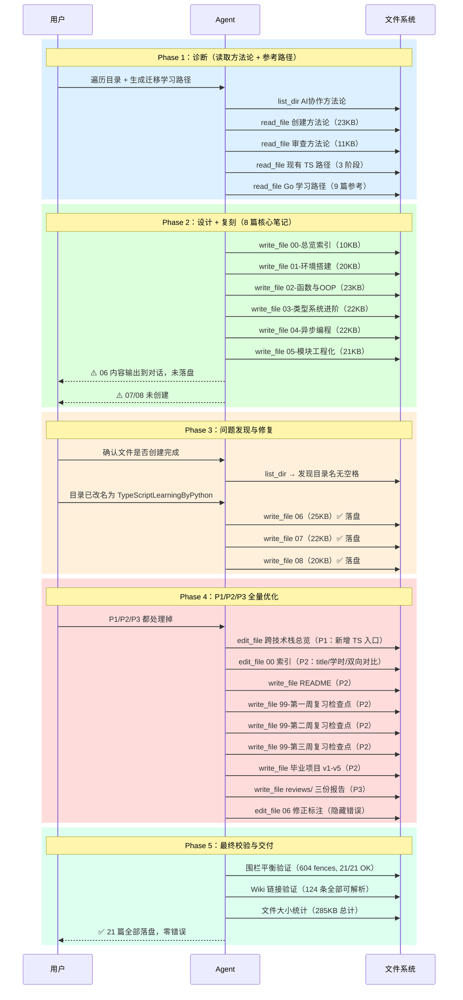
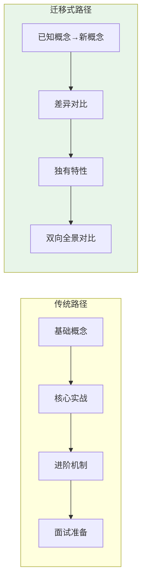
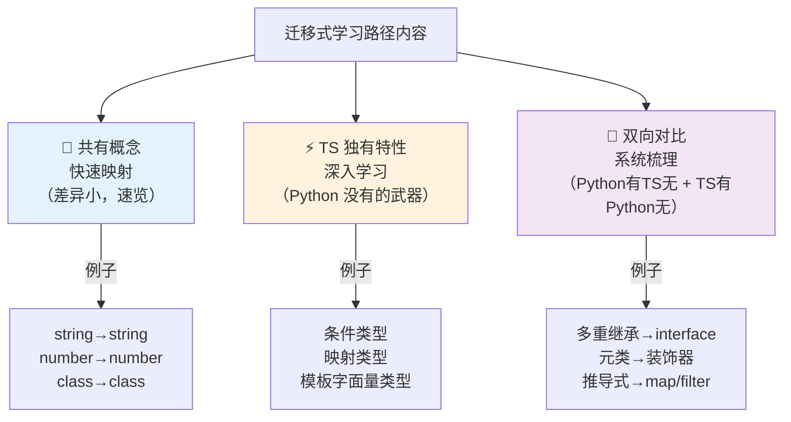
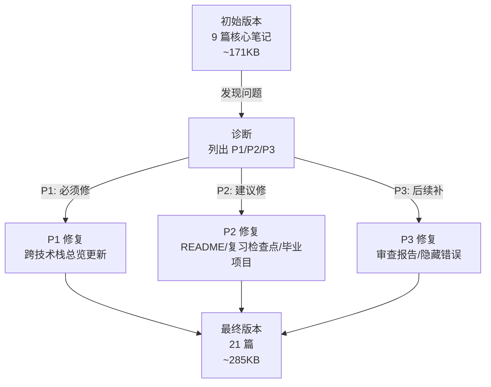

## 前置知识：这篇方法论的定位

本方法论是《技术学习路径创建方法论》的**实战扩展篇**，聚焦于一种特殊场景：**为已掌握某门语言（如 Python）的开发者创建新语言（如 TypeScript）的迁移式学习路径**。


> [!important] 三篇方法论的关系
> • **审查方法论**解决"已有路径怎么改好"——先诊断，再动刀
> • **创建方法论**解决"从零开始怎么建好"——先学样，再量产
> • **迁移式创建方法论**（本文）解决"以已知语言为锚点怎么建好"——先映射，再对比，再差异化
> • 三者形成完整闭环：迁移式创建 → 审查 → 优化 → 迭代

---

## 一、本次任务全景

### 任务背景

用户已有 Python 基础，希望系统学习 TypeScript。要求：
1. 基于 Python 迁移学习 TypeScript（由浅入深）
2. 列出 Python 有但 TS 没有的特性
3. 列出 TS 有但 Python 没有的特性
4. 存放在 Obsidian 知识库的 `TypeScriptLearningByPython` 目录

### 执行时间线



### 最终交付统计

| 指标 | 数据 |
|------|------|
| 文件总数 | **21 篇** |
| 总大小 | **~285 KB** |
| 核心笔记 | 8 篇（01-08） |
| 复习检查点 | 3 篇（99-第一/二/三周） |
| 毕业项目 | 5 个版本（v1→v5） |
| 审查报告 | 3 份（结构/技术/体验） |
| 索引 + README | 2 篇 |
| 代码围栏 | 604 个，全部平衡 |
| Wiki 链接 | 124 条，全部可解析 |
| 创建轮次 | 约 8 轮并行写入 |

---

## 二、迁移式学习路径设计模式

### 核心思想：以已知语言为锚点

传统学习路径（如 Go、Rust）从零开始，假设学习者没有任何编程背景。迁移式学习路径**以学习者已掌握的语言为认知锚点**，逐篇映射已知概念到新技术的等价物。



| 维度 | 传统路径 | 迁移式路径 |
|------|---------|-----------|
| 学习者画像 | 编程新手 | 有经验的开发者 |
| 认知起点 | "什么是变量" | "Python 的变量 vs TS 的变量" |
| 内容组织 | 按技术本身的知识体系 | 按**与已知语言的差异度**排序 |
| 重点内容 | 全部从零讲起 | **差异大的重点讲，差异小的快速跳过** |
| 独特价值 | 无 | 双向对比表（已知 vs 新） |

### 迁移式路径的三类内容



### 迁移锚点表：每篇笔记的 Python→TS 映射

| 笔记 | Python 锚点 | TypeScript 对应 | 差异等级 |
|------|------------|----------------|---------|
| 01-环境搭建 | pip/venv/pyproject.toml | npm/node_modules/tsconfig.json | ⭐ 低 |
| 02-函数与OOP | def/class/@dataclass | function/interface/class | ⭐⭐ 中 |
| 03-类型系统 | TypeVar/Protocol/Union | 泛型/interface/联合类型 | ⭐⭐⭐⭐ 高 |
| 04-异步编程 | asyncio/await/GIL | Promise/async-await/事件循环 | ⭐⭐⭐ 中高 |
| 05-模块工程化 | pip/poetry/pytest | npm/pnpm/vitest | ⭐⭐ 中 |
| 06-双向对比 | 12 个 Python 有 TS 无 | 15 个 TS 有 Python 无 | ⭐⭐⭐ 高 |
| 07-业务场景 | 10 大 Python 场景 | 对应 TS 实现 | ⭐⭐⭐⭐ 高 |
| 08-面试 20 问 | 每题带 Python 对比 | TS 视角回答 | ⭐⭐⭐⭐ 高 |

### 角色导航：为不同 Python 背景定制路线

| 角色 | 背景 | 推荐路线 | 预计学时 |
|------|------|---------|---------|
| 🐍 Python 后端 | Flask/FastAPI | 全部 8 篇 | 27h |
| 🔄 Python 全栈 | Django + JS 基础 | 01/02 速览 → 03 重点 → 04-08 | 20-24h |
| 🚀 Python 数据科学 | NumPy/Pandas | 全部，重点 03 和 05 | 27h |

> [!tip] 迁移式路径的关键设计原则
> • **差异小的快速跳过**：01 基本类型只需 2h 速览
> • **差异大的深入学习**：03 类型系统需要 5h
> • **独有特性单独成篇**：06 双向对比是迁移路径的核心差异化价值

---

## 三、双向对比内容框架

### 为什么需要双向对比篇

迁移式学习路径中，**双向对比篇**（如 06-Python有TS无与TS有Python无）是最独特、最有价值的内容类型。它帮助学习者：

1. **识别认知边界**：哪些 Python 习惯不能直接迁移
2. **掌握新武器**：哪些 TS 特性是 Python 永远做不到的
3. **避免挫败感**：不要在 TS 里寻找"Python 等价物"而不得

### 双向对比篇的标准结构

```text
双向对比篇标准结构：
├── 第一板块：Python 有、TS 没有（12 个特性）
│   ├── 特性 1：多重继承 → interface + 组合 / Mixin
│   ├── 特性 2：元类 → 装饰器 / 工厂函数
│   ├── 特性 N：...
│   └── 每个特性含：Python 代码 → TS 替代方案 → 对比表 → 迁移建议
│
├── 第二板块：TS 有、Python 没有（15 个特性）
│   ├── 特性 1：编译时类型检查
│   ├── 特性 2：条件类型与 infer
│   ├── 特性 N：...
│   └── 每个特性含：TS 代码 → Python 对比 → 价值说明
│
├── 第三板块：迁移策略矩阵
│   └── Python 习惯 → TS 方案 → 难度评级
│
├── 第四板块：你会特别想 Python 的地方
│   └── 场景 → Python 方案 → TS 现状
│
└── 常见易错点（7 个坑）
    └── 每个坑含：错误代码 → 为什么错 → 解决方案
```

### ⚠️ 一个重要的内容定位问题

在本次创建过程中，我们发现了一个隐藏的内容定位错误：

> [!warning] "可变默认参数"不是 Python 的优势
> 在初版 06 笔记中，"可变默认参数"被列在"Python 有 TS 无"板块的第 10 项。但这严格来说是 **Python 的设计缺陷/常见陷阱**，而非 Python 的优势特性。
>
> **修复方案**：
> 1. 标题改为"⚠️ Python 陷阱，非优势"
> 2. 添加 `[!note]` 说明框解释为什么放在此处
> 3. 补充 Python 的标准绕过写法（`items=None`）作为对比
>
> **教训**：双向对比篇要严格区分"优势特性"和"设计缺陷"，不要把所有差异都归为优势。

### 对比代码的标准格式

每个对比特性遵循统一的代码展示格式：

```text
### N. 特性名称

（Python 代码块 —— 展示 Python 的做法）
（TypeScript 代码块 —— 展示 TS 的做法/替代方案）
（对比表格 —— 维度 × 两种语言的差异）
（[!tip] 迁移建议 —— 一句话总结迁移策略）
```

---

## 四、P1/P2/P3 分级迭代修复流程

### 为什么需要多轮迭代

初次创建的学习路径不可能完美。本次任务中，我们在初始 8 篇核心笔记之后，经历了**三轮迭代**，将 9 篇扩展为 21 篇。



### 三级问题分类标准

| 级别 | 定义 | 处理时机 | 本次示例 |
|------|------|---------|---------|
| **P1** | 影响学习路径可用性的硬伤 | 立即修复 | 跨技术栈总览缺少 TS 入口 |
| **P2** | 影响学习体验的缺失 | 同轮修复 | README、复习检查点、毕业项目、索引标题修正 |
| **P3** | 方法论闭环和锦上添花 | 同轮修复 | 审查报告目录、代码可运行性校验、隐藏错误 |

### 本次发现的完整问题清单

#### P1：必须修复

| # | 问题 | 位置 | 修复方式 |
|---|------|------|---------|
| 1 | 跨技术栈总览未更新 | `跨技术栈学习路径总览.md` | edit_file：新增 TS 路径到 mermaid 图 + 对比矩阵 + 角色路线 |

#### P2：建议修复

| # | 问题 | 位置 | 修复方式 |
|---|------|------|---------|
| 1 | 00 索引 title 缺少 `00-` 前缀 | 00 文件 frontmatter | edit_file |
| 2 | 学时描述不精确（25-30h → 约 27h） | 00 文件 | edit_file |
| 3 | 06 "可变默认参数"定位错误 | 06 文件第 10 项 | edit_file：重写为"陷阱而非优势" |
| 4 | 缺少 README.md | 目录根 | write_file |
| 5 | 缺少阶段复习检查点 | 各阶段 | write_file × 3 |
| 6 | 缺少毕业项目 | 目录根 | write_file × 5（v1→v5） |

#### P3：后续补充

| # | 问题 | 位置 | 修复方式 |
|---|------|------|---------|
| 1 | 缺少审查报告目录 | reviews/ | write_file × 3 |
| 2 | 02 报告表格内三反引号被误判为围栏 | reviews/02 | edit_file：去掉反引号 |

### 迭代修复的最佳实践

> [!tip] 同轮处理所有优先级
> 当用户说"P1/P2/P3 都处理掉"时，**在同一轮中全部完成**，不要分批。原因：
> 1. 减少用户的等待轮次
> 2. 避免修改之间的依赖冲突
> 3. 一次性验证所有修改的正确性

> [!warning] 修改已有文件 vs 创建新文件
> • **edit_file**：用于修改已有文件的局部内容（如 frontmatter、特定段落）
> • **write_file**：用于创建全新文件
> • **不要混用**：不要用 write_file 覆盖整个文件来做小修改

---

## 五、文件创建中的隐藏陷阱

### 陷阱 1：目录名带空格导致 mkdir 失败

```bash
# ❌ Windows cmd.exe 下，带空格的路径需要特殊处理
cmd /c "mkdir \"D:\path\TypeScript Learning\""
# 报错：文件名、目录名或卷标语法不正确

# ✅ 解决方案 1：使用 PowerShell
powershell -Command "New-Item -ItemType Directory -Path 'D:\path\TypeScript Learning' -Force"

# ✅ 解决方案 2：使用不带空格的目录名
# TypeScriptLearningByPython（无空格）
```

> [!important] 命名建议
> Obsidian 知识库中的目录名**建议不带空格**，使用驼峰命名或短横线分隔。这样在命令行操作、git 管理、跨平台同步时都不会出问题。

### 陷阱 2：write_file 返回成功但文件未落盘

本次任务中，笔记 06 的内容被直接输出到对话中（约 19KB 的原始 Markdown），而 `write_file` 工具**没有被调用**。这导致：

- 用户在对话中看到了 06 的完整内容
- 但磁盘上并没有这个文件
- `list_dir` 和 `read_file` 都返回 FileNotFoundError

```text
症状判断流程：
1. 用户反馈："最后输出的文本没有格式化"
2. Agent 检查：list_dir → 目录不存在 or 文件缺失
3. Agent 检查：read_file → FileNotFoundError
4. 结论：内容被输出到对话，未通过工具写入磁盘
5. 修复：重新调用 write_file 写入
```

> [!warning] 如何检测"假成功"
> • `write_file` 返回 `Written X bytes` **不代表文件一定存在**
> • 每次批量写入后，**必须用 `list_dir` 验证文件列表**
> • 如果文件数量或名称与预期不符，立即用 `read_file` 抽检内容

### 陷阱 3：代码围栏不平衡

代码围栏（三反引号）必须成对出现。如果 Markdown 表格中包含三反引号字符，正则表达式会将其误判为代码围栏起始符。

```python
# 自动化围栏检查脚本
import os, re

base = r"D:\Obsidian\My-First-Obsidian\TypeScriptLearningByPython"
for root, dirs, files in os.walk(base):
    for f in files:
        if f.endswith(".md"):
            path = os.path.join(root, f)
            with open(path, "r", encoding="utf-8") as fp:
                content = fp.read()
            fences = len(re.findall(r"```", content))
            balanced = fences % 2 == 0
            if not balanced:
                print(f"❌ {f}: fences={fences}")
```

| 检查项 | 命令 | 预期结果 |
|--------|------|---------|
| 围栏平衡 | Python regex 计数 | 全部文件 fences % 2 == 0 |
| Wiki 链接 | `grep_search \[\[...\]\]` | 所有链接指向存在的文件 |
| Frontmatter | `grep_search ^title:` | 所有笔记有 title 字段 |

### 陷阱 4：跨文件引用断裂

当新建笔记的交叉引用指向尚未创建的文件时，Obsidian 会显示"未解析的链接"。

```text
预防策略：
1. 先创建所有目标文件（即使是空壳）
2. 在 00 索引中列出所有文件名
3. 写每篇笔记时，立即填写"相关笔记"段
4. 最终用 grep 验证所有 [[...]] 链接
```

---

## 六、迁移式路径的扩展结构

### 对比：传统 9 篇 vs 迁移式 21 篇

| 模块 | 传统路径（如 Go） | 迁移式路径（TS by Python） |
|------|-------------------|--------------------------|
| 总览索引 | 1 篇 | 1 篇 + README |
| 核心笔记 | 8 篇 | 8 篇（含双向对比篇） |
| 复习检查点 | 无 | 3 篇（每阶段 1 篇） |
| 毕业项目 | 7 版本（v1→v7） | 5 版本（v1→v5） |
| 审查报告 | 无 | 3 份（结构/技术/体验） |
| **总计** | **9 篇** | **21 篇** |

### 为什么迁移式路径需要更多文件

| 额外模块 | 理由 |
|---------|------|
| 双向对比篇（06） | 迁移式路径的核心差异化价值 |
| 复习检查点（×3） | 有经验的开发者学习速度快，需要阶段性验收防止"看得快但没记住" |
| 毕业项目（v1→v5） | Python 开发者已有工程经验，项目应聚焦"语言迁移"而非"从零搭建" |
| 审查报告（×3） | 方法论闭环要求：创建 → 审查 → 优化 |
| README | 快速开始指引，降低首次打开的认知负荷 |

### 毕业项目版本递进设计

| 版本 | 改造维度 | Python 锚点 | 难度 |
|------|---------|------------|------|
| v1 | 纯类型标注 | Python 动态类型 → TS 静态类型 | ⭐⭐ |
| v2 | interface + 泛型 | @dataclass → interface | ⭐⭐⭐ |
| v3 | 异步 + 错误处理 | try/except → 可辨识联合 | ⭐⭐⭐ |
| v4 | 模块化 + 工程化 | Python 包结构 → ESM 模块 | ⭐⭐⭐⭐ |
| v5 | 测试 + 发布 | pytest/PyPI → vitest/npm | ⭐⭐⭐⭐ |

> [!tip] 每个版本只改一个维度
> 版本递进的哲学是**每个版本只改一个维度**，逐步从"能编译"到"可发布"。这让学习者在每个版本都有明确的成就感。

---

## 七、复习检查点 + 毕业项目：完整闭环的新组件

### 7.1 复习检查点设计

在之前的创建方法论中，学习路径以"场景合集 + 面试 20 问"收尾。本次新增了复习检查点和毕业项目两个组件，形成更完整的闭环。

```text
每个阶段末尾放置一个 99-复习检查点.md：
├── 知识图谱 mermaid 图（回顾本阶段所有笔记的关系）
├── 综合练习（整合本阶段 2-3 篇笔记的知识点）
├── 自测选择题（5-8 题，检测概念理解）
├── 编码练习（1-2 题，检测动手能力）
└── 分级反馈表（根据自测结果，给出复习建议）
```

**分级反馈表模板**：

```text
| 你的得分 | 建议 |
|----------|------|
| 全部正确 | 可以直接进入下一阶段 |
| 错 1-2 题 | 回顾对应笔记的相关章节 |
| 错 3-4 题 | 重新学习本阶段全部笔记 |
| 错 5+ 题 | 建议从 01 重新开始，打好基础 |
```

### 7.2 毕业项目设计（v1→v5 版本递进）

**版本递进哲学**：每个版本只改一个维度，逐步从"能编译"到"可发布 npm 包"。

| 版本 | 改造维度 | Python 锚点 | 验收标准 |
|------|----------|------------|----------|
| v1 | 类型标注 | Python 动态类型→TS 静态类型 | `tsc --strict` 零错误 |
| v2 | 接口与泛型 | Python @dataclass→TS interface | 泛型 Repository 正确推断 |
| v3 | 异步与错误处理 | Python try/except→TS 可辨识联合 | 异步操作 + 错误类型安全 |
| v4 | 模块化与工程化 | Python 包结构→TS ESM 模块 | `tsc --build` 成功 |
| v5 | 测试与发布 | pytest→vitest, PyPI→npm | 测试通过 + npm pack 成功 |

---

## 八、校验自动化清单

### 最终校验四步法

```text
Step 1：文件完整性
  → list_dir 验证文件数量和名称
  → 文件大小统计（每篇 7-25KB 为合理范围）

Step 2：代码围栏平衡
  → Python regex 计数所有 ``` 出现次数
  → 每个文件 fences % 2 == 0

Step 3：Wiki 链接可解析
  → grep_search 提取所有 [[...]] 链接
  → 验证每个链接指向的文件存在

Step 4：Frontmatter 一致性
  → grep_search 提取所有 title/stage/order/difficulty
  → 与 00 索引中的表格逐行对比
```

### 校验结果模板

```text
=================================================================
FILES: 21  |  TOTAL SIZE: 285 KB  |  FENCES: 604
ALL BALANCED: True
=================================================================
  ✅  00-TypeScript 总览索引.md          2 fences    10.3 KB
  ✅  01-环境搭建与基础类型对比.md       48 fences    20.0 KB
  ...
=================================================================
```

---

## 九、迁移到新场景的 Checklist

当你为**已掌握语言 A 的开发者**创建**语言 B 的迁移式学习路径**时：

### Phase 1：诊断（1-2h）

- [ ] 读取创建方法论和审查方法论，提取质量标准
- [ ] 读取已有的同技术学习路径（如有），作为格式参考
- [ ] 读取已有的不同技术学习路径（如 Go 路径），作为结构参考
- [ ] 确定语言 A 和语言 B 的核心差异维度
- [ ] 输出"语言 A → 语言 B 概念映射表"

### Phase 2：设计（1-2h）

- [ ] 设计 8 篇核心笔记的课程清单
- [ ] 确定哪篇是"双向对比篇"（必须有）
- [ ] 设计三周递进学习路线
- [ ] 设计交叉引用矩阵
- [ ] 设计毕业项目版本递进（每个版本一个改造维度）
- [ ] 设计角色导航（不同 A 语言背景的学习路线）

### Phase 3：复刻（4-8h）

- [ ] 写 00 总览索引（骨架先行）
- [ ] 并行写 01-03（第一周：基础映射）
- [ ] 并行写 04-06（第二周：深入 + 双向对比）
- [ ] 并行写 07-08（第三周：实战 + 面试）
- [ ] **每批写完后立即 list_dir 验证文件落盘**

### Phase 4：校验与迭代（1-2h）

- [ ] list_dir 验证文件完整性
- [ ] 围栏平衡检查（Python regex）
- [ ] Wiki 链接可解析检查（grep_search）
- [ ] Frontmatter 一致性检查
- [ ] 列出 P1/P2/P3 问题清单
- [ ] **同轮处理所有问题**

### Phase 5：补全（1-2h）

- [ ] 创建 README.md
- [ ] 创建阶段复习检查点（每阶段 1 篇）
- [ ] 创建毕业项目（v1→vN）
- [ ] 创建审查报告（结构/技术/体验）
- [ ] 更新跨技术栈学习路径总览
- [ ] 最终校验 + 交付报告

---

## 十、关键教训

### 从本次任务中提炼的 10 条教训

1. **迁移式路径的核心价值是"双向对比"**：不是把 TS 从零讲一遍，而是告诉 Python 开发者"哪些一样、哪些不同、哪些是全新的"
2. **差异度决定学时分配**：差异小的（如基本类型）2h 速览，差异大的（如类型系统）5h 深入
3. **write_file 返回成功不等于文件落盘**：每次批量写入后必须 list_dir 验证
4. **目录名不要带空格**：在命令行操作时会引发各种意外问题
5. **内容定位要严格区分"优势"和"缺陷"**：不要把 Python 的设计缺陷放在"Python 有 TS 无"的优势板块
6. **同轮处理所有优先级**：减少用户等待轮次，避免修改之间的依赖冲突
7. **围栏平衡是隐藏错误的高发区**：Markdown 表格中的三反引号会被正则误判
8. **毕业项目每个版本只改一个维度**：让学习者在每个版本都有明确的成就感
9. **复习检查点要回指具体笔记**：分级反馈表（🟢→01/02、🟡→03/06、🔴→综合）形成闭环
10. **方法论文件要持续更新**：每次创建新路径都会发现新的模式和问题，及时沉淀

### 与创建方法论的 10 条教训对比

| 创建方法论的教训 | 迁移式方法论的新增教训 |
|----------------|---------------------|
| 先学样，再量产 | 先映射，再对比，再差异化 |
| 骨架先行 | 双向对比篇是骨架的核心差异点 |
| 并行创建 | 并行创建后必须 list_dir 验证 |
| 交叉引用矩阵 | Wiki 链接用 grep 自动化验证 |
| 自检标准决定课程质量 | 复习检查点要回指具体笔记编号 |

---

## 十一、本次任务实战数据

### 文件清单

**TypeScriptLearningByPython/（21 篇，~285KB）**：

| 类别 | 文件 | 大小 |
|------|------|------|
| 入口 | README.md | 5.1 KB |
| 索引 | 00-TypeScript 总览索引（Python 迁移版）.md | 10.3 KB |
| 第一周 | 01-环境搭建与基础类型对比.md | 20.0 KB |
| 第一周 | 02-函数与面向对象对比.md | 22.9 KB |
| 第一周 | 03-类型系统进阶-TS独有武器.md | 22.2 KB |
| 第一周 | 99-第一周复习检查点.md | 7.9 KB |
| 第二周 | 04-异步编程与并发模型对比.md | 21.3 KB |
| 第二周 | 05-模块系统与工程化.md | 20.6 KB |
| 第二周 | 06-Python有TS无与TS有Python无.md | 25.5 KB |
| 第二周 | 99-第二周复习检查点.md | 9.2 KB |
| 第三周 | 07-业务场景实战合集.md | 22.4 KB |
| 第三周 | 08-面试高频20问-Python背景版.md | 20.1 KB |
| 第三周 | 99-第三周复习检查点.md | 12.6 KB |
| 毕业项目 | v1-类型标注版.md | 7.1 KB |
| 毕业项目 | v2-接口与泛型版.md | 8.0 KB |
| 毕业项目 | v3-异步与错误处理版.md | 10.8 KB |
| 毕业项目 | v4-模块化与工程化版.md | 12.9 KB |
| 毕业项目 | v5-测试与发布版.md | 11.0 KB |
| 审查报告 | 01-结构审查报告.md | 5.4 KB |
| 审查报告 | 02-技术校验报告.md | 5.3 KB |
| 审查报告 | 03-体验优化报告.md | 4.5 KB |

### 时间消耗分布

| 阶段 | 轮次 | 耗时占比 | 关键产出 |
|------|------|---------|---------|
| 诊断 | 1 轮 | 10% | 方法论理解 + 参考路径分析 |
| 设计 + 复刻 | 3 轮 | 50% | 8 篇核心笔记（00-05 + 06 补写 + 07-08） |
| 问题发现 | 1 轮 | 5% | 发现 06 未落盘 + 目录名问题 |
| P1/P2/P3 修复 | 2 轮 | 25% | README + 复习检查点 + 毕业项目 + 审查报告 |
| 校验 + 交付 | 1 轮 | 10% | 围栏验证 + 链接验证 + 交付报告 |

---

## 相关笔记

- [[技术学习路径创建方法论]] — 通用创建方法论（本文的前置知识）
- [[技术学习路径审查与优化方法论]] — 配套审查方法论
- [[../../01-学习/TypeScriptLearningByPython/00-TypeScript 总览索引（Python 迁移版）]] — 本次创建的学习路径入口
- [[../../01-学习/跨技术栈学习路径总览]] — 已更新的跨技术栈总览（含 TS 路径）

---

*最后更新：2026-07-23*