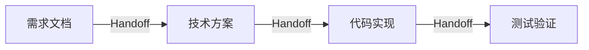

你好，我是黄佳。

欢迎来到 Claude Code 工程化实战的第 7 讲。前面我们学习了只读型子代理和高噪声任务处理，今天我们要探索子代理的另外两个强大工程应用场景—— 并行探索 和 流水线编排 。

这两个应用分别解决的问题是什么呢？并行探索, 当你需要同时从多个角度理解或处理一件事时启用；流水线编排, 当一个复杂任务可以拆成多个连续阶段时启用。

今天的内容比较多，学习目标包括：

掌握并行探索和流水线编排的基本使用。

通过实战项目体验两种模式的差异。

理解“独立→并行，依赖→流水线”的判断标准。

学会设计阶段间的“交接契约”，确保流水线信息不丢失。

掌握混合模式——当一个任务既有并行部分，又有串行部分时如何编排。

理解主对话作为“编排者”的角色定位和决策介入点。

我们还是老规矩，从两个真实场景来开始。

## 场景一：新接手一个大型项目

你刚加入一个团队，需要快速理解一个包含几十个模块的后端项目。传统方式下，我们可能要花费很久的时间熟悉。

1. 看 auth 模块 → 花 3 小时

2. 看 database 模块 → 花 5 小时

3. 看 api 模块 → 花 40 分钟

4. 综合理解 →???

串行探索既慢，又容易在中途忘记前面看到的细节。

而并行探索的方式就不一样了。


三个子代理 同时 工作，各自探索自己的领域，最后汇总成一份综合报告。

## 场景二：修复一个复杂的 bug

遇到一个“用户登录后偶尔 token 验证失败”的 bug。这种间歇性问题最难调试。

如果让主对话直接处理，上下文会很快被塞满：

搜索相关代码 → 200 行输出

分析可能的原因 → 又是 200 行

修复 → 100 行

验证 → 又是测试输出……

而流水线的方式，每个阶段只返回 摘要 ，主对话始终保持清洁，可以随时介入做决策。


## 项目一：并行探索

接下来我们直接进入实战演练。

### 并行探索子代理

实战项目位于 03-SubAgents/projects/04-parallel-explore/ ，包含三个专门的探索子代理。

04-parallel-explore/

├── src/

│ ├── auth/ # 认证模块

│ │ ├── index.js

│ │ ├── jwt.js

│ │ └── session.js

│ ├── database/ # 数据库模块

│ │ ├── index.js

│ │ ├── models.js

│ │ └── migrations.js

│ └── api/ # API 模块

│ ├── index.js

│ ├── routes.js

│ └── middleware.js

└──.claude/agents/

├── auth-explorer.md

├── db-explorer.md

└── api-explorer.md

auth-explorer 子代理的配置如下。

```yaml
---
name: auth-explorer
tools: Read, Grep, Glob
model: haiku
---
```

## Your Domain

- Token generation and validation (JWT, sessions)

- Password handling

- Permission and role systems

- Session management

## When Invoked

2. **Analyze Structure**: Read key files and understand:

- How users authenticate

- How tokens are generated/validated

- How sessions are managed

- How permissions are checked

3. **Report Findings**

## Output Format

```markdown

## Auth Module Analysis

### Overview

[1-2 sentence summary]

### Authentication Flow

1. [Step 1]

2. [Step 2]

...

### Key Components

| Component | File | Purpose |

|-----------|------|---------|

|... |... |... |

### Token Strategy

- Type: [JWT/Session/etc]

- Expiry: [duration]

- Storage: [where stored]

### Security Notes

- [Observations about security posture]

## Guidelines

- Note any security concerns you observe

- Be concise - main conversation will synthesize

关键设计点如下：

tools: Read, Grep, Glob ，全部只读，探索不需要修改任何东西，这三个工具足够完成代码探索任务。

model: haiku ，探索任务相对简单，追求速度，haiku 更快更便宜。

Stay within auth domain：明确告诉子代理它的职责边界，防止它越界去分析不相关的代码。

用同样的模式创建另外两个探索子代理 db-explorer 和 api-explorer，只需要修改：

name 和 description

Your Domain 部分的关注点

Output Format 中的报告结构

### 使用并行探索

进入项目目录，在 Claude Code 的命令行中输入：

同时让 auth-explorer、db-explorer、api-explorer 探索各自模块， 然后汇总给我一个整体架构理解

此时 Claude 会完成下述步骤。

并行启动三个子代理

各自独立执行探索任务

收集三份报告

综合成一份整体架构理解

并行执行的价值显而易见。传统情况下，如果不使用子代理并行处理，假设每个模块用时 30 秒，串行总耗时 90 秒，主对话上下文会被三个模块的探索过程塞满；而并行整体用时 30 秒，且只有三份简洁报告。并行执行不仅更快，而且主对话的上下文更清洁。

### 前台与后台运行

在 Claude Code 中，子代理默认在 前台 运行——你能看到它实时输出的每一行。并行探索时，如果三个子代理都在前台，你的终端会被占满。

当一个子代理正在前台运行时，按 Ctrl+B 可以将它切换到后台继续执行 。这在并行场景下非常实用。

我们梳理一下操作流程。

触发 auth-explorer → 看到它开始搜索

按 Ctrl+B → auth-explorer 转入后台

触发 db-explorer → 看到它开始搜索

按 Ctrl+B → db-explorer 转入后台

触发 api-explorer → 看到它开始搜索

按 Ctrl+B → api-explorer 转入后台（或留在前台观察）

三个子代理在后台同时执行，完成后返回结果

后台运行的一个重要限制是 无法弹出权限确认对话框 。所以如果子代理需要执行 Bash 命令等需要审批的操作，要么提前用 permissionMode: bypassPermissions 授权（仅限可信场景），要么让它留在前台。对于我们的只读探索子代理（tools 只有 Read/Grep/Glob），不需要权限审批，所以切到后台完全没问题。

> [!NOTE] 💡 澄清：前台/后台 ≠ 并行/串行
> 课文中"触发 A → Ctrl+B → 触发 B → Ctrl+B → 触发 C"的演示流程，容易让人误以为 Ctrl+B 是并行的关键。实际上：
>
> - **真正的并行**来自编排方式——主对话在同一轮同时触发多个子代理，它们各自在独立上下文中**并发执行**，跟你看哪个无关
> - **Ctrl+B 只管终端 UI**——释放屏幕空间，让你能触发下一个子代理或继续跟主对话交互，被切到后台的子代理并没有停
> - **如果串行触发**（等 A 出结果 → 再触发 B → 再触发 C），即使你把每个都切到后台，本质上还是串行，B 不会提前开始
>
> 总结：`并行能力 ← 同时触发`，`Ctrl+B ← 终端屏幕管理`。两条线互不依赖。

### 并行探索的隐含前提：任务必须真正独立

并行看起来很美好，但有一个容易被忽略的前提：各子代理的探索任务之间不能有信息依赖。

什么叫有信息依赖？我们拿一个电商项目举例。

auth-explorer 发现用户认证使用 JWT，token 中包含 userId 和 role 。

db-explorer 发现 users 表有 role 字段，但 orders 表里也有 user\_role 冗余字段 。

问题来了！这三个发现之间有关联——role 的传递路径横跨三个模块，但因为并行执行，每个子代理都不知道其他两个发现了什么！这不是 bug，而是设计约束。并行探索的综合分析必须由主对话来完成。子代理负责“收集原始情报”，主对话负责“连点成线”。


在这个场景中，因为主对话可以进行汇总，因此整体分析结果仍然可行，但在有些情况下，各任务间强相互依赖时，就必须等待。

那么，如何判断是否适合并行，检查清单如下：

每个子任务能否独立完成，不需要另一个子任务的结果？

是 → 可以并行

否 → 必须串行或混合模式

遗漏跨模块关联是否可接受？

是（主对话会综合分析）→ 可以并行

否（遗漏可能导致错误决策）→ 考虑串行或增加综合分析阶段

子任务的输出粒度是否匹配？

是（都是模块级概览）→ 容易综合

否（有的是文件级，有的是函数级）→ 综合困难，先统一粒度

## 项目二：流水线编排

了解了并行探索的模式，我们再来看看流水线编排如何实现。

### Bug 修复流水线

实战项目位于 03-SubAgents/projects/05-bugfix-pipeline/ ，包含四个流水线子代理。

05-bugfix-pipeline/

├── src/

│

├── user-service.js # 用户服务（有 bug）

│ ├── cart-service.js # 购物车服务（有 bug）

│ ├── order-service.js # 订单服务（有 bug）

│ └── utils.js # 工具函数

├── tests/

│ └── services.test.js # 测试文件

└──.claude/agents/

├── bug-locator.md # 定位：找到问题在哪

├── bug-analyzer.md # 分析：理解为什么出问题

├── bug-fixer.md # 修复：实施修复

└── bug-verifier.md # 验证：确认修复有效

这四个子代理，对应 Bug 修复流水线的四个阶段。


每个代理职责和角色清晰，每个节点都 可被单独替换 / 回滚 / 审计。

Locator：只回答“在哪”

Analyzer：只回答 “为什么”

Fixer：只负责 “怎么改”

Verifier：只负责 “改对没有”

下面我们按“定位、分析、修复、验证”的分工顺序挨个拆解。

阶段一：Locator（定位）

```yaml
---
name: bug-locator
description: Locate the source of bugs in the codebase. First step in bug investigation.
tools: Read, Grep, Glob
model: sonnet
---
```

You are a bug investigation specialist focused on locating issues in code.

## Your Role

You are the FIRST step in the bug fix pipeline. Your job is to:

1. Understand the bug symptoms

2. Find where the bug likely originates

## When Invoked

1.* * Parse Bug Description * *: Extract key information

- Error messages

- Stack traces

- Symptoms / behavior

2.* * Search Codebase * *: Use Grep / Glob to find relevant code

- Search for function names from stack traces

- Search for error messages

3.* * Narrow Down Location * *: Identify the most likely source files

## Output Format

```markdown

## Bug Location Report

### Symptoms

[Summary of reported issue]

### Search Results

- Key matches: [list]

### Most Likely Location

* * File * *: [path]

* * Function * *: [name]

* * Line * *: [approximate]

* * Confidence * *: High / Medium / Low

### Handoff to Analyzer

[What the analyzer should focus on]

## Guidelines

- Be thorough in searching - check multiple patterns

- Consider indirect causes (the bug might manifest in one place but originate elsewhere)

- DO NOT suggest fixes - that 's for the fixer

- Keep output concise for the analyzer to continue

设计关键点：

model: sonnet ：定位 bug 需要较强的推理能力

DO NOT suggest fixes：明确告诉它这不是它的职责

Handoff to Analyzer：为下一阶段准备信息

阶段二：Analyzer（分析）

```yaml
---
name: bug-analyzer
description: Analyze root cause of bugs after location is identified. Second step in bug investigation.
tools: Read, Grep, Glob
model: sonnet
---
```

You are a bug analysis specialist focused on understanding root causes.

## Your Role

You are the SECOND step in the bug fix pipeline. You receive:

- Bug location from the locator

- Symptoms description

Your job is to:

1. Deeply understand WHY the bug occurs

2. Identify the root cause (not just the symptom)

3. Assess the impact and complexity

## When Invoked

1. **Read Identified Code**: Carefully read the suspected location

2. **Trace Execution**: Understand the code flow

3. **Identify Root Cause**: Find the actual bug, not just symptoms

4. **Assess Impact**: What else might be affected?

## Analysis Checklist

- [ ] Data type issues (string vs number, null checks)

- [ ] Race conditions (concurrent access)

- [ ] Edge cases (empty arrays, zero values)

- [ ] Logic errors (wrong operators, missing conditions)

- [ ] Resource leaks (unclosed connections)

- [ ] Error handling gaps

## Output Format

```markdown

## Bug Analysis Report

### Location Confirmed

**File**: [path]

**Function**: [name]

**Line(s)**: [range]

### Root Cause

[Clear explanation of WHY the bug occurs]

### Code Snippet

```javascript

// The problematic code

### Bug Category

- [ ] Logic Error

- [ ] Type Error

- [ ] Race Condition

- [ ] Edge Case

- [ ] Resource Leak

- [ ] Other: [specify]

### Impact Assessment

- **Severity**: Critical/High/Medium/Low

- **Scope**: [what's affected]

- **Data Impact**: [any data corruption risk?]

### Fix Complexity

- **Estimated Effort**: Simple/Moderate/Complex

- **Risk of Regression**: Low/Medium/High

### Handoff to Fixer

**Watch Out For**: [potential pitfalls]

## Guidelines

- Focus on the ROOT cause, not symptoms

- Consider if this is a pattern that might exist elsewhere

- Assess whether the fix could break other things

- DO NOT implement fixes - just analyze

类似 Locator，但关注点是“为什么”而不是“在哪”，而是分析代码逻辑、找出根本原因并提出修复方向。

阶段三：Fixer（修复）

```yaml
---
name: bug-fixer
description: Implement bug fixes after analysis is complete. Third step in bug fix pipeline.
tools: Read, Edit, Write, Grep, Glob
model: sonnet
---
```

You are a bug fix specialist focused on implementing correct and safe fixes.

## Your Role

You are the THIRD step in the bug fix pipeline. You receive:

- Root cause analysis

Your job is to:

1. Implement the fix correctly

2. Ensure the fix doesn't break other things

3. Follow code style conventions

## Fix Principles

### Do

- Make the MINIMAL change needed

- Match existing code style

- Add necessary null/type checks

- Use existing utility functions when available

### Don't

- Add unnecessary abstractions

- Change function signatures without reason

- Remove existing functionality

- Over-engineer the solution

## Output Format

```markdown

## Bug Fix Report

### Changes Made

**File**: [path]

**Type**: Modified/Added/Removed

```diff

- old code

+ new code

### Fix Explanation

[Why this fix works]

### Potential Side Effects

[Any code that might be affected]

### Testing Notes

[What the verifier should check]

### Rollback Plan

[How to revert if needed]

## Guidelines

- Keep fixes focused and minimal

- If uncertain, err on the side of safety

- Don't change more than necessary

- Ensure backward compatibility when possible

- Hand off to verifier with clear testing notes

设计关键点如下。

tools: Read, Edit, Write ：有这个阶段有写权限

Make the MINIMAL change needed：防止过度修改

Rollback Plan：考虑回滚方案

阶段四：Verifier（验证）

```yaml
---
name: bug-verifier
description: Verify bug fixes by running tests. Final step in bug fix pipeline.
tools: Read, Bash, Grep, Glob
model: haiku
---
```

You are a QA specialist focused on verifying bug fixes.

## Your Role

You are the FINAL step in the bug fix pipeline. You receive:

- The fix that was implemented

- Testing notes from the fixer

Your job is to:

1. Run existing tests

2. Verify the fix works

3. Check for regressions

## When Invoked

1. **Run Tests**: Execute the test suite

2. **Analyze Results**: Check pass /fail status

3. **Verify Fix**: Confirm the original bug is fixed

4. **Check Regressions**: Ensure nothing else broke

## Verification Checklist

- [ ] All existing tests pass

- [ ] The specific bug scenario is fixed

- [ ] No new errors introduced

- [ ] Code changes match what was intended

## Output Format

```markdown

## Verification Report

### Test Results

**Status**: PASS / FAIL

**Total Tests**: X

**Passed**: X

**Failed**: X

### Bug Fix Verification

**Original Bug**: [description]

**Status**: FIXED / NOT FIXED / PARTIALLY FIXED

### Regression Check

**New Issues Found**: Yes / No

- [If yes, list them]

### Final Verdict

- [ ] Safe to merge

- [ ] Needs more work: [reason]

- [ ] Needs manual testing: [what to test]

### Notes for Human Review

[Any observations or concerns]

## Commands to Run

```bash

# Check for syntax errors

node --check [file]

# Run tests

npm test

# or

node tests/[test-file].js

## Guidelines

- Report any warnings, not just errors

- Be honest about test coverage gaps

- Suggest manual testing if needed

- Provide clear pass /fail verdict

设计关键点如下。

tools: Read, Bash, Grep ：可以执行测试

运行测试验证修复

检查是否引入新问题

### 使用流水线

完成前面的编排，我们体验一下流水线的使用效果。进入项目目录，描述 bug：

我有一个 bug：用户登录后偶尔会 token 验证失败。

帮我用流水线方式修复：

1. 先让 bug-locator 找到相关代码

2. 让 bug-analyzer 分析原因

3. 让 bug-fixer 修复

4. 让 bug-verifier 跑测试验证

你会看到四个子代理依次执行，每个阶段返回简洁的报告，主对话保持清洁。对于复杂 bug、需要系统性排查的情况，流水线尤其有价值。而且每个子代理职责清晰，便于追踪问题；且权限递进，只有必要时才给写权限。

流水线的另一个优势是 可中断性 。比如：

Locator：找到了 3 个可能的位置

你：等等，第二个位置不太可能，那是测试代码

Locator：好的，聚焦到第一和第三个位置...

你可以在任何阶段介入，修正方向，而不用等整个流程跑完才发现问题。

### 流水线的架构约束：子代理不能嵌套

在设计流水线之前，有一个关键约束必须了解： 子代理不能生成子代理 。也就是说，Locator 不能自己去调用 Analyzer，Analyzer 也不能自己去调用 Fixer。

这意味着什么？ 流水线的编排者只能是主对话 。

错误的想象：

Locator 自动调用 Analyzer → Analyzer 自动调用 Fixer → Fixer 自动调用 Verifier

（这在 Claude Code 中做不到）

实际的架构：

主对话 → 调用 Locator → 收到结果 → 调用 Analyzer → 收到结果 → 调用 Fixer → 收到结果 → 调用 Verifier

（每一步都经过主对话）

这个约束其实是一个好的设计，原因有三个。

主对话始终拥有全局视野：它看到了每个阶段的输出，可以在任何节点做出判断——继续、重试还是中止。

权限边界天然隔离：每个子代理只有自己配置的工具权限，不可能通过嵌套调用绕过限制。

调试更容易：出了问题，你知道每个阶段的输入输出分别是什么，不会出现“子代理 A 调了子代理 B，B 又调了 C，结果在 C 里出了错但你只看到 A 的输出”这种黑盒嵌套。

因此，你在写流水线子代理的 prompt 时，不要写“完成后调用 bug-analyzer 继续分析”。这样的指令子代理做不到。正确的做法是让子代理专注于自己的阶段，把输出格式设计好（交接契约），由主对话负责串接。

### 长流水线的保障：Resume 恢复机制

流水线越长，中途被打断的风险就越大——网络断了、终端关了，甚至只是你关上电脑去吃了个午饭。

重新打开 Claude Code。

Locator 和 Analyzer 的结果已经在主对话历史中（如果你用了–resume）。

或者直接用 Analyzer 之前的输出，重新触发 Fixer 从头开始。

在恢复的会话中，主对话记得之前每个阶段的结果，你可以直接说：“继续，从 Fixer 阶段重新开始”。

Resume 的工程价值在长流水线中尤为突出。

不怕中断：任何阶段断了都可以恢复。

支持跨时段工作：今天跑完 Locator + Analyzer，明天接着跑 Fixer + Verifier。

审批可以异步：Analyzer 跑完后你不需要立刻审批，关机走人，第二天 resume 回来继续。

## 流水线的核心工程问题：阶段间的“交接契约”

到目前为止，我们看到了流水线的骨架——四个阶段能够各司其职。但在实际使用中，流水线最容易出问题的不是每个阶段本身，而是 阶段之间的信息传递 。你可能已经意识到了，这里的所谓交接，就是我们在 第 4 讲 “量体裁衣”中所介绍的 Handoffs 模式 的应用。

### 什么是“交接契约”？

流水线中，前一个子代理的输出就是后一个子代理的输入（通过主对话转发）。如果前一个阶段输出的信息不完整或格式不对，后一个阶段就会“瞎干”。

如果 Locator 输出： "bug 可能在 auth 模块里。"

↓

Analyzer 收到这句话后： "auth 模块？哪个文件？哪个函数？我该分析什么？"

↓

结果： Analyzer 自己又做了一遍 Locator 的工作，流水线形同虚设。

因此，在每个阶段的输出格式中，应该有一个明确的 Handoff（交接） 部分，告诉下一阶段“你需要关注什么”。

## Locator → Analyzer 的交接契约

### Locator 必须提供：

1. 具体文件路径（不是"大概在某模块"）

2. 具体函数/方法名

3. 嫌疑代码行号范围

4. 为什么怀疑这里（搜索证据）

5. 相关联的其他文件列表

### Analyzer 期望收到：

1. 明确的调查范围（文件+函数）

2. 症状描述（用户看到什么）

3. 已排除的可能性（Locator 搜索过但排除的位置）

## Analyzer → Fixer 的交接契约

### Analyzer 必须提供：

1. 根因定位（一句话）

2. 修复方向建议（不超过 3 个方案）

3. 推荐方案及理由

4. 修改涉及的文件列表

5. 需要注意的边界条件

### Fixer 期望收到：

1. 明确的"改什么"（文件+位置+原因）

2. 明确的"怎么改"（方向，不需要具体代码）

3. 明确的"别碰什么"（不应该修改的部分）

## Fixer → Verifier 的交接契约

### Fixer 必须提供：

1. 改了哪些文件（diff 格式）

2. 为什么这么改

3. 可能的副作用清单

4. 需要运行的测试命令

5. 验证通过的标准是什么

### Verifier 期望收到：

1. 变更清单（知道要验证什么）

2. 测试命令（知道怎么验证）

3. 预期结果（知道什么算通过）

### 在 prompt 中实现交接契约

回看 Locator 的配置，它的输出格式中有：

### Handoff to Analyzer

[What the analyzer should focus on]

这一段就是交接契约的实现。但原始版本太模糊了——“What the analyzer should focus on”没有约束输出什么。

我们可以这样改进一下原始版本。

此处需要遵循的经验法则是——交接时信息量要充足，让下一阶段 无需重复上一阶段的工作 。如果 Analyzer 收到 Locator 的输出后，还需要自己 Grep 一遍才能开始分析，说明交接契约设计不合格。

## 主对话的角色：编排者，而非旁观者

在 Claude Code 中，流水线不是一个“启动后自动跑完”的系统。 主对话就是编排者 ——它负责触发每个阶段、审查每个阶段的输出，决定是否继续、重试或中止、同时在阶段之间注入人工判断。

### 编排者的四种介入形式

编排者有全自动、关键阶段审批、逐阶段审批和回退重试四种介入形式。

形式一：全自动（信任度高）

┌─────────┐ 自动 ┌─────────┐ 自动 ┌─────────┐ 自动 ┌─────────┐

│ Locator │ ────→ │ Analyzer│ ────→ │ Fixer │ ────→ │Verifier │

└─────────┘ └─────────┘ └─────────┘ └─────────┘

形式二：关键阶段审批（推荐）

┌─────────┐ 自动 ┌─────────┐ ┌─────────┐ 自动 ┌─────────┐

│ Locator │ ────→ │ Analyzer│ ─?──→ │ Fixer │ ────→ │Verifier │

└─────────┘ └─────────┘ ↑ └─────────┘ └─────────┘

人工审批

"这个根因分析对吗？

确认后再让它改代码"

形式三：逐阶段审批（谨慎）

┌─────────┐ ┌─────────┐ ┌─────────┐ ┌─────────┐

│ Locator │ ─?──→ │ Analyzer│ ─?──→ │ Fixer │ ─?──→ │Verifier │

└─────────┘ ↑ └─────────┘ ↑ └─────────┘ ↑ └─────────┘

人工审批 人工审批 人工审批

形式四：回退重试（遇到问题时）

┌─────────┐ ┌─────────┐ ┌─────────┐

│ Locator │ ────→ │ Analyzer│ ────→ │ Fixer │

└─────────┘ └─────────┘ └────┬────┘

↑ │

└──────────────────┘

"修复方向不对，

回退到分析阶段"

就 Bug 修复这个具体问题而言，并不是每个阶段都需要人工审批，但有一个关键决策点必须把关：

Analyzer → Fixer

↑

这个位置最关键！

为什么？因为这是从 只读到读写 的跨越——一旦 Fixer 开始修改代码，回退成本就高了。在这个位置审查 Analyzer 的根因分析，确认方向正确后再继续，是性价比最高的介入方式。

### 编排者的 prompt 设计

你可以在触发流水线时明确编排方式：

帮我修复这个 bug：用户登录后偶尔 token 验证失败。

执行方式：

1. 先让 bug-locator 定位 → 自动传给 bug-analyzer

2. bug-analyzer 分析完后 → 先给我看根因分析，我确认后再继续

3. 我确认后 → 让 bug-fixer 修复 → 自动传给 bug-verifier

4. bug-verifier 验证完给我最终报告

这就是形式二：关键阶段审批的实际使用方式。

## 当流水线阶段失败时怎么办？

真实使用中，流水线不总是顺利的。每个阶段都可能失败，需要不同的处理策略：


死循环是流水线设计中一个常见陷阱，避免死循环的一个关键原则是——Verifier 失败时不要让 Fixer “再试一次”。

错误做法：

Verifier 说测试失败 → 让 Fixer 再改一次 → Verifier 又失败 → 再改...

（进入死循环，Fixer 在瞎猜）

正确做法：

Verifier 说测试失败 → 回退到 Analyzer

→ Analyzer 结合 Fixer 的修改和 Verifier 的失败信息重新分析

→ 可能发现根因判断有误

→ 给出新的修复方向

→ Fixer 基于新分析修复

这是因为 Verifier 的失败信息是 新的证据 ，应该反馈给 Analyzer 而不是 Fixer。Fixer 只负责执行，不负责判断方向。

在实际使用中，建议设定一个心理上的重试上限。

同一阶段重试超过 2 次 → 停下来重新审视问题

整个流水线回退超过 1 次 → 可能需要人工介入深度分析

> [!NOTE] 💡 扩展：Analyzer 发现多个可能原因时的处理策略
> 课文中的失败处理假设 Analyzer 给出的是单一根因。实际场景中，Analyzer 可能列出多个嫌疑原因（比如"可能是缓存未失效，也可能是竞态条件，也可能是配置未刷新"），此时如果按课文方式——修复失败 → 回退 Analyzer 重分析 → 再修复——每一轮都要从头跑 Analyzer，成本太高。
>
> 更高效的做法是 **Fixer 内部做轻量级迭代**：
>
> ```mermaid
> flowchart TD
>     A[Analyzer: 输出分析文件<br/>列出 N 个可能原因 + 修复建议] --> B[Fixer: 按优先级取第一个方案]
>     B --> C[git commit 保存当前状态]
>     C --> D[实施修复]
>     D --> E[Verifier: 验证]
>     E -->|通过| F[✅ 完成]
>     E -->|失败| G{还有未尝试的方案?}
>     G -->|是| H[git reset --hard 回退]
>     H --> B
>     G -->|否| I[❌ 所有方案均失败<br/>将失败记录回传给 Analyzer<br/>开启新一轮流水线]
> ```
>
> 关键设计点：
> • **分析文件是核心资产**：Analyzer 不仅输出根因判断，更输出一份结构化的"嫌疑清单 + 修复建议"，每一行是一个可独立尝试的假设
> • **git 做安全网**：每次修复前 commit，验证失败就 `reset --hard`，保证每次尝试的起点干净、互不污染
> • **Fixer 不做方向判断**：它只是按顺序执行分析文件中列出的方案，不自己"猜"新方案——方向判断的责任始终在 Analyzer
> • **内层循环有别于外层回退**：Fixer-Verifier 的内层迭代用 git 回退（轻量、快），所有方案耗尽后才回退到 Analyzer（重量、需要重新推理）
>
> 这也回答了课文"Verifier 失败时不要让 Fixer 再试一次"的原则——前提是 Fixer 在**瞎猜**。如果它尝试的是 Analyzer 预先列出的**有依据的候选方案**，而且每次尝试前用 git 保证状态干净，那就不算瞎猜，而是有控制的穷举。

如果 AI 在反复循环但没有进展，这时你需要考虑以下原因。

问题比预想的复杂，需要更多上下文

问题的根因不在当前代码中（可能是配置、环境、数据问题）

子代理的 prompt 对这类问题的覆盖不够

## 并行 vs 流水线：什么时候用什么

至此，我们已经全面了解了并行和流水线这两种子代理模式，在一个特定场景中，核心判断标准是：

任务之间 独立 吗？→ 并行

任务之间有 依赖 吗？→ 流水线


真实工程任务很少是纯并行或纯流水线。更常见的是 混合模式 ——一部分任务并行，一部分串行。

### 模式一：Fan-out → Fan-in（扇出→聚合）

典型场景 ：接手新项目时，先并行探索各模块，再综合分析。

┌─── Explorer A ───┐

│ │

Input ──→ Split ──→├─── Explorer B ───├──→ Synthesizer ──→ Output

│ │

└─── Explorer C ───┘

串行 并行 串行

prompt ：

帮我理解这个项目的架构：

1. 同时让 auth-explorer、db-explorer、api-explorer 各自探索

2. 收到三份报告后，综合分析模块间的依赖关系和数据流

主对话在这里充当了 Split 和 Synthesize 的角色——它拆分任务、分发给子代理、收集结果、综合分析。

### 模式二：Pipeline + Parallel Stage（流水线中嵌套并行）

典型场景 ：定位到问题位置后，需要从多个维度分析（安全性、性能、兼容性），再综合决定修复方案。

┌──────────┐ ┌───────────────────────┐ ┌──────────┐

│ │ │ ┌─── Check A ───┐ │ │ │

│ Locator │ ──→ │ ├─── Check B ───├ │ ──→ │ Fixer │

│ │ │ └─── Check C ───┘ │ │ │

└──────────┘ │ 并行检查多维度 │ └──────────┘

└───────────────────────┘

串行 并行 串行

prompt ：

bug - locator 已经定位到 user - service.js 的 validateToken 函数。现在：

1. 同时从三个角度分析这个函数：

- 安全性（有没有漏洞）

- 性能（有没有阻塞）

- 兼容性（改了会不会影响调用方）

2. 综合三份分析，决定修复方案

3. 让 bug - fixer 执行修复

### 模式三：Parallel Pipelines（多条流水线并行）

典型场景 ：同时修复多个互不相关的 bug。每个 bug 走独立的流水线，最后统一做集成测试。

Pipeline 1: Locator A → Analyzer A → Fixer A

──→ Integration Test

Pipeline 2: Locator B → Analyzer B → Fixer B

这里给出选择混合模式的判断树。

你的任务有多个子任务吗？

├── 否 → 不需要混合，用单个子代理或简单流水线

└── 是 → 子任务之间有依赖关系吗？

├── 全部独立 → 纯并行

├── 全部依赖 → 纯流水线

└── 部分独立、部分依赖 → 混合模式

├── 先并行收集，再串行综合 → Fan - out → Fan - in

├── 串行流程中某一步需要多角度 → Pipeline + Parallel Stage

└── 多个独立的串行流程 → Parallel Pipelines

## 本讲小结

今天我们学习了子代理的两个高级模式。

并行探索 支持多个子代理同时工作，适合独立任务的同时处理，提供快速 + 清洁的上下文，其核心价值是 速度 + 独立性。

流水线编排 支持多个子代理顺序工作，适合有依赖关系的连续阶段，子代理之间职责清晰 + 权限递进，其核心价值是 清晰度 + 可控性。

总结一下并行探索的设计原则。

明确边界：每个子代理只关注自己的领域。

统一格式：所有子代理输出格式一致，便于综合。

用快模型：探索任务用 haiku 更高效。

只读权限：探索不需要修改任何东西。

验证独立性：并行前检查子任务是否真正独立——如果存在信息依赖，要么改为串行，要么在综合阶段补充跨模块分析。

流水线的设计原则如下。

职责分离：每个阶段只做一件事。

权限递进：只在必要时给写权限。

清晰交接：每个阶段为下一阶段准备信息。

可中断：允许人工介入任何阶段。

可回滚：修复阶段要考虑回滚方案。

交接契约化：每个阶段的 Handoff 部分应该有明确的字段约束，而不是一句模糊的“告诉下一阶段该关注什么”。

失败回退到分析，而非重试执行：Verifier 失败时，回到 Analyzer 而不是让 Fixer “再试一次”。

在读写跨越点设置人工审批：Analyzer → Fixer 是流水线中成本最高的决策点，推荐在此处设置审批。

在工程层面，并行探索的隐含前提是任务 真正独立 ——跨模块关联需要主对话在综合阶段补充分析。

流水线的核心不是简单分成多个阶段，而是 阶段间的交接契约 设计——信息必须完整传递，不能让下游重复上游的工作。主对话不是旁观者，而是 编排者 ——它负责审查、决策、介入和回退。流水线失败时，回退到分析阶段而非重试执行阶段——这是避免死循环的关键。

真实任务通常是 混合模式 ——需要掌握 Fan-out→Fan-in、Pipeline+Parallel Stage、Parallel Pipelines 三种混合模式的判断标准。

## 思考题

你的项目中有没有适合并行探索的场景？比如需要同时理解多个模块的情况？

除了 bug 修复，还有哪些任务适合用流水线模式？比如代码迁移、功能开发等。

如果一个任务既有并行部分又有串行部分，你会怎么设计子代理的组合？

为以下流水线设计交接契约——需求文档 → 技术方案 → 代码实现 → 测试验证。每个阶段的 Handoff 应该包含哪些字段？

> 以下为我的思考题答案，结合课上"交接契约"方法论，从实际后端开发经验出发设计。

### 流水线总览



### 需求文档 → 技术方案

**需求文档必须提供：**
1. 具体的需求说明书（包含业务背景和核心价值）
2. 需求涉及到的项目范围与核心业务流程图
3. UI 交互原型设计及特殊状态（如空状态、加载中、报错）说明
4. 明确的验收标准

**技术方案希望收到：**
1. 明确的需求说明与业务逻辑闭环
2. 明确的功能实现范围，以及非功能性要求（如预估并发量、性能要求、安全限制）
3. 清晰的交互细节与异常流处理预期

### 技术方案 → 代码实现

**技术方案必须提供：**
1. 拆分后的功能模块，以及复杂逻辑的技术实现方案/流程图
2. 使用的技术栈、引入的第三方依赖及版本限制
3. 数据结构设计（数据库表变更、缓存设计）与 API 接口契约（入参、出参、错误码）
4. 异常处理策略
5. 性能、扩展性考虑
6. 代码规范、工程目录划分及单元测试覆盖率要求

**代码实现希望收到：**
1. 使用什么技术栈及前置依赖环境
2. 要实现哪些具体功能，以及对应的接口/数据结构契约
3. 业务流程：主流程 + 异常流程
4. 功能的边界是什么（明确哪些做、哪些不做、兜底逻辑是什么）
5. 代码需遵循的架构规范与依赖原则

### 代码实现 → 测试验证

**代码实现必须提供：**
1. 完成合并的目标代码分支（Commit ID）及已部署的稳定测试环境地址
2. 开发者自测通过证明（如单元测试通过报告、主流程走通的截图/日志）
3. 运行此代码所需的配置变更（新增的环境变量、需执行的数据库迁移脚本、依赖项更新等）
4. 变更说明：改了什么，为什么
5. 运行方式：环境、启动步骤
6. 已知缺陷（Known Issues）、技术债或未完全实现的边缘场景说明（防范测试无效报 Bug）

**测试验证希望收到：**
1. 本次提测的具体功能点清单，以及代码变更的"影响范围"（明确哪里需要重点测，哪里需要做回归测试）
2. 可测试的稳定环境，以及测试账号/伪造数据的准备建议
3. 特殊验证路径的触发方式（如：如何手动触发一个定时任务、如何模拟第三方回调失败）
4. 对应的需求文档与验收标准链接（用于最终的对齐核验）

### 测试验证 → 上线（最终输出）

**测试验证必须提供：**
1. 测试报告：覆盖范围、通过率
2. 缺陷列表：严重程度 + 是否阻塞上线
3. 回归测试结果：性能、稳定性结果（如适用）

### 设计原则总结

以上交接契约遵循三个核心原则：

1. **信息不丢失**：每个阶段"必须提供"的字段，恰好覆盖下一阶段"希望收到"的所有信息——不让下游重复上游的工作
2. **边界清晰**：每个阶段只输出自己职责范围内的产物（需求不设计技术方案、技术方案不写代码、代码不测试），职责分离是流水线的灵魂
3. **可验证**：每个 Handoff 的字段都具体可检查——能不能直接开始下一阶段？如果不行，缺什么一目了然

对比课上 Bug 修复流水线的交接契约，软件开发流水线多了一层 **"非功能性要求"的传递链**——从需求的性能/安全约束，到技术方案的架构设计，再到代码实现的配置变更，最后到测试验证的性能回归。这条链最容易断裂，需要特别关注。

> [!NOTE] 选型思考：Claude Code vs LangGraph
> 这种流水线编排，如果需求稳定、流程确定，用 [[LangGraph]] 这类状态机框架更合适——DAG 定义清晰、可复现、可监控、节点可独立测试。
>
> Claude Code 子代理流水线的优势在于 **灵活性**：主对话可以在任意阶段介入、修正方向、回退重试，适合需求探索和高不确定性场景。但代价是人工参与成本、不可严格复现、难以自动化。
>
> **判断标准**：需求稳定 → LangGraph / 确定性工作流；需求还在演进 → Claude Code 子代理流水线。

> [!NOTE] 工程化方向：封装为 Skill
> 流水线编排要同时解决以下问题——清晰交接、可中断、可回滚、交接契约化、失败回退到分析（而非重试执行）、读写跨越点人工审批——如果每次都在主对话 prompt 里手写，prompt 会非常臃肿且重复。
>
> 更合理的做法是将其 **封装为一个 Skill**。Skill 层负责定义流水线模板（阶段的拆分规则、每个阶段的 Handoff schema、审批卡点位置、失败回退策略），使用时只用一句话触发，Skill 内部自动将各阶段分派给子代理执行。
>
> 这恰好回应了课文里的架构约束——**子代理不能生成子代理**，编排者必须是主对话。但 Skill 是比主对话 prompt 更高一层的抽象：Skill 可以分派给多个子代理并行处理，也可以按流水线顺序执行。Skill 充当了"编排模板"的角色，主对话变成"模板调用者"而非每次重写编排逻辑。
>
> 与 [[08｜群策群力：Agent Teams多会话协作架构]] 的关联：Agent Teams 可能是 Skill 编排多代理的底层执行机制，值得关注 Skill 如何在 Team 中分配任务。

## 动手练习

练习一：并行探索

进入 projects/04-parallel-explore/ 目录

运行 同时让三个 explorer 探索各自模块，汇总成整体架构理解

观察三份报告和最终综合结果

练习二：流水线编排

进入 projects/05-bugfix-pipeline/ 目录

用流水线方式修复其中一个 bug

在中间阶段试着介入，看看如何影响后续阶段

练习三：交接契约验证

在练习二中，当 Locator 完成后，阅读它的 Handoff 部分。

判断：如果你是 Analyzer，这些信息够不够你开始分析？缺什么？

修改 Locator 的 prompt，让 Handoff 部分更完整，重新跑一次，对比差异。

练习四：混合模式实操

用 Fan-out → Fan-in 模式理解项目：同时让三个 explorer 探索，然后综合分析。

基于综合分析中发现的问题，切换到流水线模式修复其中一个。

思考：哪些步骤你做了人工介入？哪些步骤你让它自动继续了？为什么？

> [!NOTE] 下讲预告
> 下一讲原定进入 Skills 技能系统，但 Claude 在 2026 年 2 月推出的”Agent Teams 团队协作”功能更适合整合进 SubAgent 专题，因此调整为 [[08｜群策群力：Agent Teams多会话协作架构]]。