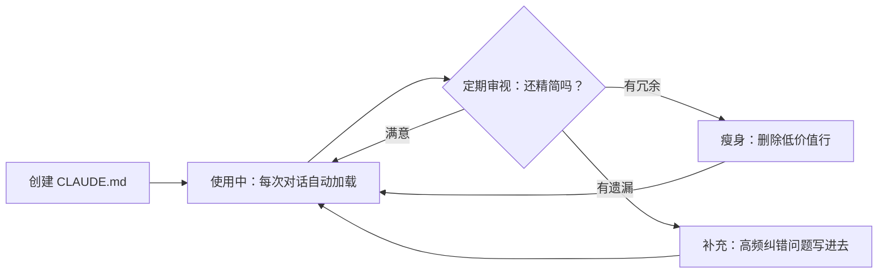

> [!ABSTRACT] 快速概览
> CLAUDE.md 写好之后能干什么？本文档列举八个典型使用场景，覆盖笔记创建、复习提问、跨领域串联、批量整理、模拟面试、路线规划、索引更新和辅助写作。

---

## 核心认知

CLAUDE.md 不是写给你读的——是写给 Claude 读的。它的作用是**让 Claude 每一次对话都提前知道你的 vault 规矩**，不用你每次重复解释。

| 没有 CLAUDE.md | 有了 CLAUDE.md |
|----------------|---------------|
| 不知道你是谁 | 知道你叫刘方轩，4 年 Python 后端 |
| 不知道 vault 结构 | 知道 15 个主题文件夹 + 索引入口 |
| 不知道你的笔记格式 | 知道两套 frontmatter + Wiki-link + Mermaid |
| 每次都要探索或等你解释 | 上来就知道规矩，直接干活 |

---

## 八个使用场景

### 场景 1：创建新笔记 🆕

**典型指令：**
> "帮我把今天学的 LRU 缓存整理成笔记"

**没有 CLAUDE.md 时**：Claude 可能把文件写到根目录，用错 frontmatter 格式，不知道要链接到哪个索引。

**有了之后**：
- 自动放到 `算法/基础概念/`
- 用学习笔记 frontmatter（`title` + `created` + `tags` + `description`）
- 标题保持 `*基础与通用解题框架` 命名风格
- 在 [[算法/基础概念/算法总览索引]] 的表格里追加一行

### 场景 2：基于已有笔记复习 📖

**典型指令：**
> "动态规划的状压 DP 我还不太懂，结合我的笔记讲讲"
> "Redis 的持久化部分帮我画个图总结"

**没有 CLAUDE.md 时**：不知道你有没有相关笔记，从零讲起，可能和你已有笔记冲突。

**有了之后**：
- 先找到你的相关笔记（如 [[动态规划基础与通用解题框架]]）
- 基于你已有的理解水平补充
- 不重复你笔记里已经写清楚的内容
- 用 [[Wiki-link]] 串联已有知识

### 场景 3：跨领域串联 🔗

**典型指令：**
> "全栈项目里，Redis 缓存那部分帮我完善一下"

**没有 CLAUDE.md 时**：不知道你同时有 `全栈项目/` 和 `Redis/` 两个文件夹，可能重写一份 Redis 内容。

**有了之后**：
- 同时读 [[全栈项目：架构设计与技术选型]] + [[Redis/Redis 总览索引]]
- 用已有 Redis 笔记的知识来补充全栈项目
- 用 Wiki-link 串联而非复制——保持单一信息源

### 场景 4：批量整理 🗂️

**典型指令：**
> "算法文件夹太乱了，帮我重新组织一下"
> "帮我把散落的 LeetCode 题解归到 LeetCode 文件夹"

**没有 CLAUDE.md 时**：不知道什么叫"不乱"——你的组织标准是什么？

**有了之后**：
- 知道按"基础概念 / LeetCode / 牛客网"三级分类
- 知道每个子模块需要总览索引
- 保持 `*基础与通用解题框架` 命名约定
- 不破坏已有的 Mermaid 学习路线图

### 场景 5：模拟面试 🎤

**典型指令：**
> "模拟一次 Redis 面试，用中文问，追问到我答不上来为止"
> "算法面试模拟，先从数组开始"

**没有 CLAUDE.md 时**：通用 Redis 八股文，和你的实际经验脱节。

**有了之后**：
- 先读 [[Redis 面试高频 20 问]]，基于你的笔记内容提问
- 追问你笔记里标记的薄弱点
- 回答完后帮你对比笔记里的标准答案框架
- 知道你是刘方轩、4 年后端，提问时匹配你的经验层级

### 场景 6：学习路线规划 🗺️

**典型指令：**
> "我想两周内搞定动态规划，根据我的情况给个计划"
> "算法学习到哪一步了？接下来该学什么？"

**没有 CLAUDE.md 时**：通用 DP 学习计划，可能建议你已经学过的内容。

**有了之后**：
- 读 [[算法总览索引]] 里的 Mermaid 学习路线图
- 知道你在哪个阶段、哪些学过了、哪些还没碰
- 给衔接性计划，从你下一个阶段开始，不是从零开始
- 引用你的已有笔记作为学习材料

### 场景 7：更新索引 📋

**典型指令：**
> "我刚写了一篇新的 LeetCode 题解，帮我把索引更新一下"
> "TensorFlow 总览索引好像漏了一篇，检查一下"

**没有 CLAUDE.md 时**：不知道"索引"是什么格式，不知道表格的列结构。

**有了之后**：
- 找到对应领域的 `*总览索引.md`
- 按 `| # | 笔记 | 核心内容 |` 的列结构追加新行
- 如果有学时分列，保持一致
- 同时检查 Mermaid 流程图是否需要更新

### 场景 8：辅助写作 ✍️

**典型指令：**
> "帮我润色一下面试自我介绍"
> "帮我在打招呼消息里加上项目经验的亮点"

**没有 CLAUDE.md 时**：不知道你的背景，编造内容。

**有了之后**：
- 读 [[面试自我介绍]] 或 [[线上打招呼]]
- 基于你的实际经历润色，不编造
- 知道你是 Python 后端方向，润色时强化相关亮点
- 保持和你已有的语气风格一致

---

## 如何验证 CLAUDE.md 已生效？

在 Claude Code 或 Claudian 中输入：

```
/memory
```

会显示当前加载的所有记忆层级和来源。你应该能看到：

- 项目级 CLAUDE.md（你的 vault 根目录那个）
- 如果配置了用户级，也会显示

---

## CLAUDE.md 的生命周期



### 维护触发信号

| 信号 | 该做什么 |
|------|---------|
| 某件事每次都要纠正 Claude | 加入 CLAUDE.md |
| CLAUDE.md 超过 100 行 | 考虑瘦身 / 拆分条件规则 |
| Claude 开始忽略某些指令 | 可能是稀释效应，精简内容 |
| 某个规则三个月没触发过 | 考虑删除 |

### 快捷命令

- `/memory edit` — 编辑项目级 CLAUDE.md
- `/memory edit user` — 编辑用户级记忆
- `/memory edit local` — 编辑本地记忆（`CLAUDE.local.md`）

也可以用自然语言让 Claude 帮你更新：
> "记住：以后创建算法笔记时都要加 `算法` tag" → Claude 会帮你更新 CLAUDE.md

---

## 进阶：什么时候该拆分？

当前 CLAUDE.md 约 60 行，远未到 cache 上限。如果将来膨胀到 150+ 行：

1. **条件规则**：把 `算法/` 特有规范移到 `.claude/rules/algorithm.md`，设置 `paths: ["算法/**"]`
2. **本地记忆**：个人偏好放 `CLAUDE.local.md`（记得 `.gitignore`）
3. **渐进式披露**：详细规范放在各 `*总览索引.md` 里，CLAUDE.md 只放指针

详见 [[Claude的使用/CLAUDE.md 的期望值决策框架]] 中的稀释效应讨论。

---

## 相关笔记

- [[CLAUDE.md]] — 你当前的 vault 级 CLAUDE.md 本体
- [[Claude的使用/CLAUDE.md 的期望值决策框架]] — 形式化决策框架 + 三个补丁
- [[Claude的使用/02｜过目不忘：Claude Code 记忆系统与 CLAUDE.md]] — 极客时间原文
- [[如何在 Windows 启动 claude]] — 在 Windows 上启动 Claude 的步骤
- [claude-hud](https://github.com/jarrodwatts/claude-hud) — Claude Code HUD 插件，提供可视化面板增强交互体验
- [[Claude的使用/高级 Prompting 技巧：让 Claude 产出更好代码]] — 三个 Prompting 招数，和 CLAUDE.md 互补
