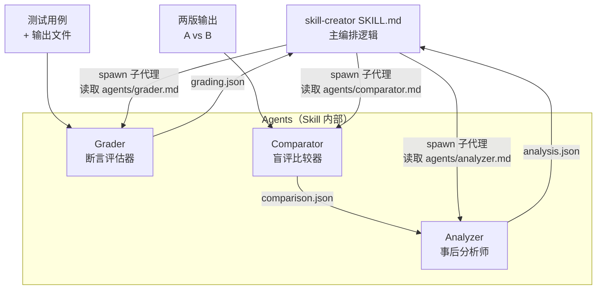
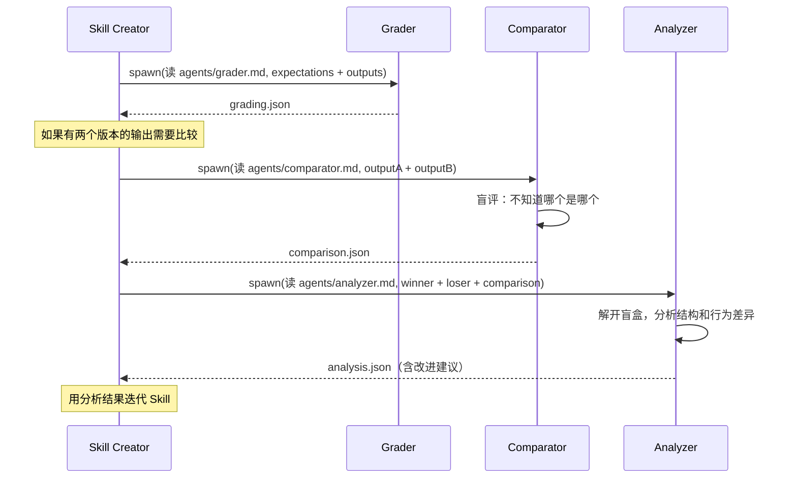

> [!ABSTRACT] 快速概览
> 分析 Anthropic 官方 [skill-creator](https://github.com/anthropics/skills/tree/main/skills/skill-creator) 中在 Skill 内部定义 Agent 的设计模式。与 Claude 层面的全局 SubAgent 不同，这种模式将 Agent 作为 Skill 的私有资源，随 Skill 打包分发，形成「Skill 即微型组织」的架构风格。

---

## 背景

[[Claude的使用/13｜纲举目张：Skills 架构定位与高级能力|第 13 讲]] 总结了 Skill 设计的四种模式：模板驱动、脚本增强、知识分层、工具隔离。而在 Anthropic 官方的 skill-creator 中，发现了一种新的模式——**将 Agent 定义内嵌在 Skill 内部**。

```
skill-creator/
├── SKILL.md              # 主编排逻辑
├── agents/               # ← Skill 私有的 Agent 定义
│   ├── analyzer.md       # 事后分析：为什么赢家赢了
│   ├── comparator.md     # 盲评比较：不看来源只判质量
│   └── grader.md         # 断言评估：检查输出是否满足期望
├── references/
│   └── schemas.md        # JSON Schema 定义
├── scripts/              # 确定性执行脚本
└── assets/               # 模板资源
```

### 关键信号：Agent 是 Skill 资源，不是系统配置

```markdown
<!-- SKILL.md 中对 Agent 的引用方式 -->
## Reference files
The agents/ directory contains instructions for specialized subagents.
Read them when you need to spawn the relevant subagent.

- `agents/grader.md` — How to evaluate assertions against outputs
- `agents/comparator.md` — How to do blind A/B comparison
- `agents/analyzer.md` — How to analyze why one version beat another
```

Agent 不是定义在 `.claude/settings.json` 或全局 CLAUDE.md 里，而是**跟着 Skill 走**——安装 Skill 的同时，就获得了它内部的 Agent 团队。

---

## 三个 Agent 的职责分工



### Grader — 断言评估器

**职责**：逐条检查输出是否满足预定义的期望（assertions）。

**输入**：
- `expectations` — 期望列表（如 "输出包含姓名 John Smith"）
- `transcript_path` — 执行过程记录
- `outputs_dir` — 输出文件目录

**核心过程**：
1. 读 transcript + 输出文件
2. 逐条检查期望 → PASS / FAIL
3. **不只打分，还批判 eval 本身**——如果某个断言太弱（如"文件存在"但内容错误也能通过），要指出
4. 提取并验证输出中的隐式声明（claims extraction）

**输出**：`grading.json`

```json
{
  "expectations": [
    {
      "text": "输出包含姓名 'John Smith'",
      "passed": true,
      "evidence": "Transcript Step 3: 'Extracted names: John Smith'"
    }
  ],
  "summary": {"passed": 2, "failed": 1, "total": 3, "pass_rate": 0.67},
  "eval_feedback": {
    "suggestions": [
      {"assertion": "...", "reason": "仅检查文件名存在但不检查内容——建议增加内容验证"}
    ]
  }
}
```

**设计亮点**：Grader 不是 blindly 执行断言——它对 eval 质量做元评估（"这个断言是否真的在测有意义的东西？"）。这是**评估体系的自我质量保证**。

### Comparator — 盲评比较器

**职责**：在不知道哪个 Skill 产生哪个输出的前提下，判断哪个输出更好。

**核心约束**：`Stay blind — DO NOT try to infer which skill produced which output. Judge purely on output quality.`

**输入**：
- `output_a_path` / `output_b_path` — 两份输出（标签为 A/B）
- `eval_prompt` — 原始任务描述
- `expectations` — 可选的期望列表

**核心过程**：
1. 读取两份输出
2. 根据任务生成评分表（Rubric）：Content（正确性、完整性、准确性）+ Structure（组织、格式、可用性）
3. 对 A 和 B 分别打分（1-5 每项）
4. **可决策**：必须有 winner，平局极少
5. 用期望做辅助证据，不主导判断

**输出**：`comparison.json`

```json
{
  "winner": "A",
  "reasoning": "Output A provides a complete solution with proper formatting. Output B is missing the date field.",
  "rubric": {
    "A": {"content_score": 4.7, "structure_score": 4.3, "overall_score": 9.0},
    "B": {"content_score": 2.7, "structure_score": 2.7, "overall_score": 5.4}
  }
}
```

**设计亮点**：盲评（blind comparison）消除偏见——Comparator 不知道哪个是新版本、哪个是旧版本，杜绝「新版本写的一定更好」的倾向。

### Analyzer — 事后分析师

**职责**：在 Comparator 选出赢家后，**解开盲盒**，解释为什么赢家赢了，并给输家提改进建议。

**两种模式**：

| 模式 | 触发场景 | 目标 |
|------|----------|------|
| **Pairwise 分析** | Comparator 判定完 A/B | 解释赢家为什么赢 + 给输家提改进建议 |
| **Benchmark 分析** | 批量 benchmark 跑完 | 发现聚合指标掩盖的模式和异常 |

**输入（Pairwise 模式）**：
- `winner`: "A" 或 "B"
- `winner_skill_path` / `loser_skill_path` — 两版 Skill 源码
- `winner_transcript_path` / `loser_transcript_path` — 执行过程
- `comparison_result_path` — Comparator 的输出

**核心过程**（Pairwise）：
1. 读 Comparator 的判断结果
2. 读两版 Skill 的 SKILL.md → 找**结构差异**
3. 读两版执行 transcript → 找**行为差异**
4. 评估**指令遵循度**（instruction following score 1-10）
5. 识别赢家优势 + 输家弱点（具体引用原文）
6. 生成**可操作的改进建议**（按优先级排序）

**建议分类**：

| 类别 | 说明 |
|------|------|
| `instructions` | 修改 Skill 的指令措辞 |
| `tools` | 添加/修改脚本和模板 |
| `examples` | 补充输入输出示例 |
| `error_handling` | 错误处理和回退逻辑 |
| `structure` | 重组 Skill 内容结构 |
| `references` | 补充外部文档或资源 |

**输出**：

```json
{
  "comparison_summary": {"winner": "A", "winner_skill": "...", "loser_skill": "..."},
  "winner_strengths": [
    "Clear step-by-step instructions for handling multi-page documents",
    "Included validation script that caught formatting errors"
  ],
  "loser_weaknesses": [
    "Vague instruction 'process the document appropriately' led to inconsistent behavior",
    "No script for validation, agent had to improvise and made errors"
  ],
  "instruction_following": {"winner": {"score": 9}, "loser": {"score": 6}},
  "improvement_suggestions": [
    {
      "priority": "high",
      "category": "instructions",
      "suggestion": "Replace 'process the document appropriately' with explicit 3-step process",
      "expected_impact": "Would eliminate ambiguity that caused inconsistent behavior"
    }
  ],
  "transcript_insights": {
    "winner_execution_pattern": "Read skill → Followed 5-step process → Used validation → Fixed issues → Output",
    "loser_execution_pattern": "Read skill → Unclear approach → Tried 3 methods → No validation → Output had errors"
  }
}
```

**设计亮点**：Analyzer 不是笼统地说"写得更好"，而是**引用 Skill 原文和 transcript 原文**，逐条给出可操作的改进建议。这相当于把 Skill 迭代从「凭感觉改」变成了「数据驱动的优化」。

---

## 三 Agent 协作流水线



关键设计原则：

1. **每个 Agent 只做一件事**：Grader 只负责断言检查，Comparator 只负责盲评比优，Analyzer 只负责解释"为什么"
2. **Agent 之间通过结构化 JSON 传递信息**：不共享内存，通过文件解耦
3. **先盲评再分析**：Comparator 不知道来源 → 消除偏见 → Analyzer 再揭盲
4. **必须引用证据**：每个 Agent 的结论都要有具体引用，杜绝模糊判断

---

## 与 Claude 层面 SubAgent 的本质区别

| 维度 | Skill 内嵌 Agent | Claude 层面 SubAgent |
|------|------------------|---------------------|
| **定义位置** | `skills/<name>/agents/` | `.claude/settings.json` 或 CLAUDE.md |
| **作用域** | 仅 Skill 内部使用 | 全局可用 |
| **可移植性** | 随 Skill 打包分发 | 绑定项目/用户配置 |
| **触发方式** | Skill 的 SKILL.md 编排 | 主对话直接 spawn 或 Hook 触发 |
| **耦合度** | 与 Skill 高耦合（Agent 定义引用 Skill 内的资源路径） | 与 Skill 低耦合（通用 Agent，加载不同 Skill） |
| **知识边界** | 领域专用（如 "分析 PDF Skill 的输出质量"） | 通用（如 "代码审查 Agent"） |
| **类比** | 部门内部的 QA 团队 | 公司级的独立审计部门 |

**简单判断**：
- 如果 Agent 的职责是「提升这个 Skill 自己的质量」→ Skill 内嵌
- 如果 Agent 的职责是「跨 Skill 做通用任务」→ Claude 层面 SubAgent

---

## 设计模式的五个核心原则

从 skill-creator 的三个 Agent 中提炼出的普适原则：

### 1. Agent as Resource（Agent 是 Skill 的资产）

```
skills/my-skill/
├── SKILL.md          # "读 agents/reviewer.md，spawn 审查子代理"
├── agents/           # ← Agent 定义与 scripts/ templates/ 同级
│   ├── reviewer.md
│   └── fixer.md
├── scripts/
└── templates/
```

Agent 定义和其他资源（脚本、模板、参考文档）一样，是 Skill 的**可打包资产**。安装 `.skill` 文件时，Agent 定义一起被安装。

### 2. Read-then-Spawn（先读后启动）

SKILL.md 不是直接启动 Agent，而是先引用 agent 文件：

```markdown
## 审查流程
1. 读取 `agents/reviewer.md` 了解审查 Agent 的职责和流程
2. 按 reviewer.md 中的 input 格式准备上下文
3. spawn 子代理执行审查
```

这样做的好处：Agent 的 prompt 可以很长（analyzer.md 有 300+ 行），不会污染 SKILL.md 的主上下文。

### 3. Structured Contract（结构化契约）

每个 Agent 有明确的：

| 契约要素 | 示例 |
|----------|------|
| **Role** | "You are a blind comparator..." |
| **Inputs** | `output_a_path`, `output_b_path`, `eval_prompt` |
| **Process** | Step 1 → Step 2 → ... → Step N |
| **Output Format** | 精确的 JSON Schema |
| **Guidelines** | 行为约束和优先级 |

这保证了 Agent 的行为可预测——同样的输入 → 同样结构的输出。

### 4. Evidence-Based（证据驱动）

```markdown
## Guidelines
- **Be specific**: Quote from skills and transcripts, don't just say "instructions were unclear"
- **Cite the evidence**: Quote the specific text that supports your verdict
- **Be objective**: Base verdicts on evidence, not assumptions
```

所有三个 Agent 都被要求**引用原文**作为判断依据。这杜绝了 AI 自由发挥导致的质量不稳定。

### 5. Pipeline Isolation（流水线隔离）

```
Grader     →  grading.json
Comparator →  comparison.json  
Analyzer   →  analysis.json
```

每个 Agent 通过文件传递结果，不共享内存。好处：
- 单个 Agent 失败不影响其他 Agent
- 中间结果可被人审查（用户可以直接看 `grading.json`）
- 可重跑单个环节而不重跑整个流水线

---

## 在你的三层架构中如何应用

回顾 [[Claude的使用/跨系统架构知识组织：三层方案|跨系统架构三层方案]]，CrossSystemImpact SubAgent 目前是定义在 CLAUDE.md 的全局 Agent。可以将其改造为 Skill 内嵌 Agent：

```
.claude/skills/cross-system-impact/
├── SKILL.md                # 主编排
├── agents/                 # ← Skill 内嵌的 Agent 团队
│   ├── system-matcher.md   # 匹配需求涉及哪些子系统
│   ├── impact-scorer.md    # 逐系统标注变更级别
│   └── report-writer.md    # 按模板生成影响分析报告
├── templates/
│   └── impact_report.md
└── scripts/
    └── dependency_graph.py
```

**改造前（全局 SubAgent）**：
```yaml
# CLAUDE.md
cross-system-analyzer:
  prompt: "你是系统架构分析专家..."
  skills: [cross-system-impact, product-domain, ...]
```

**改造后（Skill 内嵌 Agent）**：
```markdown
<!-- SKILL.md -->
## 分析流程
### Step 1: 识别涉及的系统
读取 `agents/system-matcher.md`，spawn 子代理，输入需求描述 → 返回匹配的系统列表

### Step 2: 标注变更级别  
读取 `agents/impact-scorer.md`，spawn 子代理，输入系统列表 + 领域 Skill 内容 → 返回变更级别矩阵

### Step 3: 生成报告
读取 `agents/report-writer.md`，spawn 子代理，输入变更矩阵 → 按 `templates/impact_report.md` 输出
```

**收益**：
- `cross-system-impact` Skill 变成独立可安装包（无论哪个项目、哪个团队，装上就能用）
- 每个内部 Agent 职责更单一，prompt 更聚焦
- 中间结果可审查（system match 结果、impact score 结果）

---

## 总结：第五种设计模式

在第 13 讲的四种模式之上，补充第五种：

| 模式 | 核心思想 | 解决的问题 | 适用信号 |
|------|----------|------------|----------|
| 模板驱动 | 模板约束输出结构 | 输出不稳定 | 需要格式一致性的场景 |
| 脚本增强 | 确定性计算交给脚本 | 推理结果不稳定 | 有公式/正则/数据转换 |
| 知识分层 | 按频率组织知识 | 上下文膨胀 | SKILL.md > 500 行 |
| 工具隔离 | allowed-tools 限制能力 | 越权风险 | 需要安全/职责边界 |
| **Agent 内嵌** | **Skill 定义自己的 Agent 团队** | **单 Skill 不够，需要内部多角色协作** | **Skill 内部有多个独立判断/评估/分析步骤** |

**判断何时使用 Agent 内嵌模式**：

```
Skill 内部需要多个独立角色吗？
├── 是 → Agent 内嵌
│   ├── 角色 1：独立判断 → Comparator（盲评）
│   ├── 角色 2：独立评估 → Grader（断言检查）
│   └── 角色 3：独立分析 → Analyzer（根因分析）
└── 否 → 保持单一 Skill 结构
```

**核心价值**：让 Skill 从「一份指令文档」升级为「一个微型组织」——有自己的 SOP（SKILL.md）、有自己的工具箱（scripts/）、有自己的 QA 团队（agents/）、有自己的模板（templates/）。**Skill 即组织**。

---

## 相关笔记

- [[Claude的使用/13｜纲举目张：Skills 架构定位与高级能力]] — 前四种设计模式
- [[Claude的使用/12｜珠联璧合：Skills 与 SubAgent 配合实战]] — SubAgent 编排基础
- [[Claude的使用/跨系统架构知识组织：三层方案]] — Agent 内嵌模式可应用的真实场景
