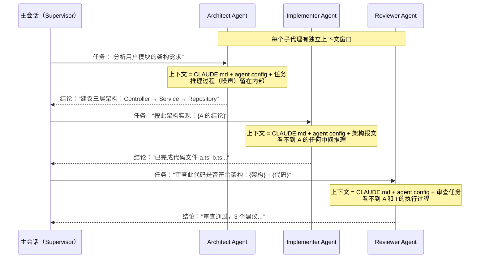
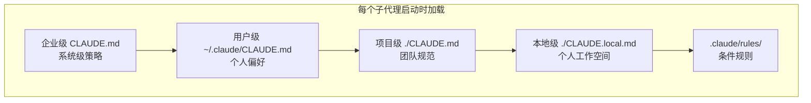
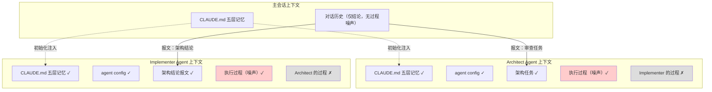

> [!ABSTRACT] 核心问题
> 子代理之间的上下文是完全隔离的吗？信息如何从 Architect → Implementer → Reviewer 流转？每个子代理都继承 CLAUDE.md 吗？如果有冲突，谁优先？

---

## 一句话结论

**子代理共享记忆基座（CLAUDE.md 体系），但执行上下文完全隔离。主会话是唯一的信息总线，以"报文"方式在子代理间传递结论。**

---

## 三个核心问题的拆解

### Q1：子代理之间上下文完全隔离吗？

**每个子代理拥有独立的上下文窗口**——这是第三讲反复强调的核心机制：

> 子代理天然拥有一个独立的上下文窗口。不是因为"聪明"，不是因为"更强"，而是因为它是 Claude Code 里唯一一个，结构上允许"执行完即丢弃"的东西。

"独立"的具体含义：

| 维度 | 子代理 A（Architect） | 子代理 B（Implementer） |
|------|----------------------|------------------------|
| CLAUDE.md 记忆体系 | ✅ 加载 | ✅ 加载 |
| Agent config（岗位说明书） | ✅ 加载自己的 | ✅ 加载自己的 |
| 主会话传递的任务 | ✅ 架构设计任务 | ✅ 实现任务 + 架构结论 |
| 自己的执行过程（推理、grep 等） | ✅ 内部可见 | ❌ 完全不可见 |
| 另一个子代理的执行过程 | ❌ 完全不可见 | ❌ 完全不可见 |

**结论**：记忆基座共享，执行过程隔离。每个子代理只看到"该看到的东西"。

---

### Q2：Architect → Implementer → Reviewer 的信息流是怎样的？

**主会话是唯一的信息总线**，这由两条架构约束决定：

1. 第三讲：**子代理不能再嵌套调用子代理**
2. 第三讲：**所有编排必须由主对话完成**

实际运行模型：



**关键洞察**：主会话只持有结论，不承载过程。这正是第三讲说的：

> 让 Claude 记得更少，但记得对。

用你的比喻：**不是共享上下文，而是主会话把结论像"报文"一样传递给下一个子代理。**

---

### Q3：CLAUDE.md 的继承与优先级

#### 子代理继承 CLAUDE.md 吗？

**是的，五层记忆体系对每个子代理都生效：**



#### 子代理可以有自己的"CLAUDE.md"吗？

**子代理的配置文件（`.claude/agents/xxx.md`）就是它的"岗位说明书"**，相当于专属的 CLAUDE.md：

```markdown
---
name: code-reviewer
description: Review code for security issues...
tools: Read, Grep, Glob
model: sonnet
---

你是一个代码审查专家。当被调用时：...
```

它**不是替代** CLAUDE.md，而是**叠加在 CLAUDE.md 之上的额外指令层**。

#### 优先级：到底听谁的？

```
优先级从高到低（后加载 > 先加载，具体 > 通用）：

1. 子代理自己的 agent config（.claude/agents/xxx.md）
   └─ 最具体，角色专属，最后加载

2. 主会话传递的任务描述
   └─ 本次调用特有指令

3. 项目级 CLAUDE.md + CLAUDE.local.md
   └─ 项目规范

4. 用户级 ~/.claude/CLAUDE.md
   └─ 个人偏好

5. 企业级 CLAUDE.md
   └─ 最通用，最先加载，最容易被覆盖
```

**冲突示例**：

| 场景 | 项目 CLAUDE.md 说 | Agent config 说 | 实际行为 |
|------|-------------------|-----------------|---------|
| 语言 | "用中文回复" | "所有审查意见用英文" | **英文**（agent config 更具体） |
| 工具 | 未限制 | `tools: Read, Grep, Glob` | **只读**（agent config 有约束力） |
| 风格 | "缩进 4 空格" | 未提及 | **4 空格**（继承项目规范） |

> [!important] 最小权限原则
> Agent config 的 `tools` 字段是**物理约束**而非行为约定——没有 Write 就无法写文件，和 prompt 里的"请不要修改"有本质区别。

---

## 一图总结全貌



---

## 工程启示

1. **CLAUDE.md 瘦身是全局收益**：因为每个子代理都会加载，越精简越省 token（子代理数量 × CLAUDE.md 大小 = 固定开销）
2. **Agent config 要写清楚"做什么"和"不做什么"**：它是子代理的专属约束层，不要依赖 CLAUDE.md 来约束子代理行为
3. **主会话只记决策信息**：这是整个架构设计的初衷——"不是为了让 Claude 做得更多，而是为了让 Claude 记得更少，但记得对"
4. **冲突不靠运气**：如果 CLAUDE.md 和 agent config 有冲突，agent config 胜出——不要写出矛盾配置，那是给自己埋坑
