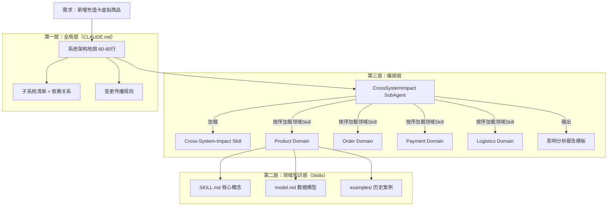
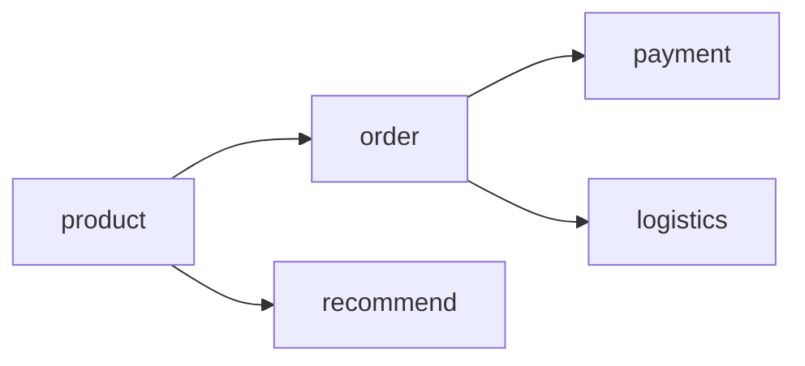
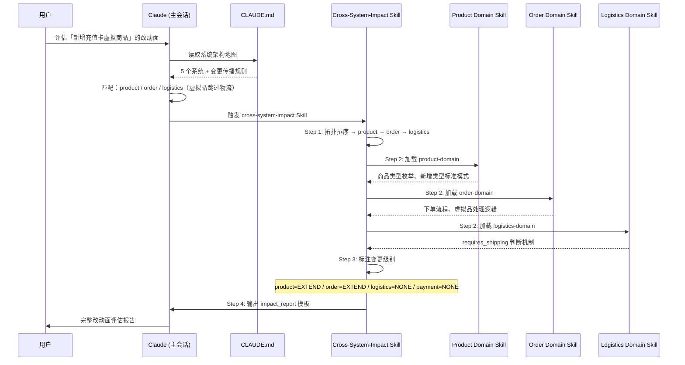

> [!ABSTRACT] 快速概览
> 针对多代码库的微服务场景（如电商），设计三层知识架构让 AI 能精准评估跨系统需求改动面：CLAUDE.md 常驻全局架构地图 → Skills 按需加载领域知识 → SubAgent 串联影响分析。让 AI 从"不知道有哪些系统"变成"能输出完整改动面评估报告"。

---

## 问题场景

```
垂直电商，多个独立代码库：
├── product-svc    # 商品模型、类目、SKU
├── order-svc      # 下单、状态机、拆单
├── payment-svc    # 支付渠道、退款、对账
├── logistics-svc  # 发货、追踪、签收
└── recommend-svc  # 召回、排序、特征工程

需求 = "新增充值卡虚拟商品"
→ 涉及 product + order + logistics
→ AI 答："我不清楚各系统职责和改动面"
```

**根因**：知识没有按正确的方式进入 AI 上下文——它不知道有哪些系统、每个系统干什么、改一个会影响谁。

---

## 核心设计原则

> 来自 [[03-AI工具/Claude的使用/13｜纲举目张：Skills 架构定位与高级能力|第 13 讲]] 的核心结论：
> • **Skills 是按需加载的专业知识**，不是常驻背景
> • **CLAUDE.md 是通识背景**，每次对话都该知道
> • **知识组织决定 AI 的行为边界**——不是模型能力问题，是知识投放问题

| 知识类型 | 位置 | 加载时机 | 职责 |
|----------|------|----------|------|
| 全局架构地图 | CLAUDE.md | 每次对话 | 知道"有哪些系统" |
| 领域业务知识 | Skill | 涉及该领域时 | 知道"这个系统怎么改" |
| 变更传播规则 | Skill | 做改动评估时 | 知道"改了 A 会影响 B" |
| 影响分析编排 | SubAgent | 跨系统需求时 | 串联前两层，产出报告 |

---

## 三层架构全景图



---

## 第一层：全局架构地图（CLAUDE.md，常驻 ~80 行）

**目标**：AI 在任何对话中都能回答"有哪些系统、谁依赖谁、变更会影响谁"。

**位置**：项目根目录 `CLAUDE.md` 中的一个独立章节。

### 模板

````markdown
## 系统架构地图

### 子系统清单

| 系统 | 代码库 | 核心职责 | 关键接口 |
|------|--------|----------|----------|
| product-svc | github.com/acme/product | 商品模型、类目体系、SKU、库存 | gRPC: GetProduct, BatchGetProduct |
| order-svc | github.com/acme/order | 下单、订单状态机、拆单合单 | gRPC: CreateOrder, GetOrder |
| payment-svc | github.com/acme/payment | 支付渠道适配、退款、对账 | gRPC: Pay, Refund |
| logistics-svc | github.com/acme/logistics | 发货、物流追踪、签收 | gRPC: Ship, Track |
| recommend-svc | github.com/acme/recommend | 召回、排序、冷启动 | HTTP: /recommend, /similar |

### 系统依赖关系



### 变更传播规则

- 新增商品类型（如虚拟商品）→ product + order + logistics（虚拟品跳过物流）
- 新增支付渠道 → payment（独立变更，不影响其他系统）
- 商品模型加字段 → product + recommend（需更新特征工程）
- 拆单规则变更 → order（内部逻辑，对上下游透明）
````

### 设计要点

- **控制在 80 行以内**——这是常驻 token，多一行就是每次对话多烧一份
- **只写"是什么"，不写"怎么做"**——怎么做由领域 Skill 负责
- **变更传播规则是核心**——这是 AI 判断改动面的第一手线索
- 随着系统演进持续更新——新增子系统、新增规则

---

## 第二层：领域知识 Skill（每个子系统一份，按需加载）

**目标**：AI 在涉及该子系统时，能回答"这个系统的模型长什么样、怎么改"。

**位置**：`.claude/skills/{domain-name}/`，每个子系统一个 Skill。

### 目录结构

```
.claude/skills/product-domain/
├── SKILL.md              # 核心概念 + 触发条件（~200 行）
├── model.md              # 数据模型详解（按需）
├── interfaces.md         # 接口契约（按需）
└── examples/
    ├── physical_goods.md # 实物商品案例
    └── virtual_goods.md  # 虚拟商品案例（首次实现后沉淀）
```

### SKILL.md 模板

````markdown
---
name: product-domain
description: 商品子系统领域知识：商品模型、类目体系、库存模型、商品类型扩展模式
allowed-tools: [Read, Grep, Glob]
triggers:
  - "商品" / "SKU" / "类目" / "product" 出现在需求中
  - "商品类型" / "库存模型" 变更
  - 需求涉及 product-svc 代码库
---

## 核心概念

### 商品类型枚举

| 类型 | 库存模型 | 物流要求 | 支付模型 | 售后规则 |
|------|----------|----------|----------|----------|
| PHYSICAL | 有库存，可缺货 | 需要发货 | 正常支付 | 7天无理由 |
| VIRTUAL_RECHARGE | 无库存，无限量 | 无需物流 | 正常支付 | 不支持退款 |
| DIGITAL_DOWNLOAD | 无库存 | 无需物流 | 正常支付 | 不支持退款 |

### 商品模型核心字段

```protobuf
message Product {
  string product_id = 1;
  ProductType type = 2;        // 新增类型时扩展此枚举
  string title = 3;
  Category category = 4;
  repeated SKU skus = 5;
  bool requires_shipping = 6;  // 虚拟品为 false
  // ...
}
```

### 新增商品类型的变更模式

历史上新增商品类型时的标准改动清单：

1. proto 枚举 `ProductType` 加值 → 影响所有消费者的 switch-case
2. 库存服务需判断 `type` 跳过库存扣减
3. 发货服务需判断 `requires_shipping` 跳过物流创建
4. 支付服务通常不受影响（除非差异定价）

## 常见改动模式

### 模式 A：新增商品类型

- 改动范围：本系统 + 下单系统 + 物流系统
- 参考案例：examples/virtual_goods.md
- 风险：下游 switch-case 未覆盖新枚举值 → 运行时 panic

### 模式 B：商品字段扩展

- 改动范围：本系统 + 推荐系统（特征工程需感知新字段）
- 风险：旧数据迁移、索引重建

## 边界

- 不负责：支付流程、物流流程的具体实现
- 当需求涉及 3+ 子系统联动时 → 触发 `cross-system-impact` Skill
````

### 每个子系统的 Skill 清单

| Skill 名 | 文件路径 | 核心内容 |
|-----------|----------|----------|
| product-domain | `.claude/skills/product-domain/` | 商品模型、类型枚举、类目体系 |
| order-domain | `.claude/skills/order-domain/` | 订单状态机、拆单规则、下单流程 |
| payment-domain | `.claude/skills/payment-domain/` | 支付渠道、退款流程、对账模型 |
| logistics-domain | `.claude/skills/logistics-domain/` | 发货流程、物流状态、签收模型 |
| recommend-domain | `.claude/skills/recommend-domain/` | 召回策略、排序模型、特征工程 |

---

## 第三层：跨系统影响分析器（Skill + SubAgent）

**目标**：当需求涉及多系统时，AI 能串联领域知识，输出结构化改动面评估报告。

### 设计模式

该 Skill 组合了第 13 讲的四种模式：

```
cross-system-impact = 模板驱动 + 脚本增强 + 知识分层 + 工具隔离
├── SKILL.md              ← 知识分层（分析流程 ~300 行）
├── templates/
│   └── impact_report.md  ← 模板驱动（标准化输出）
├── scripts/
│   └── dependency_graph.py ← 脚本增强（确定性依赖分析）
└── allowed-tools         ← 工具隔离（只读 + 脚本 + Skill 调用）
```

### 目录结构

```
.claude/skills/cross-system-impact/
├── SKILL.md
├── templates/
│   └── impact_report.md
└── scripts/
    └── dependency_graph.py
```

### SKILL.md

````markdown
---
name: cross-system-impact
description: 跨系统需求影响分析。输入需求描述，输出各子系统改动面评估报告。
allowed-tools: [Read, Grep, Glob, Bash(python:*), Skill]
triggers:
  - 需求涉及 2+ 个子系统
  - 用户说 "影响分析" / "改动评估" / "涉及哪些系统"
  - 新增功能需要改动多个代码库
---

## 分析流程

### Step 1: 识别涉及的系统

1. 从 CLAUDE.md 的「系统架构地图」读取子系统清单和变更传播规则
2. 根据需求关键词匹配可能涉及的系统
3. 按依赖拓扑排序（上游 → 下游）

### Step 2: 按序加载领域 Skill

按依赖顺序加载对应领域 Skill，每个 Skill 只加载一次：

```
product → order → payment
                 → logistics
```

每个领域 Skill 被加载后，提取：
- 该系统的核心模型（判断是否需要改模型）
- 历史上的类似变更模式（复用既有经验）
- 与上下游的接口契约（判断是否破坏兼容性）

### Step 3: 逐系统标记变更级别

| 级别 | 含义 | 决策依据 |
|------|------|----------|
| BREAKING | 破坏性变更，下游必须同步 | proto 枚举加值 / 接口参数必填 → 可选 |
| EXTEND | 扩展性变更，下游需感知 | 新增可选字段 / 新增接口方法 |
| NONE | 无影响 | 变更在该系统内部消化，接口不变 |

### Step 4: 生成影响报告

使用 `templates/impact_report.md` 输出标准化报告。报告内容必须覆盖：

- [ ] 每个涉及系统的变更级别和原因
- [ ] 跨系统间的级联依赖关系
- [ ] 建议的改动顺序（拓扑排序）
- [ ] 风险点标注

### 使用 SubAgent 的配置

在需要跨系统分析时，创建专用 SubAgent：

```yaml
# CLAUDE.md 中配置
cross-system-analyzer:
  prompt: |
    You are a system architecture analyst. Your role:
    1. Read CLAUDE.md for the system architecture map
    2. Load relevant domain Skills based on the requirement
    3. Follow the analysis workflow in cross-system-impact Skill
    4. Output the impact report using the template
  skills:
    - cross-system-impact
    - product-domain
    - order-domain
    - payment-domain
    - logistics-domain
    - recommend-domain
  allowed-tools: [Read, Grep, Glob, Bash(python:*)]
```

## 输出要求

- ALWAYS use the template from `templates/impact_report.md`
- 每个系统必须明确标注：变更级别、变更原因、建议改动点
- 标注跨系统间的级联依赖关系
- 标注建议的改动顺序（拓扑排序）
````

### 影响分析报告模板

`templates/impact_report.md`：

```markdown
# 需求影响分析报告

**需求**: {requirement_summary}
**分析时间**: {timestamp}
**涉及系统数**: {count}
**预估复杂度**: {complexity_level}

## 改动面总览

| 系统 | 变更级别 | 级联影响 | 改动复杂度 | 建议顺序 |
|------|----------|----------|------------|----------|
{system_rows}

## 逐系统分析

### {system_name}

- **变更级别**: {level}
- **变更原因**: {reason}
- **具体改动点**:
  1. {change_point_1}
  2. {change_point_2}
- **下游影响**: {downstream_impact}
- **风险点**: {risks}
- **参考案例**: {reference_example}

## 级联依赖

```mermaid
graph LR
    {dependency_mermaid}
```

## 建议改动顺序

1. {first_system} — 原因：无上游依赖，先改
2. {second_system} — 原因：依赖第 1 步的接口变更
3. ...

## 风险清单

- [ ] {risk_1}
- [ ] {risk_2}

## 边界外

以下系统经评估不需要变更：
- {system_a}: 原因
- {system_b}: 原因
```

### 依赖图脚本（确定性分析）

`scripts/dependency_graph.py` — 对已知系统依赖关系做确定性计算，不让 AI 推理依赖关系：

```python
"""
Deterministic dependency graph analysis.
Use this instead of letting Claude reason about dependencies.
"""

DEPENDENCY_GRAPH = {
    "product-svc": {"dependencies": [], "depended_by": ["order-svc", "recommend-svc"]},
    "order-svc": {"dependencies": ["product-svc"], "depended_by": ["payment-svc", "logistics-svc"]},
    "payment-svc": {"dependencies": ["order-svc"], "depended_by": []},
    "logistics-svc": {"dependencies": ["order-svc"], "depended_by": []},
    "recommend-svc": {"dependencies": ["product-svc"], "depended_by": []},
}

def topological_sort(systems):
    """Return systems in dependency order (upstream first)."""
    # ... standard Kahn's algorithm implementation


def get_transitive_impact(changed_system):
    """Given a changed system, return all systems that may be affected."""
    # ... BFS traversal of depended_by graph


if __name__ == "__main__":
    import sys, json
    result = {
        "sorted": topological_sort(sys.argv[1:]),
        "impact_chain": {
            sys: get_transitive_impact(sys) for sys in sys.argv[1:]
        }
    }
    print(json.dumps(result, indent=2))
```

> 原则：**确定性计算交给脚本，AI 负责理解和判断**。依赖关系是图遍历，不需要 LLM 推理。

---

## 工作流演示

以「新增充值卡虚拟商品」为例，用户只需要说一句话：

```
用户：评估「新增充值卡虚拟商品」的改动面
```

AI 按以下路径自动执行：



---

## 落地路线图

### Phase 1：最低成本启动（~1 小时）

**目标**：让 AI 至少知道有哪些系统。

在项目 `CLAUDE.md` 加一段「系统架构地图」（60-80 行），包含：
- [ ] 子系统清单表格
- [ ] 简化的依赖关系图（Mermaid）
- [ ] 3-5 条关键变更传播规则

**验收**：问 AI "项目有哪些系统？"→ 能列出所有子系统。问 "改了商品模型会影响谁？"→ 能说出 order 和 recommend。

### Phase 2：核心领域 Skill（~半天）

**目标**：让 AI 理解核心子系统的业务知识。

- [ ] 商品子系统 → `product-domain` Skill
- [ ] 支付子系统 → `payment-domain` Skill
- [ ] 选择一个真实的、已完成的跨系统需求，沉淀为 example 案例

**验收**：问 AI "新增虚拟商品类型怎么改？"→ 能给出 product-svc 内部的具体改动点，能引用历史类似案例。

### Phase 3：影响分析自动化（~半天）

**目标**：让 AI 能产出结构化的跨系统改动面评估。

- [ ] 创建 `cross-system-impact` Skill（含分析流程 + 报告模板）
- [ ] `dependency_graph.py` 脚本
- [ ] 配置 SubAgent 定义
- [ ] 用 2-3 个真实需求做端到端测试

**验收**：输入「新增充值卡虚拟商品」→ 输出完整的影响分析报告，覆盖所有涉及系统，标注变更级别和风险。

### Phase 4：持续演进

- [ ] 每当实现一个跨系统需求 → 把改动模式沉淀到对应领域 Skill 的 examples/
- [ ] 每当新增子系统 → 更新 CLAUDE.md 架构地图 + 新建领域 Skill
- [ ] 每当发现新的变更传播规律 → 更新 CLAUDE.md 规则 + cross-system-impact Skill

---

## 设计依据

本方案直接应用了 [[03-AI工具/Claude的使用/13｜纲举目张：Skills 架构定位与高级能力|第 13 讲]] 的核心理论：

| 理论 | 在本方案中的体现 |
|------|------------------|
| 五层架构中 Skills 的承上启下 | CLAUDE.md（常驻通识）→ Skills（按需专业知识）→ SubAgent（编排执行） |
| 三级进化：SOP → 专家系统 → 组织智能 | Phase 1 是 SOP，Phase 3 是专家系统，Phase 4 迈向组织智能 |
| 四种设计模式 | cross-system-impact Skill 组合了模板驱动 + 脚本增强 + 知识分层 + 工具隔离 |
| 渐进式披露 | 全局 80 行 → 触发加载领域 Skill → 按需 deep-dive model.md |
| 权限体系 | 分析类 Skill 只读权限，脚本白名单执行，SubAgent 上下文隔离 |

---

## 相关笔记

- [[03-AI工具/Claude的使用/13｜纲举目张：Skills 架构定位与高级能力]] — 理论基础
- [[03-AI工具/Claude的使用/12｜珠联璧合：Skills 与 SubAgent 配合实战]] — SubAgent 编排实战
- [[03-AI工具/Claude的使用/11｜循序渐进：渐进式披露架构设计]] — 知识分层策略
- [[03-AI工具/Claude的使用/project-docs Skill 设计]] — 类似的设计文档案例
