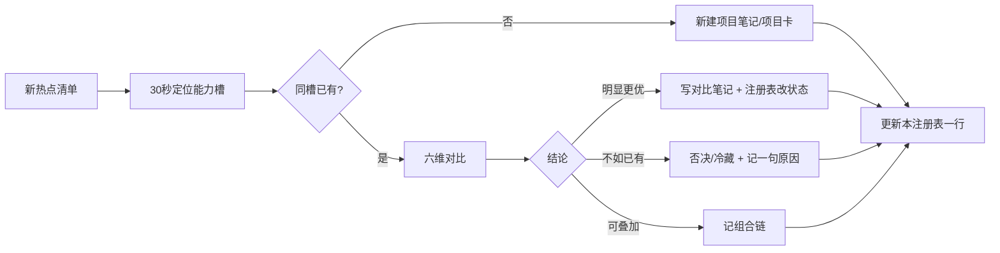

> [!tip]
> 本篇是 `04-GitHub研究` 的总入口。每周整理 GitHub 热点时，**先读本页注册表**，再决定新建笔记 / 更新对比 / 否决冷藏。

---

## 🗺️ 能力槽地图（30 秒定位）

新项目进来先问：**它卡在链路哪一格？** 同槽已有时做对比，不重复建档。

| 能力槽 | 管什么 | 已占位项目 |
|--------|--------|-----------|
| **采集 / 上游供料** | 把外部数据变成 Agent 可用素材 | MyContext · Firecrawl · pdf-inspector · huashu-chrome · ego-lite |
| **记忆 / 上下文存取** | 长期记住、组织、取回 | OpenViking · TencentDB Agent Memory · mnemosyne · ai-memory |
| **上下文压缩 / 省 token** | 传输前砍冗余，可逆 | Headroom |
| **代码理解 / 图谱** | 调用链、影响面、外科手术式上下文 | CodeGraph · archify（下游出图） |
| **Agent 运行时 / 编排** | 多 Agent 执行、通道、会话 | OpenSquilla · AgentScope · herdr · HarnessX |
| **Skills / 方法论剧本** | 身份（WHO）与流程（HOW）与评审硬约束 | agency-agents · agent-skills · mattpocock · book-to-skill · reverse-skill · i-have-adhd · ponytail（做减法） · open-code-review（评审 harness） |
| **前端设计能力** | 生成 / 质检 / 路由 | UI/UX Pro Max · Impeccable · UI Skills · Astryx |
| **金融 / ML 模型** | 量化、行情、K 线基础模型 | Kronos |
| **教育 / 学习产品** | 课程生成、苏格拉底对话 | OpenMAIC · Socratopia（在 03） |
| **落地页 / Prompt 素材** | 网站生成提示词 | MotionSites.ai（在 03） |
| **入库 / 能力路由 SOP** | 怎么管理项目与工具本身 | Table-GitHub-Capability-Router |
| **Agent 通信网络** | 跨 Agent 信息流 | EigenFlux |

> 量化交易本体工具已迁出本目录 → 见 [[量化交易工具/量化交易工具-总览索引]]。本目录只留「与 Agent / AI 工程相关」的项目。

---

## 📋 全量项目注册表

**状态机**：`候选` → `已分析` → `已实测` → `已启用` / `冷藏` / `否决`  
**匹配度**：★★★ 与栈（Python / FastAPI / React+TS / PG / Redis / TF·ML）强相关；★★ 间接；★ 弱  
**笔记完整度**：S 索引+课程/实测齐全 · A 有裁决有对照 · B 可用笔记 · C 速记

| 项目 | 能力槽 | 一句话 | 匹配 | 协议 | 平台 | 状态 | 完整度 | 入口 |
|------|--------|--------|:----:|------|------|------|:------:|------|
| **AgentScope** | 运行时/编排 | 阿里生产级多 Agent 框架（事件流/权限） | ★★★ | — | Py/Java/TS | 已分析·系统学习中 | S | [[04-GitHub研究/agentscope/AgentScope 总览索引]] |
| **OpenSquilla** | 运行时 | Python agent runtime，多通道 | ★★★ | — | Py 3.12 | **已启用** | A | [[04-GitHub研究/OpenSquilla/查看与安装更新]] |
| **Headroom** | 压缩 | 可逆压缩 60–95% token（库/代理/MCP） | ★★★ | Apache-2.0 | Py+TS / 本机 | 已分析·待实践 | A | [[04-GitHub研究/headroom/Headroom 项目笔记]] |
| **OpenViking** | 记忆存取 | `viking://` 上下文数据库，L0/L1/L2 | ★★★ | **AGPLv3** | Py / 可本地 | 已分析·待实践 | A | [[04-GitHub研究/OpenViking/OpenViking 项目笔记]] |
| **TencentDB Agent Memory** | 记忆存取 | 团队记忆中枢 + ACL 四类资产 | ★★ | MIT* | TS / 三服务 | 已分析 | A | [[04-GitHub研究/TencentDB-Agent-Memory/TencentDB Agent Memory 项目笔记]] |
| **MyContext** | 采集/供料 | 个人工档，矛盾语义裁决 | ★ | **Elastic 2.0** | 本地桌面向 | 观察·等成熟 | B | [[04-GitHub研究/Agent上下文与记忆方案对比/MyContext 项目笔记]] |
| **mnemosyne** | 记忆存取 | 零云 SQLite 记忆层，混合检索 | ★★★ | MIT | Py | 已分析 | B+ | [[04-GitHub研究/mnemosyne/mnemosyne 项目笔记]] |
| **ai-memory** | 记忆存取 | 会话编译成 Markdown wiki，跨 Agent 接力 | ★★★ | MIT | Rust；Win 需 WSL2 | 已分析 | B+ | [[04-GitHub研究/ai-memory/ai-memory 项目笔记]] |
| **CodeGraph** | 代码图谱 | 本地预索引，影响面分析 | ★★★ | MIT | Rust 内核 | 已关注·大仓库再启 | A | [[04-GitHub研究/CodeGraph/CodeGraph 项目笔记]] |
| **Impeccable** | 前端设计质检 | 59 条确定性规则 + hook | ★★★ | Apache-2.0 | Node | 已分析·待实践 | A | [[04-GitHub研究/impeccable/Impeccable 项目笔记]] |
| **UI/UX Pro Max** | 前端设计生成 | 161 规则离线生成设计系统 | ★★★ | MIT | Py 标准库 | 已分析·待实践 | A | [[04-GitHub研究/ui-ux-pro-max-skill/UI UX Pro Max 项目笔记]] |
| **UI Skills** | 前端设计路由 | 按任务挑最小技能集 | ★★ | MIT | Node | 入口试用 | B+ | [[04-GitHub研究/ui-skills/UI Skills 项目笔记]] |
| **Astryx** | 前端组件 | Meta React 19 + StyleX 组件库 | ★★★ | MIT | TS/React | 已关注·未实操 | B | [[04-GitHub研究/Astryx/Astryx 项目笔记]] |
| **book-to-skill** | Skills 工具 | 书/文档 → Agent Skill | ★★★ | — | — | 工具可用；缠论闸门已关 | A | [[04-GitHub研究/book-to-skill/book-to-skill 项目笔记]] |
| **agency-agents** | Skills·WHO | 281 人格卡，18 部门 | ★★ | MIT | Markdown | **已部署** | A | [[04-GitHub研究/agency-agents/Agency Agents 使用手册]] |
| **agent-skills (Osmani)** | Skills·HOW | 24 工程 SOP + 反合理化 + 验证门 | ★★★ | MIT | Markdown | **已部署** | A | [[04-GitHub研究/agency-agents/三大 AI Skills 项目对比分析]] |
| **mattpocock/skills** | Skills·HOW | Grilling + 领域建模 + wayfinder | ★★★ | MIT | Markdown | **已部署** | B | 同上对比笔记 |
| **i-have-adhd** | 输出风格 | ADHD 友好输出（温和版已接） | ★★ | MIT | Markdown/Py | **已落地** | B | [[04-GitHub研究/i-have-adhd/i-have-adhd 项目笔记]] |
| **reverse-skill** | Skills 路由 | 安全逆向技能包 | ★ | — | — | 架构参考·不部署 | B+ | [[04-GitHub研究/reverse-skill/reverse-skill 项目笔记]] |
| **huashu-chrome** | 浏览器采集 | 真实 Chrome 登录态 + MCP | ★★ | MIT | Win 可跑 | **可启用**（差装扩展） | A | [[04-GitHub研究/huashu-chrome/huashu-chrome 项目笔记]] |
| **ego-lite** | 浏览器运行时 | Agent 独立 Chromium + Space | ★ | — | **仅 macOS** | Windows 出局·季度盯 | A | [[04-GitHub研究/ego-lite/ego-lite 项目笔记]] |
| **Kronos** | 金融 ML | 清华 K 线基础模型 | ★★★ | MIT | Py | 研究工具·待实践 | A | [[04-GitHub研究/Kronos/Kronos 项目笔记]] |
| **HarnessX** | 训练/协同进化 | harness + GRPO 轨迹训练 | ★★ | — | Py 3.12 | Beta 观察 | B+ | [[04-GitHub研究/HarnessX/HarnessX 项目笔记]] |
| **herdr** | 终端编排 | Agent 多路复用（tmux AI 版） | ★★ | Apache-2.0 | Rust | 已关注 | B | [[04-GitHub研究/herdr/herdr 项目笔记]] |
| **OpenMAIC** | 教育编排 | 清华多 Agent 互动课堂 | ★★ | MIT | Next+LangGraph | 架构参考价值高 | A | [[04-GitHub研究/OpenMAIC/OpenMAIC 项目笔记]] |
| **EigenFlux** | Agent 通信 | 广播/信息流/交易网络 | ★ | — | Go | 已接入·无深度结论 | B | [[04-GitHub研究/EigenFlux/EigenFlux 项目笔记]] |
| **Capability-Router** | 入库 SOP | 项目卡 + 五级状态 + 薄路由 | ★★★ | MIT | Markdown | **本索引即其落地** | A | [[04-GitHub研究/GitHub入库与能力路由/Table-GitHub-Capability-Router项目笔记]] |
| **archify** | 代码理解·出图 | Agent 生成**可验证**架构/流程/时序/数据流图（自包含 HTML） | ★★★ | MIT | JS | **已实测·出图入库**；⚠️#310：8.3 短名路径 preview 必崩，本机只用 render | A | [[量化交易工具/QuantV1数据流图-archify实测与310复现-20260914]] |
| **ponytail** | Skills·HOW（减法） | 让 Agent 像「最懒资深工程师」写代码，能不写就不写 | ★★★ | MIT | JS | **已落地 lite 档**（QuantV1/AGENTS.md） | C | 同上笔记 137,441★ |
| **gods-eye-view** | 采集/OSINT | 浏览器内真实数据卫星仿真 + 3D 地球 | ★ | ⚠️ NOASSERTION | JS | **冷藏·协议未明** | C | 同上笔记 32,073★ |
| **open-code-review** | Skills·HOW（评审硬约束） | 阿里 OCR：确定性流水线+LLM Agent 混合代码审查 CLI；Delegation 可复用现有 Claude Code | ★★★ | Apache-2.0 | Go/CLI | **已分析·未安装**（2026-09-21） | A | [[04-GitHub研究/open-code-review/open-code-review 项目笔记]] |

### 每周热点核验

| 期次 | 内容 | 入口 |
|------|------|------|
| 2026-09-14 | 5 仓库实时 star/协议/近 3 周提交核验 + 6 条产品消息**改 4 处错**（Agents API 仅 public beta、猫娘 N.E.K.O.「开源」不成立、Mastra Factory 未核实、Resolve 21.1「AI 助手」措辞存疑）+ 峰谷取数纪律 | [[04-GitHub研究/AI周报-20260914/AI周报-20260914 核验笔记]] |

### 对比分析笔记（同槽 ≥2 时才新建）

| 对比主题 | 结论摘要 | 入口 |
|----------|----------|------|
| 记忆/上下文四方案 | **非竞品**：MyContext 采 → OpenViking/TencentDB 存 → Headroom 省 → LLM | [[04-GitHub研究/Agent上下文与记忆方案对比/Headroom vs OpenViking vs TencentDB Agent Memory]] |
| 三大 AI Skills | WHO × HOW-工厂 × HOW-工匠 可叠加；已部署链路写明 | [[04-GitHub研究/agency-agents/三大 AI Skills 项目对比分析]] |
| Agent-Skills vs Agency-Agents | 身份层与流程层互补 | [[04-GitHub研究/agency-agents/Agent-Skills 与 Agency-Agents 对比分析]] |
| 前端设计三件套 | Pro Max 0→1 正确，Impeccable 1→100 品味，UI Skills 路由 | [[04-GitHub研究/前端设计Skill对比/Impeccable vs UI UX Pro Max vs UI Skills]] |
| 代码评审路径对照 | agent-skills `/review` 五轴 HOW · mattpocock 双轴 · Claude 官方 PR 插件 · **OCR Delegation 硬约束 harness（未安装）** | [[04-GitHub研究/open-code-review/open-code-review 项目笔记]] §五 |

### 03-AI工具 中的项目研究（跨目录对照）

| 项目 | 定位 | 匹配 | 入口 |
|------|------|:----:|------|
| **Firecrawl** | Search+Scrape+Interact 上下文 API，官方 MCP | ★★★★★ | [[03-AI工具/Firecrawl/Firecrawl 研究笔记]] |
| **pdf-inspector** | 本地 PDF→Markdown，表格 TEDS 居首 | ★★★★ | [[03-AI工具/Firecrawl/pdf-inspector 研究笔记]] |
| **MotionSites.ai** | 动画站 Prompt 精选库 | ★★★★ | [[03-AI工具/MotionSites/MotionSites.ai 研究笔记]] |
| **Socratopia** | 苏格拉底式学习平台 + 527 本免费书 | ★★★★★ | [[03-AI工具/Socratopia/Socratopia 研究笔记]] |
| MCP-Builder.ai / Framer Agents | 周报速记，低研究价值 | ★★–★★★ | [[03-AI工具/AI周报精选-20260831]] |

评估方法论与 Prompt 框架见 [[03-AI工具/AI协作方法论/总览索引]]、[[03-AI工具/Prompt模板/Prompt 模板集 MOC]]。

---

## 🔁 每周 GitHub 热点交叉比对流程



### 六维对比清单（与已有同槽项目比）

1. **能力槽**是否真同槽，还是可叠加（采/存/省不同环节）
2. **用户栈匹配**：Python / FastAPI / React+TS / PG / Redis / TF·ML
3. **协议与商用**：MIT / Apache / AGPL / Elastic；对外 SaaS 风险
4. **平台可用性**：本机 Windows；Node/Python 版本；WSL2 需求
5. **成熟度信号**：stars、贡献者、最近 push、open issues、基准可信度（官方宣称 vs 第三方）
6. **笔记完整度与状态**：是否已实测、有无明确裁决、下次触发条件

### 去留裁决口径

| 结论 | 动作 | 注册表状态 |
|------|------|-----------|
| 当前就要用 | 装/接进工作流，写启用步骤 | `已启用` |
| 高匹配但未实测 | 项目笔记保留，写清试用路径 | `已分析` / `已实测` |
| 同槽明显不如已有 | 一句话原因 + 链到优胜项目 | `否决` |
| 平台/成熟度未到 | 写清触发条件（如 Windows 版、1.0） | `冷藏` |
| 仅架构/设计参考 | 不部署，保留机制摘录 | `参考` |

### 评估时可复用的库内框架

- **LEG-01 事实轨/推断轨** → 评估无文档仓库
- **期望值决策框架** → 该不该引入（概率 × 代价 × 频次）
- **双 Agent 对抗博弈** → 重大引入前 A/B 攻防
- **性能-成本-可控性三角** → 框架/工具选型
- 详见 [[03-AI工具/AI协作方法论/总览索引]] 与 [[03-AI工具/Prompt模板/Prompt 模板集 MOC]]

---

## 📁 目录约定

```
04-GitHub研究/
  04-GitHub研究总览索引.md   ← 本文件（唯一主注册表）
  <项目名>/
    <项目名> 项目笔记.md     ← 一项目一卡：一句话定位 / 机制 / 对照 / 试用路径
    …可选：对比、审查、课程、POC
  <主题>对比/                 ← 同槽 ≥2 时再建
```

- **量化交易工具**不再写入本目录 → [[量化交易工具/量化交易工具-总览索引]]
- 周报里的 SaaS / 低研究价值条目放 `03-AI工具/AI周报精选-*.md`，开源且值得深挖的再进本目录

---

## ⚡ 当前高优先待办（按注册表）

| 优先级 | 项目 | 动作 |
|:------:|------|------|
| P0 | huashu-chrome | 装 Chrome 扩展完成启用 |
| P0 | Headroom | 真实 coding agent 会话测 token 削减 |
| P1 | OpenViking | Studio/本地 + Ollama 验证三级加载；确认 AGPL 边界 |
| P1 | Firecrawl | 免费档 + MCP 接 Claude Code |
| P1 | pdf-inspector | 真实财报 PDF 表格提取 |
| P1 | UI/UX Pro Max + Impeccable | 按对比笔记组合链试一轮 |
| P2 | Kronos | 微调/回测路径（接量化库） |
| P2 | ego-lite | 仅当 Windows 版发布 |
| P2 | MyContext / HarnessX | 成熟度触发后再评 |

---

## 🔗 关联

- [[🏠 知识库总览]] — Vault 总入口
- [[03-AI工具/Claude的使用/总览索引]] · [[03-AI工具/AI协作方法论/总览索引]] · [[03-AI工具/Prompt模板/Prompt 模板集 MOC]]
- [[量化交易工具/量化交易工具-总览索引]]
- [[04-GitHub研究/GitHub入库与能力路由/Table-GitHub-Capability-Router项目笔记]] — 入库 SOP 原案
