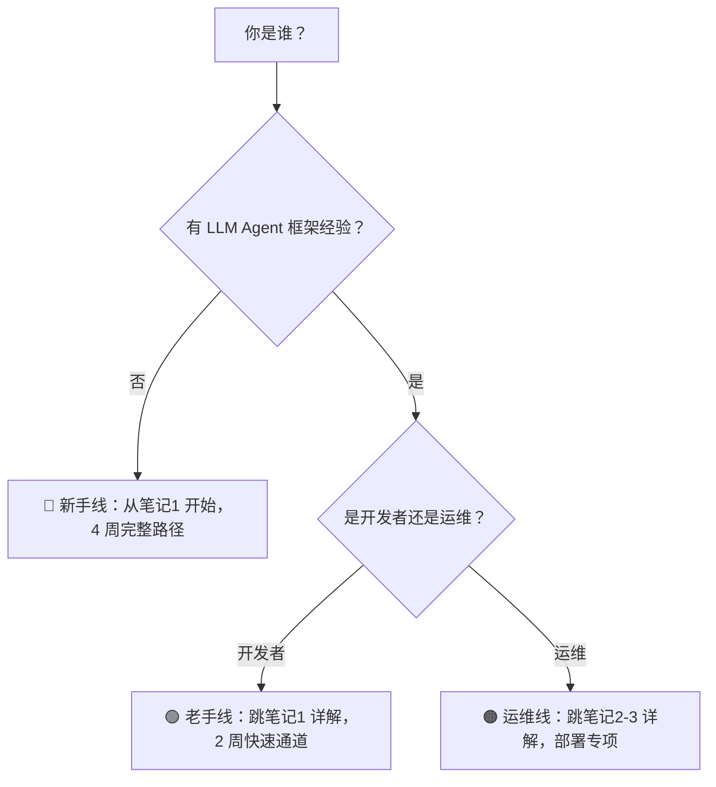

## 总体评价：6.5 / 10

> 内容扎实、结构清晰，"可以学会"；但缺少验证闭环、复习机制和差异化路径，学习者容易"走完但不确定自己真正掌握了什么"。是**好教材**，还不是**好课程**。

---

## 各维度评分

| 维度 | 评分 | 核心问题 |
|------|------|---------|
| 学习路径 | 7/10 | 3 周偏紧，建议 4 周 |
| 练习设计 | 5.5/10 🔴 | 有路线图但无验证标准 |
| 知识巩固 | 5/10 🔴 | 无跨篇复习锚点 |
| 实战项目 | 7.5/10 🟢 | v1-v7 出色，缺验收标准 |
| 可视化与交互 | 6/10 | 缺时序图/速查卡 |
| 差异化路径 | 4/10 🔴 | 无角色导航 |
| 评估反馈闭环 | 4.5/10 🔴 | 无自测题 |
| 社区与协作 | 3/10 🔴 | 纯自学 |

---

## 一、学习路径优化：7.0 / 10

### 当前结构

```
3 周 26.5h：Week1(笔记1+2, 7h) → Week2(笔记3+4+5, 9h) → Week3(笔记6+7, 4.5h) + 毕业项目(6h)
```

### 问题

| 问题 | 严重度 | 说明 |
|------|--------|------|
| 3 周节奏偏紧 | P0 | 26.5h → 建议 33.5h（4 周） |
| 笔记6 部署 3h 严重不足 | P0 | K8s+监控+安全+5 个项目需要 5h+ |
| 笔记4 核心架构 3h 偏少 | P1 | 五大系统密度极高 |
| 毕业项目 6h 不够 7 个版本 | P1 | 建议 8h |
| 迁移指南位置 | P2 | 1.0 老用户需要更早看到差异 |

### 推荐 4 周路径

```
Week1: 笔记1(3h) → 笔记2(5h) → v1-v2
  🎯 里程碑: 能写出带 Tool 的 ReAct Agent

Week2: 笔记3(5h) → 笔记4(4h) → v3-v5 + v5.5
  🎯 里程碑: 能设计多Agent架构，跟踪事件流

Week3: 笔记5(2h) → 笔记6 Docker(2h) → v6
  🎯 里程碑: 能诊断 Agent 失败，docker-compose 部署

Week4: 笔记6 K8s(3h) → 笔记7(1.5h) → v7(3h) + 复习
  🎯 里程碑: K8s 部署 + 完整交付
```

### 毕业项目嵌入主线

| 主线笔记 | 完成的项目版本 |
|----------|--------------|
| 笔记2 单Agent | v1-v4 |
| 笔记3 多Agent | v5 |
| 笔记4 核心架构 | v5.5（新增） |
| 笔记5 调试评估 | v6 |
| 笔记6 生产部署 | v7 |

---

## 二、练习设计优化：5.5 / 10 🔴

### 现状

每篇笔记都有"新手练习路线图"，但存在共同问题：

- **无验证标准**：所有练习只有"做什么"，没有"怎么算做对了"
- **无产出物链**：各篇练习独立，产物不串联
- **无渐进验证**：没有"做完第 1 步，验证后再做第 2 步"的指引

### 优化方案

#### 为每篇练习加三档验证标准

```
🟢 基础（30min）：复制代码能跑通，理解每行作用
🟡 进阶（1h）：修改一个参数/工具，观察变化
🔴 挑战（2h）：从零实现一个类似功能
```

#### 示例：笔记2「单Agent开发」练习改造

**当前(简略)**：
```
阶段 1️⃣  Toolkit 精通（2 天）
  ├── 每个内置 Tool 都手动测试一遍
  └── 对比 3 个工具 vs 8 个工具的 Agent 表现
```

**改造后**：
```
阶段 1️⃣  Toolkit 精通（2 天）
  🟢 基础: 复制代码审查 Agent 代码，跑通
  🟢 基础: 每个 Tool 单独建一个最小 Agent 测试
  🟡 进阶: 添加一个自定义 Tool（如天气查询），观察 LLM 是否调用
  🟡 进阶: 对比 3 个 Tool vs 8 个 Tool 的 Agent 完成同一任务（耗时/token/正确率）
  🔴 挑战: 从零实现一个"Bug 修复 Agent"（Bash+Read+Write+Edit）
  📝 验证: 任务完成率 ≥ 80%，无语法错误，工具调用 ≤ 5 次
```

#### 贯穿式练习产物

```
笔记1: 创建 hello_agent.py（纯对话）
笔记2: 升级为 code_reviewer.py（+Tool+Middleware）
笔记3: 升级为 multi_agent_team.py（Orchestrator+Worker）
笔记5: 加 eval_suite.py（10 个用例）
笔记6: 部署到 docker-compose
→ 毕业项目 = 这个贯穿产物的终极形态
```

---

## 三、知识巩固机制：5.0 / 10 🔴

### 现状

无任何跨篇复习机制。笔记1 讲完 ReAct 后，笔记2-7 再未系统回顾。学习者大概率 Week3 忘记 Week1 的 EventType 分类。

### 优化方案

#### 3 个阶段复习检查点

**Week1 末（笔记1+2 后）**：
```
📝 概念填空测验:
  1. Agent = ______ + ______ + ______ + ______
  2. ReAct 循环的 3 个步骤: ______ → ______ → ______
  3. Middleware 的 6 大 Hook 点名: ______
  4. EventType.TEXT_BLOCK_DELTA 的含义是 ______
  5. 同步 agent_spawn timeout_seconds=__  vs 异步=__
```

**Week2 末（笔记3+4 后）**：
```
📝 概念图绘制:
  1. 画出 Orchestrator+Workers 的协作序列图
  2. 画出 Permission 三层决策引擎的流程图
  3. 对比三种多Agent协作模式（群聊/辩论/分工）的适用场景
📝 代码重构:
  将 Week1 的 code_reviewer.py 从单 Agent 改为 Leader+Worker 模式
```

**Week3 末（笔记5+6 后）**：
```
📝 综合案例分析:
  给定一个 Agent 失败案例，用四步诊断法定位问题，给出修复方案
📝 部署实操:
  将贯穿项目部署到 docker-compose，验证监控指标
```

---

## 四、实战项目优化：7.5 / 10 ✅

### 亮点

v1-v7 渐进式设计是全课程最大亮点：
- 进度感强（~30 行 → ~250 行）
- 每步可见成果
- 架构决策有注释（v5 的"为什么用 Multi-Agent"）

### 优化建议

| 建议 | 具体方案 | 优先级 |
|------|---------|--------|
| 项目主题更贴近学习者 | 当前"AI 研究助手"偏学术，可增加"代码审查助手"或"智能客服"作为备选主题 | P1 |
| 加 v5.5 Event Tracking | v5→v6 之间插入：用 DiagnosticLogger 追踪 Director 和 3 个 Worker 的完整事件流 | P0 |
| 每版本加验收标准 | 不仅"检查点"，明确"通过标准"（如 v5：Director 成功分解 3-5 个子课题，Researcher 并行执行） | P0 |
| v4 RAG 可运行化 | 目前全注释，提供最小化可运行版本（ChromaDB + 2 篇示例文档） | P0 |
| 加"自己动手"环节 | 每版本提供"代码框架"而非完整代码，让学习者填空 | P1 |
| 加成本估算 | 每个 v 版本标注预计 Token 消耗和费用 | P2 |

### 版本验收清单（草案）

| 版本 | 验收项 |
|------|--------|
| v1 | 能与 Agent 完成 3 轮以上对话，EventType 识别正确 |
| v2 | 工具调用成功率 ≥ 90%，能读取文件、执行 Bash、写入结果 |
| v3 | 跨轮对话记忆保留率 ≥ 80%，上下文压缩自动触发 |
| v4 | RAG 检索结果相关性 ≥ 70%，能从知识库检索并回答 |
| v5 | Director 成功分解出 3-5 个子课题，Researcher 并行执行 |
| v5.5 | 能打印并解释关键事件流（REPLY_START → TOOL_CALL → REPLY_END） |
| v6 | Evaluator 评分 ≥ 18/25，且 2 轮优化后有提升 |
| v7 | Docker Compose 部署成功，Web UI 可访问，监控面板能看到核心指标 |

---

## 五、可视化与交互：6.0 / 10

### 当前 Mermaid 图表统计

| 笔记 | flowchart | sequenceDiagram | stateDiagram | graph | 总计 |
|------|-----------|-----------------|---------------|-------|------|
| 总览 | 1 | 0 | 0 | 1 | 2 |
| 基础 | 2 | 0 | 1 | 0 | 3 |
| 单Agent | 2 | 1 | 0 | 0 | 3 |
| 多Agent | 3 | 1 | 0 | 0 | 4 |
| 核心架构 | 1 | 2 | 0 | 1 | 4 |
| 调试 | 2 | 0 | 0 | 0 | 2 |
| 部署 | 1 | 0 | 0 | 1 | 2 |
| 迁移 | 1 | 0 | 0 | 0 | 1 |
| 毕业 | 1 | 0 | 0 | 0 | 1 |
| **总计** | **14** | **4** | **1** | **3** | **22** |

22 张图覆盖 9 篇笔记，密度合理。但缺以下类型：

### 缺失的关键图表

| 缺失图表 | 用途 | 建议位置 | 优先级 |
|---------|------|---------|--------|
| **Middleware 调用链时序图** | 展示洋葱模型：请求和响应经过各 Middleware 的顺序 | 笔记2/4 | P0 |
| **Permission 冒泡拦截图** | 展示三层引擎的具体拦截案例 | 笔记4 | P0 |
| **AgentScope 1.0 vs 2.0 对照图** | 一图胜千言 | 笔记7 | P1 |
| **28 种事件类型速查表** | 表格形式，含触发条件和携带数据 | 笔记4 | P1 |
| **agent_spawn 同步/异步对比图** | 两种模式的时序对比 | 笔记3 | P1 |
| **毕业项目 v1-v7 完整时序图** | 全版本演进一览 | 毕业项目 | P2 |

### 缺少速查卡

建议新增 **AgentScope 2.0 Cheat Sheet**（1 页 A4）：

```
AgentScope 2.0 速查卡.md
├── 常用 API 一页纸（Agent/Toolkit/TeamTools/EventType/PermissionMode）
├── 1.0 vs 2.0 对照表
├── 28 种事件类型速查
├── 调试命令清单（DiagnosticLogger + 常见 Bug 修复对照）
├── 部署检查清单（Docker Compose / K8s 关键配置）
└── 错误码对照
```

### 概念关系地图

```mermaid
graph TD
   Agent --> Model
   Agent --> Toolkit --> Tool
   Agent --> Memory --> InMemory/Redis/Vector
   Agent --> Planner --> ReAct/PlanExecute
   Agent --> Middleware --> 6 Hooks
   Agent --> EventSystem --> 28 Events
   Agent --> PermissionSystem --> 3 Layers
   Agent --> Workspace --> Local/Docker/E2B
```

---

## 六、差异化路径：4.0 / 10 🔴

### 现状

所有学习者走同一条路，无任何角色导航。

### 建议 3 条差异化路径

**🔵 纯新手（无 Agent 框架经验）**：按 4 周标准路径，每篇完整阅读
```
笔记1(3h) → 笔记2(5h) → 笔记3(5h) → 笔记4(4h) → 笔记5(2h) → 笔记6(5h) → 笔记7(1.5h) → 毕业(8h)
```

**🟢 有 LangChain/AutoGen 经验**：
```
快速通道: 笔记1(1h，只读 vs 对比表) → 笔记2(2h，只读 Toolkit/Middleware 新概念)
→ 笔记3(3h) → 笔记4(3h) → 笔记5(1h) → 笔记6(3h) → 笔记7(1h) → 毕业(5h)
跳过: 模型配置、ReAct 基础、Python 异步基础
总学时: ~19h
```

**🟠 运维/平台工程师（关注部署）**：
```
路径: 笔记1(1h，架构概览) → 笔记4(2h，Agent Service + Workspace)
→ 笔记6(5h，重点) → 笔记7(1h) → 笔记2-3(按需)
跳过: 单Agent 开发细节、Planner 进阶
重点: K8s 部署、监控、安全、沙箱配置
```

### 在总览索引加"角色导航"



---

## 七、评估反馈闭环：4.5 / 10 🔴

### 现状

- ❌ 无自测题
- ❌ 无项目验收标准
- ❌ 学习者不确定"学会了没"

### 建议自测体系

| 层级 | 形式 | 数量 |
|------|------|------|
| 每篇自测 | 3 选择 + 2 代码填空 | 5 题/篇 × 9 篇 = 45 题 |
| 阶段测验 | Week1/2/3 末各 1 套 | 3 套 |
| 毕业验收 | v7 验收 Checklist | 1 套 |

### 自测题示例（笔记1）

```markdown
### 笔记1 自测

1. AgentScope 2.0 的三层解耦架构是哪三层？
   A) Studio / Core / Runtime
   B) Agent / Toolkit / Memory
   C) Model / Tool / Memory
   D) Event / Permission / Middleware

2. reply() 和 reply_stream() 的区别是什么？
   A) reply() 是同步的，reply_stream() 是异步的
   B) reply() 返回 str，reply_stream() 返回 AsyncIterator[Event]
   C) reply() 不需要 await，reply_stream() 需要
   D) 没有区别

3. 代码填空：补全创建 Agent 的代码
   agent = Agent(
       name="helper",
       system_prompt="...",
       model=DashScopeChatModel(
           credential=DashScopeCredential(api_key=______("DASHSCOPE_API_KEY")),
           model="qwen-plus",
       ),
   )

<details><summary>答案</summary>
1. A  2. B  3. os.environ
</details>
```

### 能力自评雷达图

```
## 学完前后能力自评

| 维度 | 学前 | 目标 | 自评 |
|------|------|------|------|
| 单 Agent 开发 | 0 | 5 | ___/5 |
| 多 Agent 协作 | 0 | 4 | ___/5 |
| 工具系统设计 | 0 | 5 | ___/5 |
| 事件驱动架构 | 0 | 4 | ___/5 |
| 权限与安全 | 0 | 4 | ___/5 |
| 调试与诊断 | 0 | 4 | ___/5 |
| 评估体系 | 0 | 4 | ___/5 |
| 生产部署 | 0 | 3 | ___/5 |
```

---

## 八、社区与协作：3.0 / 10 🔴

### 现状

纯自学教材，无任何协作/互动元素。

### 优化建议（P2 锦上添花）

| 建议 | 实现方式 |
|------|---------|
| 毕业项目 PR 式提交 | GitHub 仓库 + PR 模板 + Review Checklist |
| 同伴 Review | 两两配对，互相审查对方的毕业项目代码 |
| 周报/打卡 | 每周末在 Discussions 中分享学习笔记 |
| 常见问题 FAQ | 收集前 3 期学习者的常见问题，附在每篇末尾 |
| 项目展示 | 毕业项目部署到 Vercel/Railway，公开展示 |
| 学习小组建议 | 2-3 人一组，每周 30min sync |

---

## 问题汇总

### 🔴 P0 必须改（5 项）

| # | 改进项 | 可执行方案 |
|---|--------|-----------|
| P0-1 | 每篇加"学完自检" | 🟢基础/🟡进阶/🔴挑战 三档验证标准 + 3-5 道自测题（答案折叠在 `<details>` 中） |
| P0-2 | 毕业项目拆散嵌入主线 | v1-v2 随笔记2，v3-v4 随笔记3，v5 随笔记4，v5.5-v6 随笔记5，v7 收尾 |
| P0-3 | 3 个阶段复习检查点 | Week1 末概念填空，Week2 末概念图+代码重构，Week3 末综合案例+部署 |
| P0-4 | 加毕业项目验收标准 | 每版本明确通过标准（定量指标） |
| P0-5 | 在总览索引加角色导航 | 三条路径：纯新手 / 有经验快速通道 / 运维工程师 |

### 🟡 P1 强烈建议（8 项）

| # | 改进项 | 可执行方案 |
|---|--------|-----------|
| P1-1 | 4 周标准路径 | 3 周 26.5h → 4 周 33.5h |
| P1-2 | 贯穿式练习产物 | 每篇练习产出物串联为毕业项目的中间版本 |
| P1-3 | Cheat Sheet 速查卡 | 1 页 A4：API + EventType + 调试命令 + 部署清单 |
| P1-4 | 28 种事件类型速查表 | 笔记4 附录 |
| P1-5 | 加 Middleware 时序图 | 笔记2/4 |
| P1-6 | 补全缺失的 Mermaid 图 | Permission 冒泡图、1.0 vs 2.0 对照图 |
| P1-7 | 每篇练习加验证标准 | 🟢/🟡/🔴 三档 + 可执行断言 |
| P1-8 | GitHub Discussions 模板 + Review Checklist | 社区协作基础设施 |

### 🟢 P2 锦上添花（5 项）

| # | 改进项 |
|---|--------|
| P2-1 | 每篇 5 道自测题（答案折叠） |
| P2-2 | 能力自评雷达图（学前/学后对比） |
| P2-3 | 毕业项目 PR 式提交 + Review Checklist |
| P2-4 | 项目主题可替换（AI 研究助手 / 代码审查助手 / 智能客服） |
| P2-5 | FAQ 收集 + 社区 Discussions |

---

## 📋 学习者自测 Checklist

学完整套课程后，学习者应能：

### 基础能力

- [ ] 独立搭建 AgentScope 2.0 开发环境，创建并运行第一个 Agent
- [ ] 解释 Agent = Model + Tool + Memory + Planner 的执行循环
- [ ] 区分 reply() 和 reply_stream() 的使用场景
- [ ] 配置 DashScope / OpenAI / DeepSeek 三种模型提供商

### 单 Agent 开发

- [ ] 使用 Toolkit 组合内置工具（Bash/Read/Write/Grep/Glob/WebSearch/WebFetch）
- [ ] 编写自定义 Tool（装饰器方式和类继承方式）
- [ ] 配置 Memory（InMemoryMemory）和上下文压缩（ContextCompactionMiddleware）
- [ ] 选择合适的 Planner（ReAct vs Plan-and-Execute）
- [ ] 编写自定义 Middleware 拦截 Agent 行为

### 多 Agent 协作

- [ ] 实现 Leader + Worker 的 Orchestrator+Workers 模式
- [ ] 使用 TeamTools 和 SubagentDeclaration 声明 Worker
- [ ] 区分同步 agent_spawn 和异步 agent_spawn 的使用场景
- [ ] 实现群聊、辩论、分工并行三种协作模式
- [ ] 画出架构决策树，判断何时用单 Agent vs 多 Agent

### 核心架构

- [ ] 理解 Event System 的 28 种事件类型和 reply_stream() 事件流
- [ ] 配置 Permission System 三层引擎（内置/规则/模式）
- [ ] 解释 Middleware 六大 Hook 点的触发时机
- [ ] 启动 Agent Service 并通过 REST API 调用
- [ ] 配置 Workspace（Local / Docker / E2B）

### 调试与评估

- [ ] 实现 DiagnosticLogger 记录 Agent 执行过程
- [ ] 识别 5 种常见 Bug 模式并给出修复方案
- [ ] 编写 Prompt 优化循环（测试→评估→修复→再测）
- [ ] 编写 EvalCase 并运行 run_eval_suite
- [ ] 说出 Agent 调试和传统代码调试的核心区别

### 生产部署

- [ ] 使用 Docker Compose 部署 AgentScope Runtime
- [ ] 配置 Prometheus + Grafana 监控
- [ ] 配置 K8s Secret 管理密钥
- [ ] 实现至少 1 个实战项目（RAG/辩论/代码审查/深度研究）

### 版本迁移

- [ ] 解释 MsgHub → Orchestrator 的转变原因
- [ ] 将 1.0 的 SequentialPipeline 改写为 2.0 的 agent_spawn
- [ ] 完成迁移 Checklist 中的所有项

### 毕业项目

- [ ] 独立完成毕业项目 v1-v7 全部版本
- [ ] 解释每个版本的设计决策（为什么用 Multi-Agent？为什么选这个 Planner？）
- [ ] 在 v7 中部署为 Agent Service，通过 Web UI 访问
- [ ] 监控面板能看到核心指标（reply_duration, token_usage）
- [ ] （加分）完成至少 1 个扩展方向

### 进阶能力

- [ ] 编写自定义 Middleware 扩展 Agent 行为
- [ ] 在 K8s 集群中部署 AgentScope，配置 Prometheus 监控
- [ ] 实现 Human-in-the-Loop 交互（处理 REQUIRE_USER_CONFIRM 事件）
- [ ] 评估一次 Agent 调用的 Token 成本
- [ ] 阅读 AgentScope 源码，贡献文档或 Bug 修复

---

*最后更新：2026-07-16*