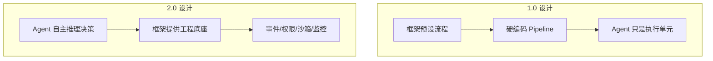
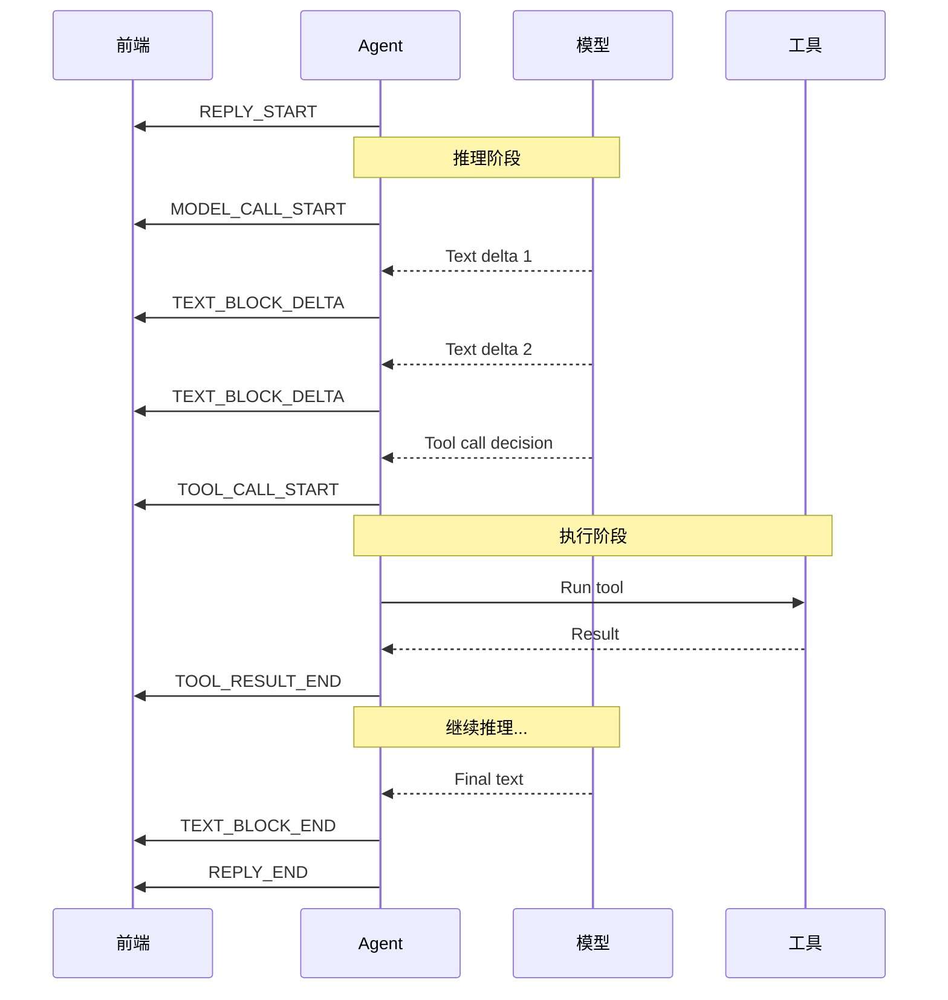
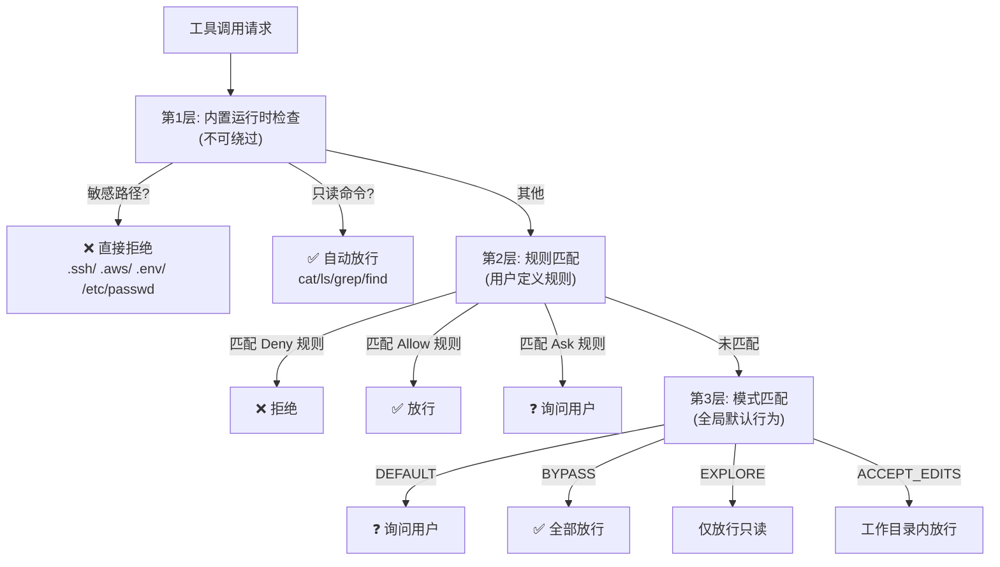
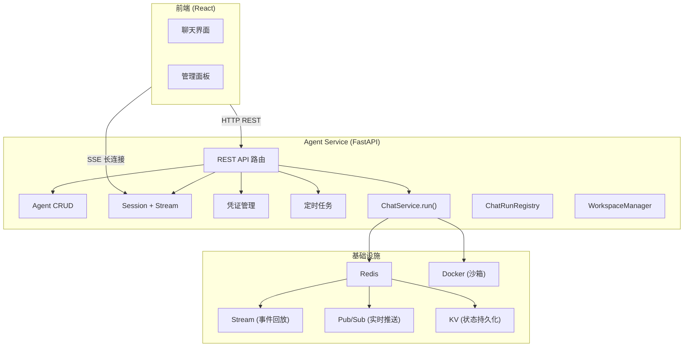
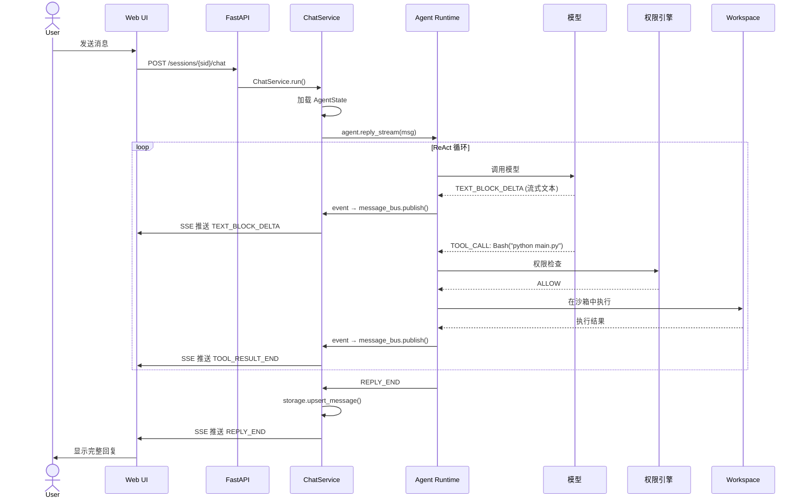

## 前置知识：2.0 的架构设计哲学

AgentScope 2.0 不是 1.0 的升级，而是一次**重新设计**。核心理念从"框架控制 Agent"转变为"框架服务 Agent"。



2.0 的五大核心系统：

| 系统 | 解决什么问题 | 1.0 有吗 |
|------|------------|---------|
| **Event System** | Agent 执行过程不可观察 | 部分（只有回调） |
| **Permission System** | 工具调用无安全边界 | 无 |
| **Middleware** | 无法扩展 Agent 行为 | 无 |
| **Agent Service** | 开发到部署割裂 | 独立仓库 |
| **Workspace** | 代码执行污染宿主机 | 无 |

---

## 一、Event System（事件系统）

### 为什么需要事件系统

Agent 的 `reply()` 返回的是**最终文本**，你完全看不到中间的推理和工具调用过程。在以下场景中这是不可接受的：

- **调试**：Agent 为什么调用了那个工具？为什么没调用这个工具？
- **前端渲染**：Chat UI 需要实时显示"正在思考..."→"正在读文件..."→"正在运行代码..."
- **人工干预**：如果 Agent 要执行 `rm -rf /`，需要暂停并请求用户确认

### 28 种事件类型

AgentScope 2.0 将 Agent 的每一步执行都转化为**类型化事件（Typed Event）**，通过 `reply_stream()` 以异步流的形式输出。



### 核心事件类型速查

| 事件 | 含义 | 携带的关键数据 |
|------|------|-------------|
| `REPLY_START` | Agent 开始回复 | `agent_name` |
| `REPLY_END` | Agent 回复结束 | `usage`（总 token 用量） |
| `MODEL_CALL_START` | 开始调用 LLM | — |
| `MODEL_CALL_END` | LLM 调用完成 | `usage`（本次 token 用量） |
| `TEXT_BLOCK_START` | 开始一段文本输出 | — |
| `TEXT_BLOCK_DELTA` | 流式文本增量 | `text`（增量文本） |
| `TEXT_BLOCK_END` | 文本段结束 | — |
| `THINKING_BLOCK_START` | 模型开始思考（CoT） | — |
| `THINKING_BLOCK_DELTA` | 思考过程增量 | `text` |
| `THINKING_BLOCK_END` | 思考过程结束 | — |
| `TOOL_CALL_START` | 开始调用工具 | `tool_name`, `tool_input` |
| `TOOL_CALL_END` | 工具调用请求完成 | — |
| `TOOL_RESULT_START` | 工具返回结果开始 | — |
| `TOOL_RESULT_END` | 工具返回结果完成 | `result` |
| `REQUIRE_USER_CONFIRM` | 需要用户确认 | `tool_name`, `tool_input` |
| `REQUIRE_EXTERNAL_EXECUTION` | 需要外部执行 | 执行上下文 |
| `ERROR` | 发生错误 | `error_message` |
| `ROUND_START` | 开始新一轮 ReAct 循环 | `round_index` |
| `ROUND_END` | 一轮 ReAct 循环结束 | `round_index`, `round_usage` |
| `MEMORY_OPERATION_START` | 开始记忆操作（读/写/压缩） | `operation_type` |
| `MEMORY_OPERATION_END` | 记忆操作完成 | `operation_type`, `message_count` |
| `CONTEXT_COMPACTION_START` | 开始上下文压缩 | `original_tokens` |
| `CONTEXT_COMPACTION_END` | 上下文压缩完成 | `compressed_tokens`, `compaction_ratio` |
| `AGENT_STATE_SAVE_START` | 开始保存 Agent 状态 | `agent_name` |
| `AGENT_STATE_SAVE_END` | Agent 状态保存完成 | `agent_name`, `state_size` |
| `PERMISSION_CHECK` | 权限检查触发 | `tool_name`, `decision` |
| `MAX_ROUNDS_REACHED` | 达到最大推理轮次 | `max_rounds` |
| `SESSION_END` | 会话结束 | `session_id`, `total_usage` |

> [!note] 28 种事件分类速记
> • **生命周期**（4）：REPLY_START/END, ROUND_START/END
> • **模型交互**（2）：MODEL_CALL_START/END
> • **文本生成**（3）：TEXT_BLOCK_START/DELTA/END
> • **思考链**（3）：THINKING_BLOCK_START/DELTA/END
> • **工具调用**（4）：TOOL_CALL_START/END, TOOL_RESULT_START/END
> • **权限与人机交互**（3）：REQUIRE_USER_CONFIRM, REQUIRE_EXTERNAL_EXECUTION, PERMISSION_CHECK
> • **记忆与上下文**（4）：MEMORY_OPERATION_START/END, CONTEXT_COMPACTION_START/END
> • **状态持久化**（2）：AGENT_STATE_SAVE_START/END
> • **异常与终止**（3）：ERROR, MAX_ROUNDS_REACHED, SESSION_END

### 处理事件流的标准模式

```python
from agentscope.event import EventType

async def handle_agent_stream(agent, user_msg):
    thinking = False
    tool_calls = []

    async for event in agent.reply_stream(user_msg):
        match event.type:
            # 生命周期
            case EventType.REPLY_START:
                print("🤖 Agent 开始处理...")

            case EventType.REPLY_END:
                print(f"\n✅ 完成 (Token: {event.usage})")

            # 思考过程（CoT / 推理链）
            case EventType.THINKING_BLOCK_START:
                thinking = True
                print("\n🧠 思考中: ", end="")
            case EventType.THINKING_BLOCK_DELTA:
                if thinking:
                    print(event.text, end="", flush=True)
            case EventType.THINKING_BLOCK_END:
                thinking = False
                print()

            # 流式文本
            case EventType.TEXT_BLOCK_DELTA:
                print(event.text, end="", flush=True)

            # 工具调用
            case EventType.TOOL_CALL_START:
                tool_calls.append(event)
                print(f"\n🔧 [{event.tool_name}]: {event.tool_input[:100]}...")
            case EventType.TOOL_RESULT_END:
                result_preview = str(event.result)[:200]
                print(f"📋 结果: {result_preview}...")

            # 需要用户确认
            case EventType.REQUIRE_USER_CONFIRM:
                print(f"\n⚠️ 需要确认: {event.tool_name}")
                print(f"   参数: {event.tool_input}")
                # 这里可以暂停并等待用户输入
                # user_approved = await ask_user(event)
                # if user_approved:
                #     await event.approve()

            # 错误处理
            case EventType.ERROR:
                print(f"\n❌ 错误: {event.error_message}")
```

---

## 二、Permission System（权限系统）

### 设计目标

Agent 调用工具时，可能产生破坏性操作。权限系统提供不可绕过的安全边界：

```
rm -rf /              ← 必须拒绝
git push --force      ← 必须确认
cat config.py         ← 可以放行（只读操作）
```

### 三层决策引擎



> [!important] 第 1 层不可绕过
> 即使设置为 `BYPASS` 模式，敏感路径（`.ssh/`、`.aws/`、`.env`、`/etc/passwd` 等）的保护仍然生效。这是硬编码的安全底线。

### 配置权限模式

```python
from agentscope.permission import PermissionMode

# 开发阶段：跳过所有权限检查（敏感路径保护仍生效）
agent = Agent(
    name="dev_agent",
    system_prompt="...",
    model=model,
    toolkit=toolkit,
    permission_mode=PermissionMode.BYPASS,
)

# 探索模式：只允许只读操作
agent = Agent(
    name="reader",
    system_prompt="...",
    model=model,
    toolkit=toolkit,
    permission_mode=PermissionMode.EXPLORE,
)

# 生产模式：所有工具调用都需要用户确认（默认）
agent = Agent(
    name="prod_agent",
    system_prompt="...",
    model=model,
    toolkit=toolkit,
    permission_mode=PermissionMode.DEFAULT,  # 默认值，可省略
)
```

### 自定义权限规则

```python
from agentscope.permission import PermissionRule, RuleAction

# 拒绝所有 git push 到 main/master
deny_force_push = PermissionRule(
    pattern="git push.*main|git push.*master",
    action=RuleAction.DENY,
    description="禁止推送到主分支",
)

# 允许在 /tmp 目录下的一切操作
allow_tmp = PermissionRule(
    pattern=r".*\/tmp\/.*",
    action=RuleAction.ALLOW,
    description="允许 /tmp 目录下的操作",
)

# 询问用户：删除操作
ask_delete = PermissionRule(
    pattern="rm |del |delete ",
    action=RuleAction.ASK,
    description="删除操作需要确认",
)

agent = Agent(
    name="safe_agent",
    system_prompt="...",
    model=model,
    toolkit=toolkit,
    permission_rules=[deny_force_push, allow_tmp, ask_delete],
)
```

### 权限事件的处理

当权限系统返回 `ASK` 时，Agent 会产生 `REQUIRE_USER_CONFIRM` 事件：

```python
async for event in agent.reply_stream(user_msg):
    if event.type == EventType.REQUIRE_USER_CONFIRM:
        # 暂停执行，展示给用户
        tool_info = f"{event.tool_name}: {event.tool_input}"
        print(f"\n⚠️ Agent 请求确认:\n  {tool_info}")

        # 等待用户决定
        user_choice = input("允许? (y/n/always): ").strip().lower()

        if user_choice == "y":
            await event.approve()
        elif user_choice == "always":
            # 保存为永久规则
            agent.add_permission_rule(PermissionRule(
                pattern=event.tool_name,
                action=RuleAction.ALLOW,
            ))
            await event.approve()
        else:
            await event.deny("用户拒绝")
```

---

## 三、Agent Service（多租户实时服务）

### 架构总览

Agent Service 是 AgentScope 2.0 内置的**生产级服务层**，提供 RESTful API + SSE 实时推送 + 多租户隔离。



### 启动 Agent Service

```bash
# 1. 启动 Redis（MessageBus + Storage 依赖）
docker run -d --name redis -p 6379:6379 redis:7-alpine

# 2. 安装 Runtime 依赖
pip install agentscope[runtime]

# 3. 启动服务
python -m agentscope.runtime.main --host 0.0.0.0 --port 8000

# 4. 访问
# API 文档: http://localhost:8000/docs
# Web UI:   http://localhost:8000/ui
```

### 核心 API 端点

| 方法 | 路径 | 功能 |
|------|------|------|
| `POST` | `/agents` | 创建 Agent |
| `GET` | `/agents` | 列出所有 Agent |
| `GET` | `/agents/{id}` | 获取 Agent 详情 |
| `DELETE` | `/agents/{id}` | 删除 Agent |
| `POST` | `/agents/{id}/sessions` | 创建会话 |
| `POST` | `/sessions/{sid}/chat` | 发送消息 |
| `GET` | `/sessions/{sid}/stream` | SSE 事件流 |
| `GET` | `/sessions/{sid}/messages` | 获取消息历史 |
| `POST` | `/credentials` | 添加凭证 |
| `POST` | `/cron` | 创建定时任务 |

### 多租户隔离

```python
# 每个 Agent 属于一个用户（通过 API Key / Token 认证）
# Agent 实例跨用户不可见
# Workspace 按 user_id/agent_id 分配独立目录

# 示例：两个用户的 Agent 互不干扰
# User A 的 Agent "assistant" → 工作区 /workspaces/user_a/assistant/
# User B 的 Agent "assistant" → 工作区 /workspaces/user_b/assistant/
```

---

## 四、Workspace（沙箱抽象）

### 三种执行环境，一行切换

```python
from agentscope.workspace import LocalWorkspace, DockerWorkspace, E2BWorkspace

# 本地进程（开发环境，快速但不隔离）
workspace = LocalWorkspace()

# Docker 容器（生产推荐，cgroup/namespace 隔离）
workspace = DockerWorkspace(
    image="python:3.12-slim",
    memory_limit="512m",
    cpu_limit=1.0,
    network="none",  # 可配置网络访问
)

# E2B 云沙箱（SaaS，免运维）
workspace = E2BWorkspace(
    api_key=os.environ["E2B_API_KEY"],
    template="python-3.12",
)
```

### Workspace 的能力

| 能力 | Local | Docker | E2B |
|------|-------|--------|-----|
| 文件系统隔离 | ❌ | ✅ | ✅ |
| 网络隔离 | ❌ | ✅（可配） | ✅ |
| 资源限制（CPU/Mem） | ❌ | ✅ | ✅ |
| 进程隔离 | ❌ | ✅ | ✅ |
| 跨机器部署 | ❌ | ❌ | ✅ |
| 启动速度 | 即时 | 1-3s | 3-10s |

---

## 五、事件流转的完整链路

将 Event System + Permission System + Agent Service + Workspace 串起来的完整流程：



---

## 新手练习路线图

```
阶段 1️⃣  Event System（1 天）
  ├── 打印 Agent 执行的所有事件类型
  ├── 实现一个事件日志器（记录每种事件的耗时）
  └── 画出一次 ReAct 循环的完整事件时序图

阶段 2️⃣  Permission System（1 天）
  ├── 配置 EXPLORE 模式观察只读放行
  ├── 添加自定义 Deny/Ask/Allow 规则
  └── 实现用户确认交互（REQUIRE_USER_CONFIRM）

阶段 3️⃣  Agent Service（1 天）
  ├── 启动 Agent Service + Web UI
  ├── 通过 API 创建 Agent、创建会话、发送消息
  └── 通过 SSE 端点观察事件流

阶段 4️⃣  Workspace（1 天）
  ├── 对比 Local / Docker / E2B 三种 Workspace
  ├── 在 Docker 沙箱中执行危险命令测试隔离性
  └── 配置资源限制（CPU/Mem/Net）
```

---

## 常见易错点

> [!warning] **坑 1：BYPASS 模式不代表绝对安全**
> ```python
> # BYPASS 跳过第 2 层（规则）和第 3 层（模式）检查
> # 但第 1 层（内置运行时检查）始终生效
> # 即使 BYPASS，Agent 也无法读取 ~/.ssh/id_rsa
> ```

> [!warning] **坑 2：Agent Service 强依赖 Redis**
> ```python
> # ⚠️ 没有 Redis，Agent Service 无法启动
> # MessageBus 和 Storage 默认都用 Redis
> 
> # 本地测试可以不用 Agent Service，直接用 Core API
> agent = Agent(...)
> await agent.reply(msg)
> ```

> [!warning] **坑 3：忘记处理 REQUIRE_USER_CONFIRM 事件导致 Agent 卡死**
> ```python
> # ❌ 权限模式是 DEFAULT，但没处理确认事件
> async for event in agent.reply_stream(msg):
>     pass  # Agent 一直在等用户确认，永远不会结束
> 
> # ✅ 要么改成 BYPASS，要么处理确认事件
> async for event in agent.reply_stream(msg):
>     if event.type == EventType.REQUIRE_USER_CONFIRM:
>         await event.approve()  # 自动批准
> ```

---

## 🎯 本文学完自检

| 层次 | 检查项 |
|------|--------|
| 🟢 基础 | 能说出 28 种事件类型中 5 类以上的名称和触发时机 |
| 🟡 进阶 | 能配置 `PermissionMode` 和自定义 `PermissionRule`，处理 `REQUIRE_USER_CONFIRM` 事件 |
| 🔴 挑战 | 能启动 Agent Service，并通过 SSE 端点实时观察 Agent 的事件流 |

---

## 相关笔记

- [[AgentScope 基础概念与环境搭建]] -- 三层架构概览、环境搭建
- [[AgentScope 单Agent开发]] -- Agent 类的完整配置
- [[AgentScope 多Agent协作]] -- Agent Team 协作机制
- [[AgentScope 调试与评估]] -- 事件流驱动的诊断方法
- [[AgentScope 毕业项目：AI研究助手]] -- 事件流和权限系统贯穿全部版本
- [[AgentScope 生产部署与实战]] -- K8s 部署和完整项目

---

*最后更新：2026-07-16*
