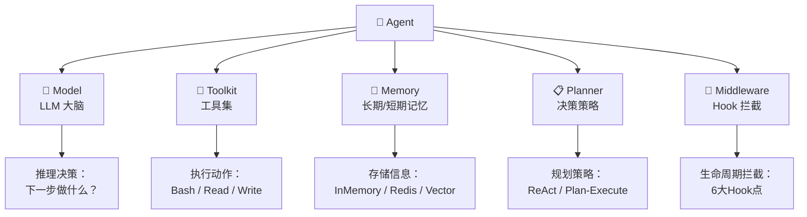
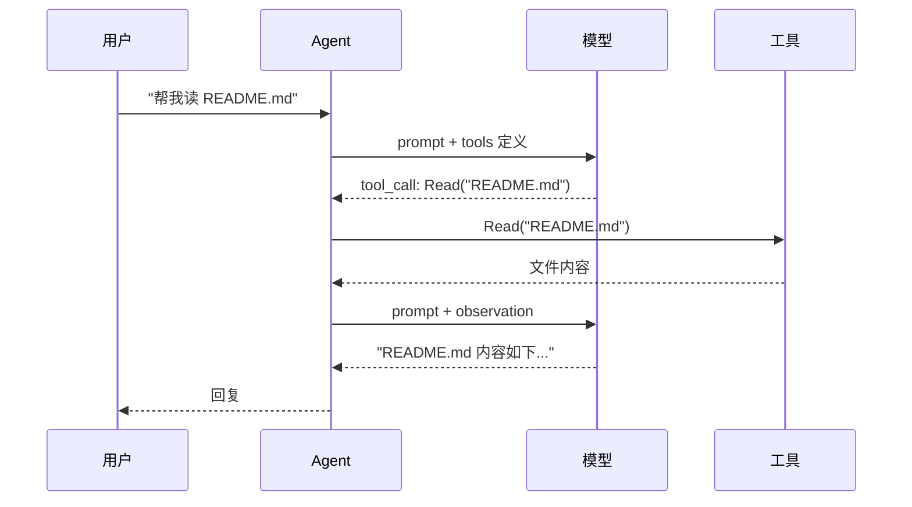
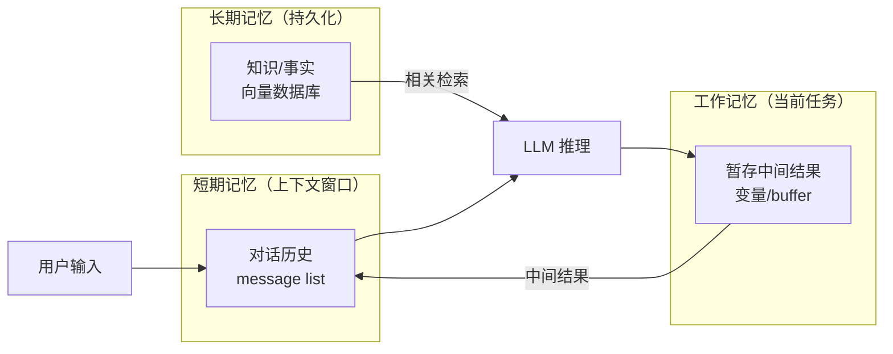
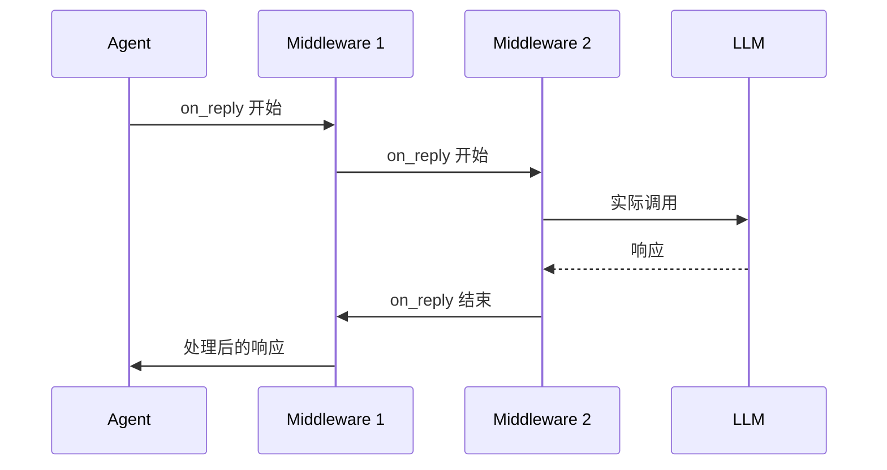

## 前置知识：Agent 类的设计

AgentScope 的 Agent 是一个**高度可组合的抽象**。把 Agent 想象成一个人——有大脑（Model）、有工具箱（Toolkit）、有记忆（Memory）、有决策方式（Planner）。



### Agent 构造函数完整参数

```python
from agentscope.agent import Agent

agent = Agent(
    # === 必选参数 ===
    name="assistant",                    # Agent 唯一名称（字符串）
    system_prompt="You are a...",        # 系统提示词

    # === 模型（可选，但通常必选） ===
    model=DashScopeChatModel(...),       # 大脑

    # === 可选组件 ===
    toolkit=Toolkit(tools=[...]),        # 工具集
    memory=InMemoryMemory(),             # 记忆系统
    planner=ReActPlanner(),              # 规划器（默认 ReAct）
    middleware=[                          # 中间件链
        ContextCompactionMiddleware(),
        TokenLimitMiddleware(),
    ],

    # === 高级配置 ===
    max_rounds=30,                       # 最大推理轮次
    temperature=0.7,                     # 模型温度
    top_p=0.9,                           # 模型 top_p
    stream=True,                         # 是否默认流式
)
```

---

## 一、Toolkit 工具系统

### 工具的本质

在 AgentScope 中，工具（Tool）就是 Agent 可以调用的函数。每个工具会通过 **Function Calling** 机制暴露给 LLM，LLM 决定什么时候调用哪个工具。



### 内置工具清单

| 工具 | 功能 | 使用场景 |
|------|------|---------|
| `Bash()` | 执行 Shell 命令 | 编译、运行代码、文件操作 |
| `Read()` | 读取文件内容 | 查看源代码、日志、配置 |
| `Write()` | 写入文件 | 创建代码文件、配置、文档 |
| `Edit()` | 精确字符串替换 | 修改代码片段 |
| `Grep()` | 正则搜索文件内容 | 查找函数定义、错误信息 |
| `Glob()` | 文件名模式匹配 | 查找特定类型的文件 |
| `WebSearch()` | 网络搜索 | 查找资料、文档、最新信息 |
| `WebFetch()` | 抓取网页内容 | 阅读在线文档、博客 |

### 创建和配置 Toolkit

```python
from agentscope.tool import Toolkit, Bash, Read, Write, Edit, Grep, Glob

# 方式一：声明式创建
toolkit = Toolkit(tools=[
    Bash(timeout=30000),           # 超时 30 秒
    Read(),                         # 读文件
    Write(),                        # 写文件
    Edit(),                         # 编辑文件
    Grep(),                         # 内容搜索
    Glob(),                         # 文件搜索
])

# 方式二：分步添加
toolkit = Toolkit()
toolkit.add(Bash())
toolkit.add(Read())
toolkit.add(Write())
toolkit.register_tool(Grep())      # register_tool 是 add 的别名
```

### 自定义工具

```python
from agentscope.tool import Tool, ToolParam
from typing import Annotated

# 方式一：装饰器定义（推荐）
@Tool.register_tool  # type: ignore[attr-defined]
async def get_weather(
    city: Annotated[str, ToolParam(description="城市名称，如 '北京'")],
    date: Annotated[str, ToolParam(description="日期，格式 YYYY-MM-DD")] = "today",
) -> str:
    """查询指定城市的天气信息"""
    # 模拟 API 调用
    weather_data = {
        "北京": "晴，25°C",
        "上海": "多云，28°C",
        "深圳": "阵雨，30°C",
    }
    return weather_data.get(city, f"未找到 {city} 的天气数据")

# 方式二：类定义
from agentscope.tool import BaseTool

class CalculatorTool(BaseTool):
    name: str = "calculator"
    description: str = "执行数学计算"

    async def __call__(self, expression: str) -> str:
        """计算数学表达式"""
        try:
            result = eval(expression)  # 生产环境需做安全处理
            return f"计算结果: {result}"
        except Exception as e:
            return f"计算错误: {e}"

# 使用
toolkit = Toolkit(tools=[
    Bash(),
    Read(),
    get_weather,       # 直接传函数
    CalculatorTool(),  # 传实例
])
```

> [!warning] 工具描述的写法很重要
> LLM 依赖工具的名称和描述来决定调用哪个工具。描述要写清楚：
> • **做什么**：工具的功能是什么
> • **什么时候用**：适用场景
> • **参数含义**：每个参数的类型和含义
> ```python
> # ❌ 描述太模糊
> @Tool.register_tool
> async def search(query: str) -> str:
>     """搜索"""  # 太模糊，LLM 不知道该什么时候调用
>
> # ✅ 描述清晰
> @Tool.register_tool
> async def search_code(
>     query: Annotated[str, ToolParam(description="要搜索的关键词或正则表达式")],
>     path: Annotated[str, ToolParam(description="搜索路径，默认为当前目录")]
> ) -> str:
>     """在代码库中搜索函数定义、类名或代码片段。适用场景：查找代码位置、理解调用关系"""
> ```

### 工具执行的权限控制

AgentScope 2.0 对工具执行有三层权限拦截（详见 [[AgentScope 2.0 核心架构#权限系统]]）。在开发阶段，可以用 `BYPASS` 模式绕过权限：

```python
from agentscope.permission import PermissionMode

agent = Agent(
    name="dev_agent",
    system_prompt="...",
    model=model,
    toolkit=toolkit,
    permission_mode=PermissionMode.BYPASS,  # 开发阶段跳过权限检查
)
```

---

## 二、Memory 记忆系统

### 记忆的类型

AgentScope 中的 Memory 模仿人类的记忆模型：



### 内置 Memory 实现

| 实现 | 存储位置 | 适用场景 |
|------|---------|---------|
| `InMemoryMemory` | 进程内存 | 开发调试，重启丢失 |
| `RedisMemory` | Redis | Agent Service 多会话持久化 |
| `VectorMemory` | 向量数据库 | RAG 检索增强 |

### 配置示例

```python
from agentscope.memory import InMemoryMemory

# 最简：使用默认 InMemoryMemory
agent = Agent(
    name="assistant",
    system_prompt="...",
    model=model,
    # memory 默认就是 InMemoryMemory，可省略
)

# 自定义：指定记忆容量
memory = InMemoryMemory(max_messages=50)  # 只保留最近 50 条消息
agent = Agent(
    name="assistant",
    system_prompt="...",
    model=model,
    memory=memory,
)
```

### 上下文压缩（重要！）

当对话历史超出模型上下文窗口时，AgentScope 提供自动压缩：

```python
from agentscope.middleware import ContextCompactionMiddleware

agent = Agent(
    name="assistant",
    system_prompt="...",
    model=model,
    middleware=[
        ContextCompactionMiddleware(
            max_tokens=8000,           # 超过 8000 token 触发压缩
            keep_recent=4,             # 保留最近 4 轮对话
        ),
    ],
)
```

> [!important] 上下文压缩原理
> 当历史消息的 token 数超过 `max_tokens` 时：
>  ① 
>  ② 
>  ③ 

---

## 三、Planner 规划器

### ReAct 规划器（默认）

AgentScope 默认使用 ReAct 模式，Agent 在 Reasoning 和 Acting 之间循环：

```python
# 默认就是 ReAct——不需要显式配置
agent = Agent(name="helper", system_prompt="...", model=model)

# 等价于
from agentscope.planner import ReActPlanner
agent = Agent(
    name="helper",
    system_prompt="...",
    model=model,
    planner=ReActPlanner(),
)
```

ReAct 的每一步：

```
Thought: 我需要做 X，因为 Y...
Action: tool_call(args)
Observation: 工具返回的结果
... (重复，直到任务完成)
```

### Plan-and-Execute 规划器

适合需要先规划再执行的任务（如多步骤数据分析）：

```python
from agentscope.planner import PlanAndExecutePlanner

agent = Agent(
    name="analyst",
    system_prompt="You are a data analyst. Always plan first, then execute.",
    model=model,
    toolkit=toolkit,
    planner=PlanAndExecutePlanner(),
)
```

Plan-and-Execute 的两阶段流程：

```
Phase 1 - Plan:
  "我将分 3 步完成:
   1. 读取 CSV 文件
   2. 计算统计指标
   3. 生成可视化图表"

Phase 2 - Execute:
   Step 1 → Step 2 → Step 3（逐步执行）
```

### 如何选择

| 场景 | 推荐 Planner | 原因 |
|------|-------------|------|
| 简单问答、代码生成 | ReAct | 无需预先规划，灵活应对 |
| 多步骤数据分析 | Plan-and-Execute | 先全局规划再执行，减少遗漏 |
| 长任务（10+ 步骤） | Plan-and-Execute | 避免中间迷失方向 |
| 需要动态调整的任务 | ReAct | 每步根据观察结果决定下一步 |

---

## 四、Middleware 中间件系统

### 什么是 Middleware

Middleware 是 AgentScope 的**扩展机制**——在 Agent 生命周期的关键节点插入自定义逻辑，不修改 Agent 核心代码。



### 六大 Hook 点

| Hook | 触发时机 | 典型用途 |
|------|---------|---------|
| `on_system_prompt` | 组装 system prompt 时 | 注入动态信息（日期、用户名） |
| `on_model_call` | 调用 LLM 前/后 | 日志、缓存、速率限制 |
| `on_reasoning` | LLM 推理输出后 | 校验推理格式、提取结构化信息 |
| `on_acting` | 工具调用前/后 | 权限检查增强、结果格式化 |
| `on_compress_context` | 触发上下文压缩时 | 自定义摘要策略 |
| `on_reply` | 回复生成后 | 内容过滤、格式转换 |

### 编写自定义 Middleware

```python
from agentscope.middleware import Middleware, MiddlewareHook

class LoggingMiddleware(Middleware):
    """记录每次模型调用的耗时和 token 用量"""

    async def on_model_call(self, context: MiddlewareHook):
        import time
        start = time.time()

        # 调用下一个中间件 / 实际模型
        result = await context.next()

        elapsed = time.time() - start
        print(f"[{context.agent.name}] 模型调用耗时: {elapsed:.2f}s")
        print(f"  Token 用量: {result.usage}")
        return result


class SensitiveWordFilter(Middleware):
    """过滤回复中的敏感词"""

    def __init__(self, words: list[str]):
        self.words = words

    async def on_reply(self, context: MiddlewareHook):
        result = await context.next()
        # 过滤敏感词
        for word in self.words:
            result = result.replace(word, "***")
        return result


# 使用
agent = Agent(
    name="safe_assistant",
    system_prompt="...",
    model=model,
    middleware=[
        LoggingMiddleware(),
        SensitiveWordFilter(words=["password", "secret"]),
    ],
)
```

### 内置 Middleware

| Middleware | 功能 |
|-----------|------|
| `ContextCompactionMiddleware` | 对话历史过长时自动压缩 |
| `TokenLimitMiddleware` | 限制单次调用的 token 量 |
| `RetryMiddleware` | 模型调用失败时自动重试 |
| `RateLimitMiddleware` | 限制 API 调用频率 |

---

## 五、完整示例：代码审查 Agent

下面是一个**能做代码审查的 Agent** 的完整实现：

```python
import asyncio
import os
from agentscope.agent import Agent
from agentscope.model import DashScopeChatModel
from agentscope.credential import DashScopeCredential
from agentscope.tool import Toolkit, Bash, Read, Grep, Glob
from agentscope.middleware import Middleware, MiddlewareHook
from agentscope.message import UserMsg
from agentscope.event import EventType


# 自定义 Middleware：统计工具调用
class ToolUsageStats(Middleware):
    def __init__(self):
        self.call_count = 0

    async def on_acting(self, context: MiddlewareHook):
        self.call_count += 1
        print(f"  🔧 工具调用 #{self.call_count}: {context.tool_name}")
        return await context.next()


async def code_review_demo():
    # 1. 配置模型
    model = DashScopeChatModel(
        credential=DashScopeCredential(api_key=os.environ["DASHSCOPE_API_KEY"]),
        model="qwen-plus",
    )

    # 2. 配置工具
    toolkit = Toolkit(tools=[
        Bash(timeout=30000),
        Read(),
        Grep(),
        Glob(),
    ])

    # 3. 创建 Agent
    stats = ToolUsageStats()
    agent = Agent(
        name="code_reviewer",
        system_prompt="""You are a senior code reviewer. When given a codebase:
1. Use Glob to find all source files
2. Use Read to examine each file
3. Use Grep to find patterns (error handling, security issues, etc.)
4. Summarize your findings in Chinese:
   - 代码结构
   - 潜在 Bug
   - 安全漏洞
   - 性能问题
   - 改进建议""",
        model=model,
        toolkit=toolkit,
        middleware=[stats],
        max_rounds=10,
    )

    # 4. 执行审查
    print("=" * 60)
    print("🔍 代码审查 Agent 启动")
    print("=" * 60)

    async for event in agent.reply_stream(
        UserMsg("developer", "审查当前目录下的 Python 代码，找出潜在问题")
    ):
        match event.type:
            case EventType.TEXT_BLOCK_DELTA:
                print(event.text, end="", flush=True)
            case EventType.TOOL_CALL_START:
                print(f"\n  ⚡ [{event.tool_name}]", end="")
            case EventType.REPLY_END:
                print(f"\n\n📊 总共调用工具 {stats.call_count} 次")
            case EventType.MODEL_CALL_START:
                pass  # 静默

asyncio.run(code_review_demo())
```

---

## 新手练习路线图

```
阶段 1️⃣  Toolkit 精通（2 天）
  ├── 每个内置 Tool 都手动测试一遍
  ├── 写一个自定义 Tool（如天气查询）
  ├── 理解工具描述对 LLM 调用决策的影响
  └── 对比 3 个工具 vs 8 个工具的 Agent 表现

阶段 2️⃣  Memory 与上下文（1 天）
  ├── 观察对话历史增长对 token 消耗的影响
  ├── 配置 ContextCompactionMiddleware 观察压缩效果
  └── 对比不同 keep_recent 值的表现

阶段 3️⃣  Middleware 实战（1 天）
  ├── 写一个日志 Middleware（记录每次调用）
  ├── 写一个耗时统计 Middleware
  └── 组合多个 Middleware，观察执行顺序

阶段 4️⃣  综合实战（1 天）
  ├── 实现代码审查 Agent（见上文）
  ├── 实现文档生成 Agent
  └── 实现 Bug 修复 Agent
```

---

## 常见易错点

> [!warning] **坑 1：Tool 注册了但不被调用**
> ```python
> # 原因 1：Tool 描述不够清晰，LLM 不知道什么时候用
> # 原因 2：system_prompt 里没告诉 Agent 可以用什么工具
> # 原因 3：模型不支持 Function Calling（确认模型能力）
>
> # ✅ system_prompt 中显式说明工具的使用时机
> system_prompt="""When you need to read a file, use the Read tool.
> When you need to run a command, use the Bash tool."""
> ```

> [!warning] **坑 2：max_rounds 太少导致任务未完成**
> ```python
> # ❌ 复杂任务可能需要 10+ 轮 ReAct
> agent = Agent(max_rounds=3)  # 3 轮可能不够
>
> # ✅ 根据任务复杂度设置
> agent = Agent(max_rounds=20)  # 复杂任务给足轮次
> ```

> [!warning] **坑 3：Middleware 顺序影响执行结果**
> ```python
> # Middleware 是洋葱模型——先注册的先执行（外层），后注册的后执行（内层）
> middleware=[
>     LoggingMiddleware(),      # 第1层（最外层）
>     TokenLimitMiddleware(),   # 第2层
>     RetryMiddleware(),        # 第3层（最接近模型）
> ]
> # 请求: Logging → TokenLimit → Retry → 模型
> # 响应: 模型 → Retry → TokenLimit → Logging
> ```

---

## 🎯 本文学完自检

| 层次 | 检查项 |
|------|--------|
| 🟢 基础 | 能用 `Agent` 类正确配置 model / toolkit / memory / planner 并运行 |
| 🟡 进阶 | 能自定义一个 Tool 并注册到 Toolkit，让 Agent 正确调用 |
| 🔴 挑战 | 能使用 Middleware 在 2 个以上 Hook 点对 Agent 行为进行干预或增强 |

---

## 相关笔记

- [[AgentScope 基础概念与环境搭建]] -- 环境搭建、第一个 Agent
- [[AgentScope 多Agent协作]] -- Orchestrator+Workers 协作模式
- [[AgentScope 2.0 核心架构]] -- 事件系统、权限系统深度解析
- [[AgentScope 调试与评估]] -- Agent 失败诊断、Prompt 优化、Eval 体系
- [[AgentScope 毕业项目：AI研究助手]] -- v2-v4 对应单 Agent 的渐进升级
- [[AgentScope 生产部署与实战]] -- 完整项目案例

---

*最后更新：2026-07-16*
