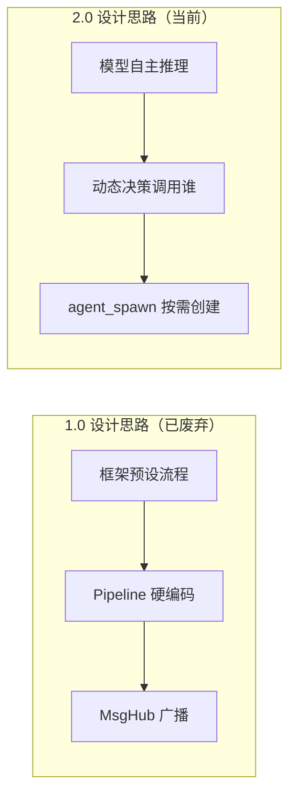
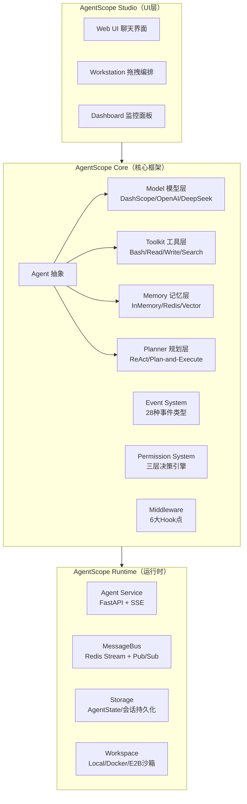
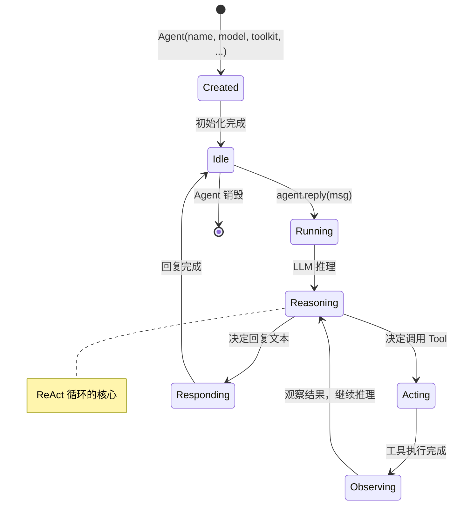

## 前置知识：AgentScope 到底是什么

### AgentScope = 生产级多智能体开发框架

AgentScope 是**阿里巴巴达摩院通义实验室**开源的**生产级多智能体（Multi-Agent）开发框架**。它不是一个简单的 LLM 调用封装，而是一个**完整的 Agent 工程化底座**——从开发、调试到部署、监控，覆盖 Agent 应用的全生命周期。

```python
# AgentScope 的核心抽象：Agent = 模型 + 工具 + 记忆 + 规划
from agentscope.agent import Agent
from agentscope.tool import Toolkit, Bash, Read, Write

agent = Agent(
    name="coder",
    system_prompt="You are a Python expert. Write clean, tested code.",
    model=DashScopeChatModel(...),      # 模型：千问 / OpenAI / DeepSeek
    toolkit=Toolkit(tools=[Bash(), Read(), Write()]),  # 工具
    memory=InMemoryMemory(),            # 记忆
)
# Agent 内部运行 ReAct 循环：Reason → Act → Observe → Reason → ...
```

> [!important] 三个关键词理解 AgentScope
> • **Agent 优先**：一切围绕 Agent 设计，模型、工具、记忆都是 Agent 的组件
> • **事件驱动**：Agent 的每一步执行都产生类型化事件，可观察、可干预、可恢复
> • **工程化**：内置权限系统、沙箱隔离、多租户、监控——为生产而设计

### AgentScope vs LangChain vs AutoGPT

| 特性 | AgentScope 2.0 | LangChain | AutoGPT |
|------|---------------|-----------|---------|
| 定位 | 生产级多Agent框架 | LLM应用开发库 | 自主Agent |
| 多Agent | 原生支持（Agent Team） | 需自行编排 | 不支持 |
| 事件系统 | 28种类型化事件 | Callback | 日志级别 |
| 权限控制 | 三层决策引擎 | 无内置 | 需人工确认 |
| 沙箱隔离 | Local/Docker/E2B | 无内置 | Docker |
| 部署 | Agent Service（FastAPI+SSE） | LangServe | 无内置 |
| 前端 | 预构建 Web UI | 需自建 | 无 |
| 语言 | Python/Java/TypeScript | Python/JS | Python |
| 学习曲线 | 中等（概念多但一致性高） | 陡峭（抽象层多） | 低（开箱即用） |

### AgentScope 的核心理念：不替代模型思考



AgentScope 2.0 的核心转变：**从"框架告诉模型怎么做"变为"模型告诉框架要做什么"**。框架提供工程底座（事件、权限、沙箱、监控），模型自己决定推理路径和协作方式。

---

## 2.0 三层解耦架构



> [!tip] 三层解耦的好处
> • **Core** 可以脱离 Runtime 独立使用（CLI 模式）
> • **Runtime** 可以对接任何 Core Agent（前后端分离）
> • **Studio** 是可选的——你可以只用 Core 开发，用自己写的前端部署

---

## 环境搭建

### 方式一：pip 安装（推荐）

```bash
# 创建虚拟环境
python -m venv .venv
source .venv/bin/activate  # Linux/macOS
# .venv\Scripts\activate   # Windows

# 安装 AgentScope 2.0
pip install agentscope

# 验证
python -c "import agentscope; print(agentscope.__version__)"
# 输出: 2.0.x
```

### 方式二：源码安装（获取最新特性）

```bash
git clone -b main https://github.com/agentscope-ai/agentscope.git
cd agentscope
pip install -e .           # 开发模式安装

# 安装可选依赖
pip install -e ".[rag]"    # RAG 相关
pip install -e ".[runtime]" # Agent Service
```

### 方式三：Docker（沙箱隔离环境）

```bash
# 拉取 AgentScope Runtime 镜像
docker pull agentscope/agentscope-runtime:latest

# 运行 Agent Service
docker run -d \
  --name agentscope-runtime \
  -p 8000:8000 \
  -v /var/run/docker.sock:/var/run/docker.sock \
  agentscope/agentscope-runtime:latest
```

### 环境依赖速查

| 组件 | 最低版本 | 说明 |
|------|---------|------|
| Python | 3.11+ | AgentScope 2.0 需要 |
| Node.js | 18+ | 仅 Web UI / TypeScript 版本需要 |
| Docker | 20.10+ | 沙箱模式需要（可选） |
| Redis | 6.0+ | Agent Service 的 MessageBus + Storage（可选，可用 InMemory 替代） |

---

## 模型配置

AgentScope 支持多种模型提供商，通过 `Model` + `Credential` 两层抽象统一配置。

### DashScope（阿里云通义千问，首选）

```python
import os
from agentscope.model import DashScopeChatModel
from agentscope.credential import DashScopeCredential

model = DashScopeChatModel(
    credential=DashScopeCredential(
        api_key=os.environ["DASHSCOPE_API_KEY"]
    ),
    model="qwen-plus",          # 模型名
    # 可选: qwen-max, qwen-turbo, qwen3.6-plus, qwen3.6-flash
)
```

> [!tip] 免费额度
> 阿里云 DashScope 为新用户提供免费额度，足够学习和开发使用。注册地址：https://dashscope.aliyun.com

### OpenAI / 兼容接口

```python
from agentscope.model import OpenAIChatModel
from agentscope.credential import OpenAICredential

model = OpenAIChatModel(
    credential=OpenAICredential(
        api_key=os.environ["OPENAI_API_KEY"],
        base_url="https://api.openai.com/v1",  # 可替换为兼容接口
    ),
    model="gpt-4o",
)
```

### DeepSeek / 其他兼容 OpenAI 协议的模型

```python
model = OpenAIChatModel(
    credential=OpenAICredential(
        api_key=os.environ["DEEPSEEK_API_KEY"],
        base_url="https://api.deepseek.com",
    ),
    model="deepseek-chat",
)
```

### 环境变量管理（推荐）

```bash
# .env 文件
DASHSCOPE_API_KEY=sk-xxxxx
OPENAI_API_KEY=sk-xxxxx
DEEPSEEK_API_KEY=sk-xxxxx
```

```python
# 加载 .env（需要 pip install python-dotenv）
from dotenv import load_dotenv
load_dotenv()

import os
api_key = os.environ["DASHSCOPE_API_KEY"]
```

---

## 第一个 Agent：Hello AgentScope

### 最简示例：纯对话 Agent

```python
import asyncio
import os
from agentscope.agent import Agent
from agentscope.model import DashScopeChatModel
from agentscope.credential import DashScopeCredential
from agentscope.message import UserMsg

async def main():
    # 1. 创建模型
    model = DashScopeChatModel(
        credential=DashScopeCredential(api_key=os.environ["DASHSCOPE_API_KEY"]),
        model="qwen-plus",
    )

    # 2. 创建 Agent
    agent = Agent(
        name="Friday",
        system_prompt="你是一个友好的助手，名字叫 Friday。用中文回答。",
        model=model,
    )

    # 3. 发送消息（非流式）
    response = await agent.reply(UserMsg("Tony", "你好，Friday！"))
    print(f"Response: {response}")

asyncio.run(main())
```

### 流式输出：实时查看 Agent 思考过程

```python
from agentscope.event import EventType

async def stream_demo():
    # ⚠️ model 需要从外部传入或在此创建
    model = DashScopeChatModel(
        credential=DashScopeCredential(api_key=os.environ["DASHSCOPE_API_KEY"]),
        model="qwen-plus",
    )

    agent = Agent(
        name="Friday",
        system_prompt="You are a helpful assistant.",
        model=model,
    )

    async for event in agent.reply_stream(UserMsg("Tony", "用 Python 写一个快速排序")):
        match event.type:
            case EventType.REPLY_START:
                print("🤖 Agent 开始回复...")
            case EventType.TEXT_BLOCK_DELTA:
                # 流式文本增量
                print(event.text, end="", flush=True)
            case EventType.TOOL_CALL_START:
                print(f"\n🔧 调用工具: {event.tool_name}")
            case EventType.TOOL_RESULT_END:
                print(f"📋 工具返回: {event.result[:200]}...")
            case EventType.REPLY_END:
                print("\n✅ 回复结束")
```

### 带工具的 ReAct Agent

```python
from agentscope.tool import Toolkit, Bash, Read, Write

async def react_demo():
    # 创建模型（实际使用时从环境变量读取 API Key）
    model = DashScopeChatModel(
        credential=DashScopeCredential(api_key=os.environ["DASHSCOPE_API_KEY"]),
        model="qwen-plus",
    )

    toolkit = Toolkit(tools=[
        Bash(),          # 执行 shell 命令
        Read(),          # 读取文件
        Write(),         # 写入文件
    ])

    agent = Agent(
        name="coder",
        system_prompt="""You are a Python programmer. When asked to write code:
1. Write the code to a .py file using the Write tool
2. Run it using the Bash tool
3. If there are errors, fix them and try again""",
        model=model,
        toolkit=toolkit,
    )

    async for event in agent.reply_stream(
        UserMsg("Tony", "写一个 Python 脚本计算斐波那契数列前 20 项，并运行它")
    ):
        match event.type:
            case EventType.TEXT_BLOCK_DELTA:
                print(event.text, end="", flush=True)
            case EventType.TOOL_CALL_START:
                print(f"\n🔧 [{event.tool_name}] {event.tool_input}")

asyncio.run(react_demo())
```

---

## AgentScope 的核心概念速览

### Agent 的生命周期



### ReAct 循环（Reasoning + Acting）

```
用户: "帮我创建一个 Python 项目，包含 hello.py"

Agent 内部 ReAct 循环:
┌──────────────────────────────────────────────────┐
│ Step 1: Reason → "我需要先创建目录"              │
│ Step 2: Act    → Bash("mkdir my_project")        │
│ Step 3: Observe → "目录创建成功"                 │
│ Step 4: Reason → "现在写入 hello.py"             │
│ Step 5: Act    → Write("my_project/hello.py",...) │
│ Step 6: Observe → "文件写入成功"                 │
│ Step 7: Reason → "验证一下能否运行"              │
│ Step 8: Act    → Bash("python hello.py")         │
│ Step 9: Observe → "Hello, World!"               │
│ Step 10: Reason → "一切正常，向用户汇报"         │
│ Step 11: Respond → "项目创建完成！..."           │
└──────────────────────────────────────────────────┘
```

> [!tip] ReAct 是 AgentScope 默认的推理模式
> AgentScope 2.0 的 Agent 类默认使用 ReAct（Reasoning + Acting）模式。不需要显式配置 planner——Agent 会自动循环推理-行动-观察，直到认为任务完成。

---

## 新手练习路线图

```
阶段 1️⃣  环境搭建（0.5-1 天）
  ├── 安装 Python 3.11+ + 创建虚拟环境
  ├── pip install agentscope
  ├── 注册 DashScope 获取 API Key
  └── 跑通第一个 Agent（纯对话）

阶段 2️⃣  理解事件流（1 天）
  ├── 实现流式输出（reply_stream + EventType）
  ├── 观察每一步事件类型的触发顺序
  └── 画出 ReAct 循环的事件流时序图

阶段 3️⃣  工具集成（1 天）
  ├── 给 Agent 添加 Bash 工具
  ├── 添加 Read/Write 工具
  ├── 观察 TOOL_CALL_START/TOOL_RESULT_END 事件
  └── 完成"写代码→运行→修bug"的任务闭环

阶段 4️⃣  模型切换（0.5 天）
  ├── 从 DashScope 切换到 OpenAI
  ├── 配置 DeepSeek
  └── 对比不同模型的工具调用表现
```

---

## 常见易错点

> [!warning] **坑 1：忘记 await agent.reply()**
> ```python
> # ❌ Agent 方法是异步的，不 await 拿不到结果
> response = agent.reply(msg)  # 返回 coroutine，不是结果！
>
> # ✅
> response = await agent.reply(msg)
> ```

> [!warning] **坑 2：API Key 直接写死在代码里**
> ```python
> # ❌ 密钥泄露风险
> credential=DashScopeCredential(api_key="sk-xxxxx")
>
> # ✅ 从环境变量读取
> credential=DashScopeCredential(api_key=os.environ["DASHSCOPE_API_KEY"])
> ```

> [!warning] **坑 3：混淆 Agent.reply() 和 Agent.reply_stream()**
> ```python
> # reply() 返回最终结果（str），适合简单场景
> result = await agent.reply(msg)
>
> # reply_stream() 返回事件流（AsyncIterator），适合需要观察过程的场景
> async for event in agent.reply_stream(msg):
>     handle(event)
> ```

> [!warning] **坑 4：Toolkit 里的工具过多**
> ```python
> # ❌ 给 Agent 塞 20 个工具，模型选择困难，token 成本高
> toolkit = Toolkit(tools=[Bash(), Read(), Write(), ..., Tool20()])
>
> # ✅ 按需组装，一个 Agent 建议 3-5 个工具
> coder_toolkit = Toolkit(tools=[Bash(), Read(), Write(), Edit()])
> researcher_toolkit = Toolkit(tools=[WebSearch(), Read(), Grep()])
> ```

> [!warning] **坑 5：在 async 函数里调用同步方法**
> ```python
> # ❌ AgentScope 2.0 的核心 API 都是异步的
> agent.reply(msg)  # 在同步函数里无法 await
>
> # ✅ 所有 Agent 操作必须在 async 上下文中
> import asyncio
> asyncio.run(main())  # 入口点
> ```

---

## 🎯 本文学完自检

| 层次 | 检查项 |
|------|--------|
| 🟢 基础 | 能独立安装 AgentScope，配置 API Key，成功运行第一个 Agent |
| 🟡 进阶 | 能说明 AgentScope 2.0 与 LangChain / AutoGPT 的核心差异与选型场景 |
| 🔴 挑战 | 能画出 2.0 三层架构图（Agent / Runtime / 工程底座），并解释 Event/Permission/Workspace 之间的关系 |

---

## 相关笔记

- [[AgentScope 单Agent开发]] -- 深入 Toolkit、Memory、Planner、Middleware
- [[AgentScope 多Agent协作]] -- Orchestrator+Workers 模式
- [[AgentScope 2.0 核心架构]] -- Event System、Permission、Agent Service
- [[AgentScope 调试与评估]] -- Agent 失败诊断与 Prompt 优化
- [[AgentScope 生产部署与实战]] -- K8s、监控、完整项目
- [[AgentScope 1.0 到 2.0 迁移指南]] -- 如有 1.0 旧代码
- [[AgentScope 毕业项目：AI研究助手]] -- v1 对应本篇知识点

---

*最后更新：2026-07-16*
