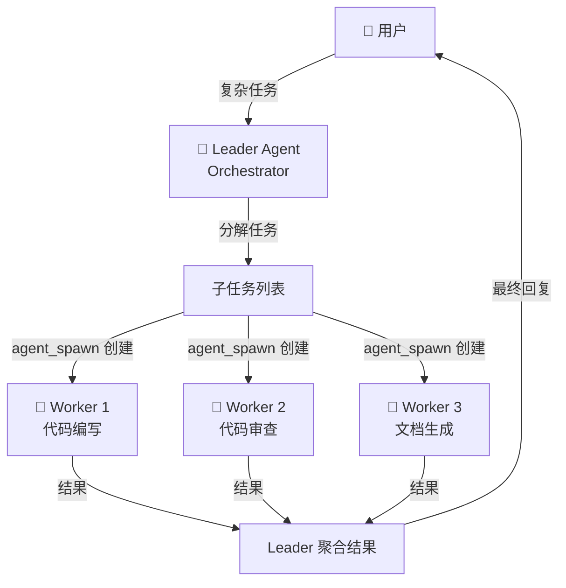
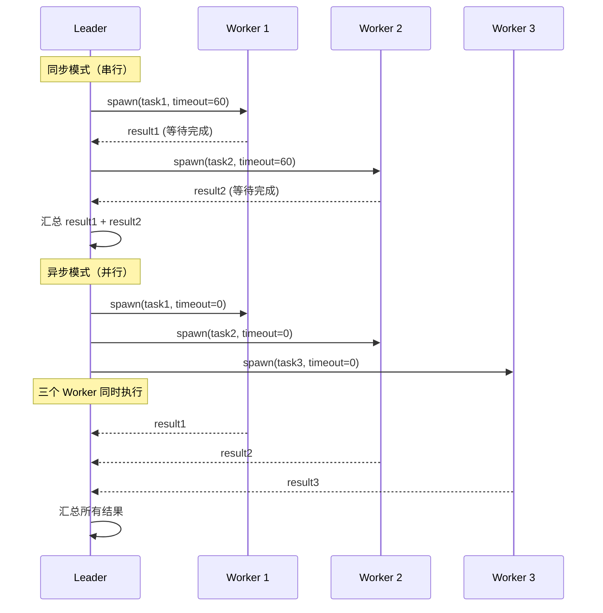
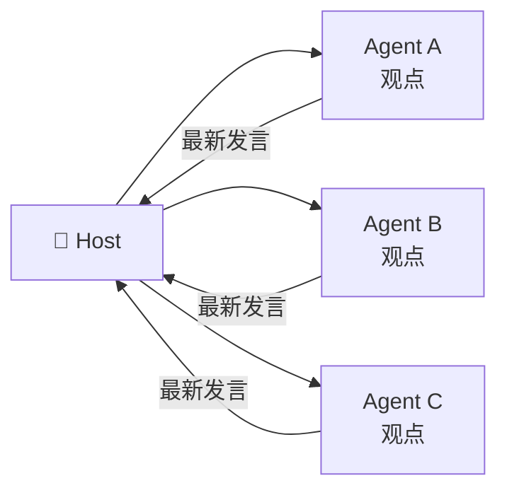
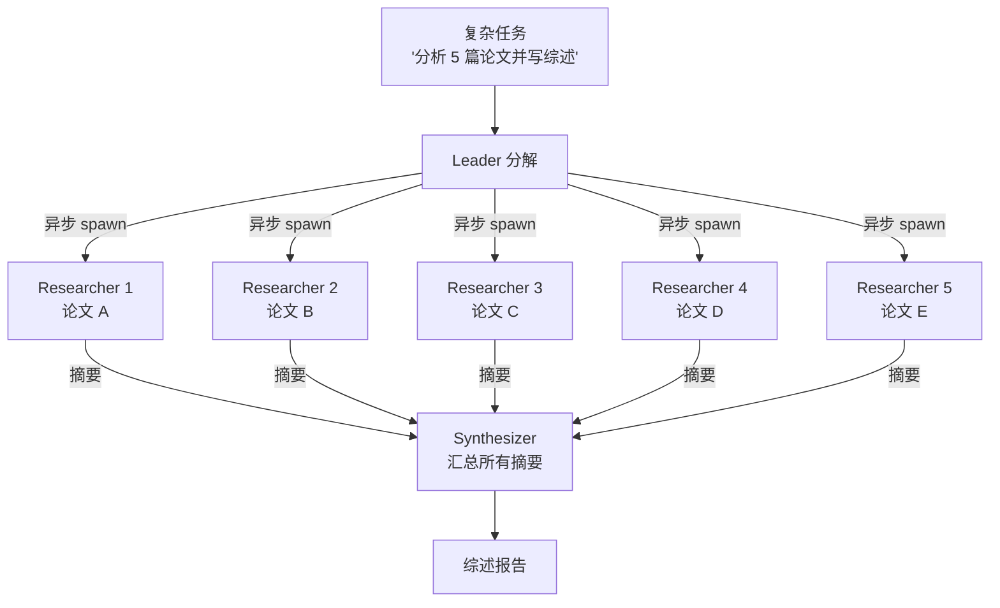
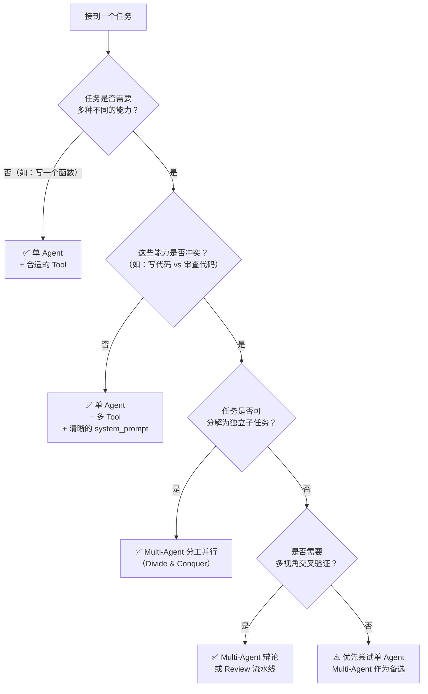

## 前置知识：多Agent协作的核心问题

当你用单个 Agent 处理复杂任务时，会遇到这些瓶颈：

| 问题 | 表现 | 多Agent解决方案 |
|------|------|---------------|
| **上下文爆炸** | 一个 Agent 读 10 个文件，上下文窗口不够 | 每个 Agent 只读自己的那份文件 |
| **能力分散** | 既要求写代码，又要求写文档，还要审查安全 | 不同 Agent 负责不同角色 |
| **单点幻觉** | 一个 Agent 的幻觉没人纠正 | 多个 Agent 交叉验证 |
| **无法并行** | 查 5 个资料只能串行 | 5 个 Agent 同时查 |

> [!important] 多Agent的核心价值
> 不是"多个模型一起聊天"，而是 **"用分工对抗幻觉，用交叉验证提升质量，用并行加速执行"**。

---

## 2.0 的协作模型：Orchestrator + Workers

### 核心理念：Leader 动态决策，Worker 专注执行



**与 1.0 的差异**：1.0 的 Pipeline 是写死的工作流（`SequentialPipeline(a,b,c).run(x)`），2.0 的 Leader 是在运行时**动态决定**谁来做什么。

### 最简单的多Agent例子：Leader + 1 Worker

```python
import asyncio
import os
from agentscope.agent import Agent
from agentscope.model import DashScopeChatModel
from agentscope.credential import DashScopeCredential
from agentscope.tool import Toolkit, Bash, Read, Write
from agentscope.message import UserMsg
from agentscope.team import TeamTools
from agentscope.event import EventType


async def leader_worker_demo():
    model = DashScopeChatModel(
        credential=DashScopeCredential(api_key=os.environ["DASHSCOPE_API_KEY"]),
        model="qwen-plus",
    )

    # Worker Agent：专注执行代码任务
    coder = Agent(
        name="coder",
        system_prompt="You are a Python expert. Write clean, tested code.",
        model=model,
        toolkit=Toolkit(tools=[Bash(), Read(), Write()]),
    )

    # Leader Agent：负责接收需求，委派给 Worker
    leader = Agent(
        name="project_manager",
        system_prompt="""You are a project manager. When given a coding task:
1. Use agent_spawn to delegate the task to the coder agent
2. Wait for the coder's result
3. Verify the result and report to the user""",
        model=model,
        # ⚠️ 关键：Leader 需要 TeamTools 才能 spawn Worker
        toolkit=Toolkit(tools=[
            TeamTools(subagents=[coder]),  # 声明可用的 Worker
        ]),
    )

    # 发送任务给 Leader
    async for event in leader.reply_stream(
        UserMsg("user", "帮我写一个 Python 脚本，计算 100 以内的所有质数，并运行验证")
    ):
        match event.type:
            case EventType.TEXT_BLOCK_DELTA:
                print(event.text, end="", flush=True)
            case EventType.TOOL_CALL_START:
                print(f"\n🔄 [{event.tool_name}]", end="")

asyncio.run(leader_worker_demo())
```

---

## TeamTools 详解

### agent_spawn 的两种模式

```python
# 同步模式：Leader 等待 Worker 完成，拿到完整结果
result = await team_tools.agent_spawn(
    agent_name="coder",
    task="Write a Python function to sort a list",
    timeout_seconds=60,        # 60 秒超时
)
# result 是 Worker 的完整输出

# 异步模式：Leader 发出任务后立即继续，不等待
handle = await team_tools.agent_spawn(
    agent_name="researcher",
    task="Search for latest Python 3.13 features",
    timeout_seconds=0,         # 0 = 异步，不等待
)
# handle 可用于后续检查状态和获取结果
```

| 模式 | `timeout_seconds` | Leader 行为 | 适用场景 |
|------|-------------------|------------|---------|
| **同步** | > 0 | 阻塞等待 Worker 完成 | Worker 结果被下一步需要 |
| **异步** | 0 | 立即返回，不等待 | 多个 Worker 并行执行，最后汇总 |

### 同步 vs 异步的执行时序



> [!tip] 异步模式的正确用法
> 异步 spawn 后，Leader 需要手动等待 Worker 结果。典型模式：
> ```python
> # 1. 派发所有异步任务
> handles = []
> for task in tasks:
>     h = await team_tools.agent_spawn(
>         agent_name="worker",
>         task=task,
>         timeout_seconds=0,
>     )
>     handles.append(h)
> 
> # 2. 等待所有完成
> results = []
> for h in handles:
>     result = await h.get_result(timeout=300)  # 等待并获取
>     results.append(result)
> ```

### SubagentDeclaration：声明式定义 Worker

对于更复杂的场景，可以用 `SubagentDeclaration` 提前定义 Worker 的能力：

```python
from agentscope.team import SubagentDeclaration, TeamTools

# 定义 Worker 的完整规格
code_reviewer_spec = SubagentDeclaration(
    agent=Agent(
        name="code_reviewer",
        system_prompt="You are a senior code reviewer. Focus on bugs, security, and performance.",
        model=model,
        toolkit=Toolkit(tools=[Read(), Grep(), Bash()]),
    ),
    description="代码审查专家，擅长发现 Bug、安全漏洞和性能问题",  # LLM 据此决定何时调用
    max_concurrent=2,  # 最多同时运行 2 个此类型 Worker
)

doc_writer_spec = SubagentDeclaration(
    agent=Agent(
        name="doc_writer",
        system_prompt="You are a technical writer. Write clear, concise documentation.",
        model=model,
        toolkit=Toolkit(tools=[Read(), Write()]),
    ),
    description="技术文档写作专家，擅长将代码逻辑转化为易懂的文档",
    max_concurrent=1,
)

# Leader 使用声明式 Worker
leader = Agent(
    name="tech_lead",
    system_prompt="""You are a tech lead. For each task:
- If it involves code quality, spawn the code_reviewer
- If it involves documentation, spawn the doc_writer
- If both are needed, spawn them in parallel""",
    model=model,
    toolkit=Toolkit(tools=[
        TeamTools(subagents=[code_reviewer_spec, doc_writer_spec]),
    ]),
)
```

---

## 三种经典多Agent协作模式

### 模式一：群聊/讨论（Group Chat）



每个 Agent 轮流发言，Leader 将前人的发言作为上下文传给下一个发言人。

```python
# 群聊系统提示词模板
HOST_PROMPT = """You are hosting a group discussion with the following experts:

{speakers}

Rules:
1. Each expert speaks in turn
2. When it's an expert's turn, pass them the latest summary of the discussion
3. After everyone has spoken, summarize the consensus
4. If there's disagreement, flag it clearly"""

# 在 Host 的系统中声明发言顺序
# Host 的 TeamTools 有所有参与者作为 subagents
```

### 模式二：辩论（Debate）

两个 Agent 持对立立场，互相质询，最终由裁判 Agent 裁决。

```python
PRO_DEBATER_PROMPT = """You are arguing FOR the proposition. 
After hearing the opponent's argument, refute their strongest points 
and present new evidence."""

CON_DEBATER_PROMPT = """You are arguing AGAINST the proposition.
Identify flaws in the opponent's reasoning and provide counter-examples."""

JUDGE_PROMPT = """You are the judge. After hearing both sides:
1. Summarize the strongest arguments from each side
2. Identify which arguments withstand scrutiny
3. Give your verdict with reasoning"""
```

关键代码模式（简化）：

```python
# Host 控制辩论流程
# Round 1: Pro → Con → Pro → Con (每个发言 2 轮)
# Round 2: Judge 给出裁决
con_response = None  # 第一轮由 Pro 先手，故初始为空
for round_num in range(2):
    pro_response = await team_tools.agent_spawn("pro_debater", con_response or topic)
    con_response = await team_tools.agent_spawn("con_debater", pro_response)

verdict = await team_tools.agent_spawn("judge", debate_transcript)
```

### 模式三：分工并行（Divide and Conquer）



```python
# 异步并行执行所有子任务
papers = ["paper_a.pdf", "paper_b.pdf", "paper_c.pdf", "paper_d.pdf", "paper_e.pdf"]

# 每个论文分配给一个 Researcher
handles = []
for paper in papers:
    h = await team_tools.agent_spawn(
        agent_name="researcher",
        task=f"Read and summarize {paper}. Extract: methods, contributions, limitations.",
        timeout_seconds=0,  # 异步
    )
    handles.append(h)

# 等待所有研究员完成
summaries = []
for i, h in enumerate(handles):
    result = await h.get_result(timeout=600)
    summaries.append(f"## 论文 {i+1}\n{result}")

# 交给合成 Agent
synthesizer_prompt = f"""Based on the following paper summaries, 
write a comprehensive literature review:

{chr(10).join(summaries)}"""

review = await team_tools.agent_spawn(
    agent_name="synthesizer",
    task=synthesizer_prompt,
    timeout_seconds=300,
)
```

---

## 1.0 → 2.0 多Agent概念对照

| 1.0 概念 | 2.0 替代 | 变化 |
|----------|---------|------|
| `MsgHub` | 不需要（Leader 隐式管理） | 广播 → Leader 显式分发 |
| `SequentialPipeline(a,b,c)` | Leader 串行 `agent_spawn` a→b→c | 硬编码 → LLM 动态决策 |
| `FanoutPipeline([a,b,c])` | Leader 异步 `agent_spawn` a,b,c | 框架调度 → Agent 自主调度 |
| `Pipelines.conversation([a,b,c])` | Leader 轮询 `agent_spawn` | 自动轮转 → Host 显式调度 |
| `Pipeline.run(x)` | `leader.reply(x)` | 框架驱动 → Agent 驱动 |

> [!important] 为什么要改？
> 1.0 的设计假设"LLM 不够聪明，需要框架预设好流程"。到 2.0，LLM 的推理和工具调用能力大幅提升，Agent 完全有能力自己决定"下一步该叫谁"。
> **核心理念转变：从"框架编排模型"到"模型驾驭框架"**。

---

## 多Agent协作的最佳实践

### 1. 角色定义要明确

```python
# ❌ 角色模糊
coder = Agent(name="assistant_1", system_prompt="Help with tasks")

# ✅ 角色明确，边界清晰
coder = Agent(
    name="python_backend_dev",
    system_prompt="""You are a Python backend developer. Your responsibilities:
- ONLY write Python code
- Use FastAPI for APIs
- Use SQLAlchemy for databases
- DO NOT write frontend code, docs, or tests (other agents handle those)""",
)
```

### 2. Worker 能力要自描述

```python
# SubagentDeclaration 的 description 字段是 LLM 用来决定"何时调用该 Worker"的关键信息
SubagentDeclaration(
    agent=security_auditor,
    description="安全审计专家：在代码写完后审查 SQL 注入、XSS、认证绕过等安全问题。"
                "只在代码完成后调用，不要在其他阶段调用。",
)
```

### 3. Leader 的提示词要包含协作流程

```
You are the project lead. Collaboration workflow:

1. Analyze the user's request → determine which specialists are needed
2. For coding tasks → spawn python_backend_dev FIRST
3. AFTER coding is done → spawn code_reviewer
4. AFTER review passes → spawn doc_writer
5. If review finds issues → spawn python_backend_dev again with review feedback
6. Finally → compile and present results to user

DO NOT spawn all agents at once unless tasks are truly independent.
```

### 4. 控制并发数

```python
# 避免一次性 spawn 20 个 Worker（API 调用成本爆炸）
# 用 max_concurrent 限制并发
SubagentDeclaration(
    agent=researcher,
    max_concurrent=3,  # 最多同时 3 个 Researcher
)
```

---

## 架构决策：什么时候用 Multi-Agent

> [!important] 核心原则
> Multi-Agent 不是"更高级"的单 Agent——它解决的是**不同的问题**。滥用 Multi-Agent 只会增加延迟和 token 成本，不会提升质量。

### 决策树



### 何时用单 Agent

| 场景 | 为什么单 Agent 足够 | 示例 |
|------|-------------------|------|
| 任务简单、线性 | 不需要角色分工 | 写一个 Python 脚本 |
| 需要的能力不冲突 | 一个 system_prompt 就能覆盖 | 代码生成 + 运行 + 调试 |
| 上下文需要完整连贯 | Multi-Agent 的上下文割裂反而有害 | 逐章写小说 |
| 延迟敏感 | spawn Worker 有额外模型调用开销 | 实时对话助手 |

```python
# ✅ 单 Agent 就能做好的事
agent = Agent(
    name="fullstack_dev",
    system_prompt="You write code, run tests, and fix bugs. All in one context.",
    toolkit=Toolkit(tools=[Bash(), Read(), Write(), Edit()]),
)
# 不需要 Leader + Coder + Reviewer + Tester 四个 Agent
```

### 何时用 Multi-Agent

| 场景 | 为什么需要 Multi-Agent | 推荐模式 |
|------|----------------------|---------|
| 角色能力互斥 | Coder 的思维模式与 Reviewer 不同，一个 prompt 难以兼顾 | 流水线（Coder→Reviewer） |
| 子任务天然并行 | 5 篇论文各自独立分析 | 分工并行（Divide & Conquer） |
| 需要对抗性验证 | 安全审查需要"攻击者思维"，开发者不具备 | 辩论（Attacker vs Defender） |
| 上下文隔离是需求 | 每个 Worker 只看自己的那部分，不被其他信息干扰 | 分工并行 |
| 质量要求极高 | 多视角交叉验证比单 Agent 自检更可靠 | 辩论 / 多裁判投票 |

```python
# ✅ Multi-Agent 的场景: 代码安全审查
# Coder 的思维: "如何实现功能"
# Auditor 的思维: "如何攻破这个功能"
# 这两种思维在一个 system_prompt 里互相削弱
security_auditor = Agent(
    name="security_auditor",
    system_prompt="""You are a RED TEAM security auditor.
Your ONLY goal: find ways to break the code.
Do NOT suggest fixes. Do NOT praise good code.
Think like an attacker, not a developer.""",
    toolkit=Toolkit(tools=[Read(), Grep(), Bash()]),
)
```

### 反模式：什么时候**不要**用 Multi-Agent

| 反模式 | 为什么不好 | 正确做法 |
|--------|----------|---------|
| "为了多而多" | 增加 3x token 成本，质量不升反降 | 先用单 Agent 做到最好，再判断是否需要拆分 |
| 每个 Tool 一个 Agent | Agent 不是 Tool 的容器——Toolkit 就是用来组合 Tool 的 | 一个 Agent + 多个 Tool |
| 微管理 Worker | 每步都 spawn 一个 Agent 做最简单的事 | 给 Worker 足够的自主权和上下文 |
| 无限嵌套 | Leader spawn Worker、Worker spawn SubWorker... | 最多两层（Leader→Worker） |

### 选择速查表

| 你的情况 | 推荐方案 |
|---------|---------|
| 任务用一句话能说清楚 | 单 Agent |
| 任务需要 2-3 种工具 | 单 Agent + Toolkit |
| 任务需要不同思维方式 | Multi-Agent（流水线/辩论） |
| 任务可以拆成 N 个独立块 | Multi-Agent（分工并行） |
| 不确定 | **先用单 Agent，评估结果后再决定** |

---

## 新手练习路线图

```
阶段 1️⃣  Leader + 1 Worker（1 天）
  ├── 实现 Leader 将编码任务委派给 Coder
  ├── 观察 Leader 如何决定"是否需要 spawn"
  └── 对比同步 spawn 和异步 spawn 的执行时序

阶段 2️⃣  2-3 Agent 协作（1 天）
  ├── 实现 Coder → Reviewer → DocWriter 的流水线
  ├── 实现并行委派（3 个 Worker 同时执行不同任务）
  └── 观察 LLM 在"串行 vs 并行"决策上的表现

阶段 3️⃣  复杂协作模式（2 天）
  ├── 实现辩论模式（正方 → 反方 → 裁判）
  ├── 实现群聊模式（N 个 Agent 轮流发言）
  └── 实现分工并行模式（N 个 Worker 处理 N 份数据）
```

---

## 常见易错点

> [!warning] **坑 1：Leader 忘记加 TeamTools**
> ```python
> # ❌ Leader 没有 TeamTools，无法 spawn Worker
> leader = Agent(name="boss", system_prompt="Delegate tasks", model=model)
> # leader.reply("spawn coder") → 失败，没有 agent_spawn 工具
>
> # ✅ 必须给 Leader 的 toolkit 添加 TeamTools
> leader = Agent(
>     name="boss",
>     system_prompt="Delegate tasks",
>     model=model,
>     toolkit=Toolkit(tools=[TeamTools(subagents=[coder])]),
> )
> ```

> [!warning] **坑 2：异步 spawn 后忘记 get_result()**
> ```python
> # ❌ spawn 了但没等待结果
> handles = [
>     await team_tools.agent_spawn("worker", task, timeout_seconds=0)
>     for task in tasks
> ]
> # ... Leader 直接回复用户了，Worker 还在跑
>
> # ✅ 显式等待所有结果
> results = [await h.get_result(timeout=300) for h in handles]
> ```

> [!warning] **坑 3：Worker 的 system_prompt 太弱**
> ```python
> # ❌ Worker 不知道自己的边界
> system_prompt="Write code and tests and docs"  # 什么都做 = 什么都做不好
>
> # ✅ Worker 知道自己该做什么、不该做什么
> system_prompt="""You write ONLY unit tests. You receive code, you return tests.
> Do NOT modify the original code. Do NOT write documentation."""
> ```

> [!warning] **坑 4：无限递归 spawn**
> ```python
> # ❌ Leader 的 system_prompt 里写了 "如果不满意，再次 spawn reviewer"
> # 但没有终止条件 → Reviewer 永远返回 "需要改进" → 无限循环
>
> # ✅ 设置明确的终止条件
> system_prompt="""最多让 reviewer 审查 2 次。
> 如果第 2 次还有问题，直接报告给用户，不再重复审查。"""
> ```

---

## 🎯 本文学完自检

| 层次 | 检查项 |
|------|--------|
| 🟢 基础 | 能解释 Orchestrator+Workers 与 1.0 Pipeline 的核心差异 |
| 🟡 进阶 | 能用 `agent_spawn` 实现一个 Leader + 2 个 Worker 的协作场景 |
| 🔴 挑战 | 能根据任务特点（信息共享/观点对抗/并行分工）选择群聊 / 辩论 / 分工三种模式 |

---

## 相关笔记

- [[AgentScope 基础概念与环境搭建]] -- 环境搭建、第一个 Agent
- [[AgentScope 单Agent开发]] -- Toolkit、Memory、Middleware 基础
- [[AgentScope 2.0 核心架构]] -- Agent Team 的底层事件流
- [[AgentScope 调试与评估]] -- 多Agent 场景的调试技巧和 Bug 模式
- [[AgentScope 毕业项目：AI研究助手]] -- v5 Multi-Agent 编排的完整实现
- [[AgentScope 生产部署与实战]] -- 多Agent 项目完整案例
- [[AgentScope 1.0 到 2.0 迁移指南]] -- MsgHub → Orchestrator 详细对照

---

*最后更新：2026-07-16*
