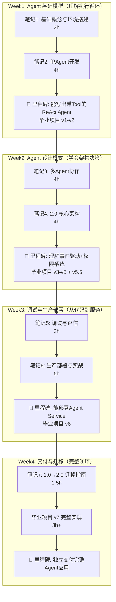
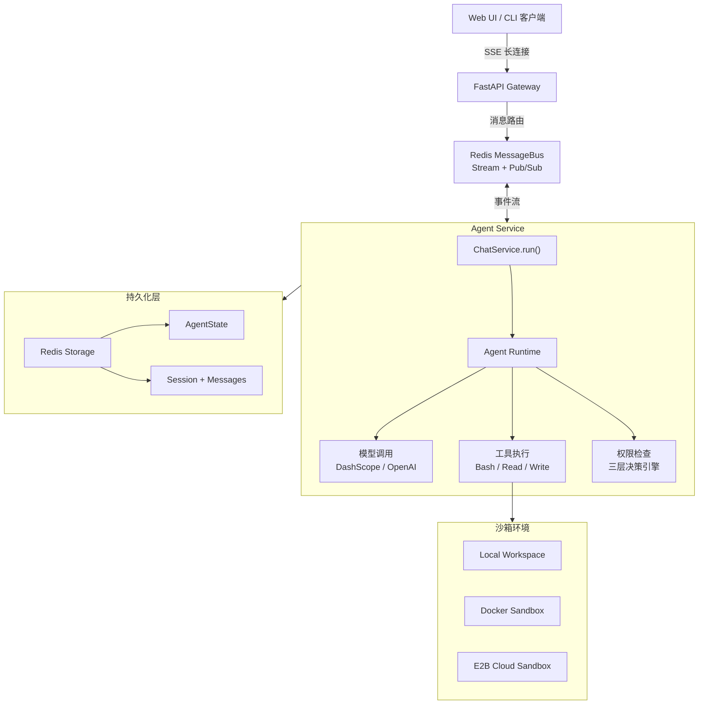

## 📋 课程清单

| # | 笔记 | 核心内容 | 建议学时 |
|---|------|---------|---------|
| 1 | [[AgentScope 基础概念与环境搭建]] | AgentScope 是什么、架构概览、安装配置、第一个 Agent、模型对接 | 3h |
| 2 | [[AgentScope 单Agent开发]] | Agent 类、Toolkit 工具系统、Memory 记忆、Planner 规划器、Middleware 中间件 | 4h |
| 3 | [[AgentScope 多Agent协作]] | Orchestrator+Workers 模式、agent_spawn、SubagentDeclaration、群聊/辩论/分工模式、**架构决策指南** | 4h |
| 4 | [[AgentScope 2.0 核心架构]] | Event System 事件流、Permission 权限三层决策、Agent Team、Agent Service | 4h |
| 5 | [[AgentScope 调试与评估]] | Agent 失败诊断、Tool 调用追踪、Prompt 优化、Eval 评估体系、常见 Bug 模式 | 2h |
| 6 | [[AgentScope 生产部署与实战]] | K8s 部署、Prometheus 监控、沙箱安全、5 个实战项目 | 5h |
| 7 | [[AgentScope 1.0 到 2.0 迁移指南]] | MsgHub → Orchestrator、Pipeline → agent_spawn、API 对照表、迁移 Checklist | 1.5h |
| 📁 | [[AgentScope 毕业项目：AI研究助手]] | 一个项目 8 次升级，贯穿全部笔记：v1 对话 → v2 工具 → v3 记忆 → v4 RAG → v5 多Agent → v5.5 事件追踪 → v6 评估 → v7 部署 | 8h+ |

---

## 🗺️ 推荐学习路线（4 周 / 31.5h）



| 阶段 | 目标 | 检验标准 | 学时 |
|------|------|---------|------|
| **Week1: 基础模型** | 理解 Agent = Model + Tool + Memory 的执行循环 | 写出 ReAct Agent，毕业项目到达 v2（带工具） | 7h |
| **Week2: 设计模式** | 掌握架构决策 + 理解事件驱动架构 | 能画架构决策树，毕业项目到达 v5.5（事件追踪） | 8h+ |
| **Week3: 调试与部署** | 能诊断 Agent 失败 + 部署 Agent Service | 毕业项目 v6 完整可运行 + Docker 部署成功 | 7h+ |
| **Week4: 交付与迁移** | 完成评估→优化→部署的完整交付链路 | 毕业项目 v7 完整可运行 + 监控面板就绪 | 4.5h+ |

> [!tip] 总学时约 31.5h（含毕业项目 8h），建议 4 周完成，每周约 8h。

---

## 🧭 角色导航：不同背景的学习路线

| 你的背景 | 推荐路线 | 可跳过 | 需重点关注 |
|---------|---------|--------|------------|
| 🔵 **纯新手**（无 LLM/Agent 经验） | 笔记1→2→3→4→5→6→7→毕业 | 无 | 笔记1-2 打牢基础，毕业项目 v1-v3 反复练习 |
| 🟢 **有 LangChain/LangGraph 经验** | 笔记1(速读)→3→4→7→毕业 | 笔记2 详解（已会 Toolkit/Memory 概念） | 笔记4 事件系统 vs LangChain Callback、笔记7 迁移指南 |
| 🟠 **平台工程师/运维** | 笔记1(速读)→4→6→7→毕业 v7 | 笔记2-3 细节（开发向） | 笔记6 K8s/监控/安全、笔记4 Agent Service 架构 |
| 🔴 **1.0 老用户** | 笔记7→4→3→毕业 v5 | 笔记1-2（已熟悉） | 迁移指南优先，理解 2.0 事件系统 + agent_spawn |

---

## ⚡ 面试急救速查

### 被问到"AgentScope"时的话题展开树

```
AgentScope
├── 定位与核心理念
│   ├── 阿里达摩院开源的生产级多Agent框架
│   ├── "让模型自主推理，框架提供工程底座"
│   └── 支持 Python / Java / TypeScript 三语言
├── 2.0 核心架构（五大系统）
│   ├── Event System：28种类型化事件，统一事件总线
│   ├── Permission System：三层决策引擎（内置检查→规则→模式）
│   ├── Workspace：Local/Docker/E2B 统一抽象，一行切换
│   ├── Middleware：6大Hook点（on_reply/on_reasoning/on_acting...）
│   └── Agent Service：多租户 + SSE推送 + 持久化会话
├── 多Agent协作（1.0 → 2.0 巨变）
│   ├── 1.0：MsgHub 广播 + Pipeline（Sequential/Fanout/Conversation）
│   └── 2.0：Orchestrator+Workers + agent_spawn（动态决策替代硬编码）
├── Agent 生命周期
│   ├── 创建（Agent声明 + 模型 + 工具 + 系统提示）
│   ├── 执行（ReAct循环：Reason→Act→Observe→Reason→...）
│   ├── 事件流（REPLY_START → MODEL_CALL → TOOL_CALL → REPLY_END）
│   └── 持久化（AgentState序列化，断点恢复）
└── 生产级能力
    ├── 沙箱隔离（Linux namespaces/cgroups + 资源限制）
    ├── 分布式（Actor模型 + Redis MessageBus）
    ├── 监控（Prometheus metrics + Grafana dashboard）
    └── 安全（TLS + 权限系统 + 敏感路径保护）
```

### 面试黄金三段式

>  ① 
>  ② 
>  ③ 

---

## ⚡ 场景速查：我想做什么 → 看哪篇

| 我想… | 看这篇 |
|--------|--------|
| 了解 AgentScope 是什么，适不适合我的项目 | [[AgentScope 基础概念与环境搭建]] |
| 搭建开发环境，跑通第一个 Agent | [[AgentScope 基础概念与环境搭建]] |
| 给 Agent 加工具（Bash/Read/Write/搜索） | [[AgentScope 单Agent开发]] |
| 配置不同模型（千问/OpenAI/DeepSeek） | [[AgentScope 单Agent开发]] |
| 让多个 Agent 协作完成复杂任务 | [[AgentScope 多Agent协作]] |
| **决定用单Agent还是多Agent** | [[AgentScope 多Agent协作#架构决策]] |
| 理解 2.0 的事件驱动架构 | [[AgentScope 2.0 核心架构]] |
| 配置工具调用的权限策略 | [[AgentScope 2.0 核心架构]] |
| **排查 Agent 为什么回答错误 / Tool 没调用** | [[AgentScope 调试与评估]] |
| **评估 Agent 质量、优化 Prompt** | [[AgentScope 调试与评估]] |
| 部署 Agent Service 到生产环境 | [[AgentScope 生产部署与实战]] |
| 从 1.0 迁移到 2.0 | [[AgentScope 1.0 到 2.0 迁移指南]] |
| **跟着一个完整项目从零到交付** | [[AgentScope 毕业项目：AI研究助手]] |

---

## 📝 术语对照表

| 中文术语 | 英文 | 说明 |
|---------|------|------|
| 智能体 / Agent | Agent | LLM + Tool + Memory + Planner 的复合体 |
| 编排器 / 协调者 | Orchestrator / Leader | 负责分解任务、调度 Worker 的主 Agent |
| 工作智能体 | Worker | 被 Leader spawn 出来执行具体任务的 Agent |
| 工具 | Tool | Agent 可调用的函数（Bash/Read/Write 等） |
| 工具集 | Toolkit | 一组 Tool 的集合 |
| 记忆 | Memory | Agent 的短期（对话历史）和长期（向量库）存储 |
| 规划器 | Planner | Agent 的决策策略（ReAct / Plan-and-Execute） |
| 中间件 | Middleware | Agent 生命周期的 Hook 拦截点 |
| 事件系统 | Event System | Agent 每一步执行产生的类型化事件流 |
| 权限系统 | Permission System | 工具调用的三层安全决策引擎 |
| 沙箱 / 工作区 | Workspace | Agent 代码执行的隔离环境（Local/Docker/E2B） |
| 子智能体声明 | SubagentDeclaration | 声明式定义 Worker 的规格（agent + description + max_concurrent） |
| 智能体生成 | agent_spawn | Leader 动态创建 Worker Agent 的操作 |
| 上下文压缩 | Context Compaction | 对话历史过长时自动摘要压缩 |
| 人机协作 | Human-in-the-Loop (HITL) | Agent 执行关键操作前暂停等待用户确认 |
| 检索增强生成 | RAG | 从外部知识库检索相关文档增强回答 |

> [!tip] 术语使用原则
> 本课程中，Orchestrator 统一译为**编排器**，Worker 统一译为**工作Agent**或保留 Worker。中文术语首次出现时标注英文原名。

---

## 📦 环境准备

```bash
# 推荐：Python 3.11+ 虚拟环境
python -m venv .venv
source .venv/bin/activate   # Linux/macOS
# .venv\Scripts\activate    # Windows

# 安装 AgentScope 2.0
pip install agentscope

# 或从源码安装（获取最新特性）
git clone -b main https://github.com/agentscope-ai/agentscope.git
cd agentscope
pip install -e .

# 安装 AgentScope Runtime（可选，用于 Agent Service）
pip install agentscope-runtime
```

验证安装：

```python
import agentscope
print(agentscope.__version__)  # 2.0.x

# 快速验证：创建一个最小 Agent
import asyncio
from agentscope.agent import Agent
from agentscope.message import UserMsg

async def main():
    agent = Agent(
        name="test",
        system_prompt="Reply with 'Hello, AgentScope!'",
    )
    async for event in agent.reply_stream(UserMsg("user", "Say hello")):
        print(event)

asyncio.run(main())
```

> [!important] 版本说明
> 本课程基于 **AgentScope 2.0.x**（2026年7月最新稳定版）。1.0 的内容在迁移指南中有对照说明，但建议直接从 2.0 开始学习。

---

## 🏗️ AgentScope 2.0 生产架构参考



---

## 相关资源

| 类型 | 资源 | 说明 |
|------|------|------|
| 官方 | [AgentScope GitHub](https://github.com/agentscope-ai/agentscope) | 主仓库，源码 + Examples |
| 官方 | [AgentScope 文档](https://doc.agentscope.io) | 完整 API 文档 |
| 官方 | [AgentScope Samples](https://github.com/agentscope-ai/agentscope-samples) | 30+ 可运行示例项目 |
| 官方 | [Runtime Cookbook](https://runtime.agentscope.io) | Agent Service 部署手册 |
| 文章 | [AgentScope 2.0 深度解析](https://zhuanlan.zhihu.com/p/2046267814298784797) | 架构演进分析 |
| 文章 | [从零掌握 AI Agent 开发](https://developer.baidu.com/article/detail.html?id=7550193) | 完整实践指南 |
| 文章 | [AgentScope Java 2.0](https://www.alibabacloud.com/blog/agentscope-java-2-0-building-a-distributed-enterprise-grade-foundation-for-ai-agents_603231) | Java 版企业级特性 |
| 社区 | [AgentScope TypeScript](https://github.com/agentscope-ai/agentscope-typescript) | TypeScript 版本 |

---

*最后更新：2026-07-16*
