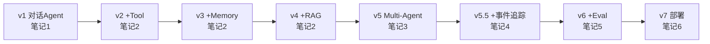
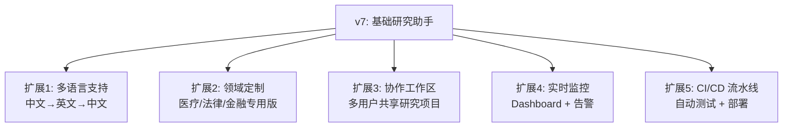

## 前置知识：为什么需要一个贯穿项目

学完 7 篇笔记后，你很可能"懂每个组件，但不知道怎么组合"。这个毕业项目**不是额外的一篇**——它是把前 7 篇笔记的知识**串联成一个可生长的应用**。



## 项目概述：AI 研究助手

**功能**：用户提一个研究问题 → Agent 自动搜索资料 → 分析 → 撰写综述报告 → 自我评估 → 迭代改进。

**架构演进**：

| 版本 | 新增能力 | 对应笔记 | 代码行数 |
|------|---------|---------|---------|
| v1 | 纯对话 Agent | 笔记1 | ~30 |
| v2 | + Bash/Read/Write 工具 | 笔记2 | ~50 |
| v3 | + Memory 跨轮记忆 | 笔记2 | ~70 |
| v4 | + RAG 文档检索 | 笔记2 | ~100 |
| v5 | + 多Agent 编排（Researcher→Analyst→Writer） | 笔记3 | ~180 |
| **v5.5** | **+ 事件流追踪与可观察性** | **笔记4** | **~200** |
| v6 | + 评估与迭代优化 | 笔记5 | ~220 |
| v7 | + Agent Service 部署 | 笔记6 | ~250 |

---

## v1: 纯对话 Agent

**目标**：跑通最基础的 Agent，验证环境。

```python
# research_assistant_v1.py
import asyncio, os
from agentscope.agent import Agent
from agentscope.model import DashScopeChatModel
from agentscope.credential import DashScopeCredential
from agentscope.message import UserMsg
from agentscope.event import EventType

async def main():
    model = DashScopeChatModel(
        credential=DashScopeCredential(api_key=os.environ["DASHSCOPE_API_KEY"]),
        model="qwen-plus",
    )

    assistant = Agent(
        name="research_assistant",
        system_prompt="""你是一个 AI 研究助手。你的职责是帮助用户研究问题。
当前版本: v1 - 基础对话。请告知用户你只能对话，还没有工具能力。""",
        model=model,
    )

    print("=" * 60)
    print("🤖 AI 研究助手 v1 - 基础对话")
    print("=" * 60)

    async for event in assistant.reply_stream(
        UserMsg("researcher", "帮我研究一下：大语言模型在医疗领域的应用现状")
    ):
        if event.type == EventType.TEXT_BLOCK_DELTA:
            print(event.text, end="", flush=True)

asyncio.run(main())
```

> [!tip] v1 检查点
> • [ ] 能正常安装 agentscope 并配置 API Key
> • [ ] Agent 可以流式回复
> • [ ] 理解 `reply_stream()` 返回的事件类型

---

## v2: 带工具的 Agent

**目标**：Agent 可以搜索文件、读取文档、执行命令。

```python
# research_assistant_v2.py
import asyncio, os
from agentscope.agent import Agent
from agentscope.model import DashScopeChatModel
from agentscope.credential import DashScopeCredential
from agentscope.tool import Toolkit, Bash, Read, Write, Glob, Grep, WebSearch, WebFetch
from agentscope.message import UserMsg
from agentscope.event import EventType

async def main():
    model = DashScopeChatModel(
        credential=DashScopeCredential(api_key=os.environ["DASHSCOPE_API_KEY"]),
        model="qwen-plus",
    )

    toolkit = Toolkit(tools=[
        Bash(timeout=60000),
        Read(),
        Write(),
        Glob(),
        Grep(),
        WebSearch(),
        WebFetch(),
    ])

    assistant = Agent(
        name="research_assistant",
        system_prompt="""你是一个 AI 研究助手 v2。你现在拥有了工具能力。

研究流程:
1. 用 WebSearch 搜索相关资料
2. 用 WebFetch 读取有价值的网页
3. 用 Write 保存研究笔记到 research_notes.md
4. 用 Read 回顾你写的笔记
5. 最后用 Bash 做数据验证（如果需要）

每次使用工具前，思考: 这个工具能帮我解决什么问题？""",
        model=model,
        toolkit=toolkit,
        max_rounds=15,
    )

    print("=" * 60)
    print("🤖 AI 研究助手 v2 - 带工具")
    print("=" * 60)

    async for event in assistant.reply_stream(
        UserMsg("researcher", "研究大语言模型在医疗领域的应用，把发现保存到 research_notes.md")
    ):
        match event.type:
            case EventType.TEXT_BLOCK_DELTA:
                print(event.text, end="", flush=True)
            case EventType.TOOL_CALL_START:
                print(f"\n  🔧 [{event.tool_name}]")
            case EventType.REPLY_END:
                print(f"\n  📊 Token 用量: {event.usage}")

asyncio.run(main())
```

> [!tip] v2 检查点
> • [ ] Agent 能自主选择正确的工具
> • [ ] 工具调用有明确的"为什么用这个工具"的推理
> • [ ] 文件正确写入并可读取

---

## v3: 带记忆的 Agent

**目标**：Agent 能记住之前的研究上下文，跨轮对话不丢失信息。

```python
# research_assistant_v3.py
# 在 v2 基础上增加:
from agentscope.memory import InMemoryMemory
from agentscope.middleware import ContextCompactionMiddleware

assistant = Agent(
    name="research_assistant",
    system_prompt="""你是一个 AI 研究助手 v3。你现在有了记忆能力。

重要: 每次研究开始前，先回顾之前的对话历史，确保不重复已经做过的工作。
如果用户说"继续上次的研究"，你需要从记忆中恢复之前的上下文。""",
    model=model,
    toolkit=toolkit,
    memory=InMemoryMemory(max_messages=100),
    middleware=[
        ContextCompactionMiddleware(
            max_tokens=8000,
            keep_recent=4,
        ),
    ],
    max_rounds=15,
)

# === 跨轮对话测试 ===
# 第一轮: "研究 AI 在医疗影像诊断中的应用"
# 第二轮: "继续上次的研究，重点关注 FDA 批准的 AI 诊断工具"
# 第三轮: "基于前两轮的研究，写一份 500 字的综述"

# 验证: Agent 在第三轮能引用第一轮和第二轮的信息
```

> [!tip] v3 检查点
> • [ ] 跨轮对话中 Agent 能引用之前的信息
> • [ ] 上下文压缩在长对话中自动触发
> • [ ] `memory.max_messages` 限制了不无限膨胀

---

## v4: RAG 增强检索

**目标**：Agent 能从本地文档库检索相关知识，提升回答质量。

```python
# research_assistant_v4.py
# 在 v3 基础上增加 RAG 能力

# ⚠️ RAG import 为示意路径，请以官方文档为准
# pip install agentscope[rag]
# from agentscope.rag import RAGTool, VectorStore

# rag_tool = RAGTool(
#     vector_store=VectorStore(
#         persist_directory="./research_chroma_db",
#         embedding_model="text-embedding-v3",
#     ),
#     docs_directory="./research_papers",  # 论文 PDF 目录
#     top_k=5,
# )

# assistant = Agent(
#     name="research_assistant",
#     system_prompt="""你是一个 AI 研究助手 v4。你现在可以检索本地论文库。
#
# 研究流程:
# 1. 理解用户问题 → 提取关键词
# 2. 用 RAG 工具检索本地论文库（优先于 WebSearch）
# 3. 如果本地资料不够 → 再用 WebSearch 补充
# 4. 标注每条信息的来源（本地论文 或 网络搜索）
# 5. 保存研究笔记""",
#     model=model,
#     toolkit=Toolkit(tools=[rag_tool, WebSearch(), WebFetch(), Read(), Write(), Bash()]),
#     memory=InMemoryMemory(max_messages=100),
#     middleware=[ContextCompactionMiddleware(max_tokens=8000, keep_recent=4)],
#     max_rounds=20,
# )
```

> [!tip] v4 检查点
> • [ ] RAG 检索结果与问题相关
> • [ ] Agent 能在"本地资料不够"时自动 fallback 到 WebSearch
> • [ ] 每条信息标注了来源

---

## v5: 多Agent 编排

**目标**：将研究任务拆分为多 Agent 协作——这是毕业项目的核心升级。

```python
# research_assistant_v5.py
import asyncio, os
from agentscope.agent import Agent
from agentscope.model import DashScopeChatModel
from agentscope.credential import DashScopeCredential
from agentscope.tool import Toolkit, Bash, Read, Write, WebSearch, WebFetch
from agentscope.team import TeamTools, SubagentDeclaration
from agentscope.message import UserMsg
from agentscope.event import EventType


async def main():
    model = DashScopeChatModel(
        credential=DashScopeCredential(api_key=os.environ["DASHSCOPE_API_KEY"]),
        model="qwen-plus",
    )

    # Researcher: 负责搜索和收集资料
    researcher = Agent(
        name="researcher",
        system_prompt="""你是研究资料搜集专家。对于给定的子课题:
1. 用 WebSearch 搜索相关中文和英文资料
2. 用 WebFetch 抓取最重要的 3-5 篇文章
3. 提取关键事实、数据、方法
4. 以结构化格式输出（含来源链接）

输出格式:
## 子课题: [名称]
### 关键发现
- 发现1 (来源: url)
- 发现2 (来源: url)
### 主要方法
### 重要数据""",
        model=model,
        toolkit=Toolkit(tools=[WebSearch(), WebFetch(), Read(), Write()]),
    )

    # Analyst: 负责深度分析
    analyst = Agent(
        name="analyst",
        system_prompt="""你是深度分析师。收到研究资料后:
1. 找出不同来源之间的共同发现和矛盾
2. 评估每条信息的可信度（来源权威性、时效性）
3. 发现研究空白（文献中没有回答的问题）
4. 提出值得深入的方向

输出格式:
## 分析报告
### 共识发现（多来源交叉验证）
### 矛盾与争议
### 研究空白
### 建议的深入方向""",
        model=model,
    )

    # Writer: 负责撰写综述
    writer = Agent(
        name="writer",
        system_prompt="""你是学术写作专家。收到分析报告后:
1. 撰写结构完整的综述报告
2. 包含: 摘要、引言、方法综述、关键发现、争议与展望、参考文献
3. 使用学术语言但保持可读性
4. 所有引用标注来源

输出格式: Markdown 格式的完整综述报告""",
        model=model,
    )

    # Director: 编排整个研究流程
    director = Agent(
        name="director",
        system_prompt="""你是研究项目主管。对于用户的每个研究问题:

流程:
1. 将问题分解为 3-5 个子课题
2. 并行 spawn 所有 researcher 处理各自的子课题（timeout_seconds=0）
3. 等待所有 researcher 完成后，将汇总结果交给 analyst
4. 将分析报告交给 writer 生成最终综述
5. 向用户交付最终报告

质量要求:
- researcher 必须在 180 秒内完成
- 如果某个 researcher 的结果质量不够，重新 spawn 一次
- 最终报告必须包含至少 5 个引用来源""",
        model=model,
        toolkit=Toolkit(tools=[
            TeamTools(subagents=[
                SubagentDeclaration(
                    agent=researcher,
                    description="研究资料搜集专家: 搜索网络资料并提取关键信息",
                    max_concurrent=3,
                ),
                SubagentDeclaration(
                    agent=analyst,
                    description="深度分析师: 交叉验证多源信息并发现研究空白",
                    max_concurrent=1,
                ),
                SubagentDeclaration(
                    agent=writer,
                    description="学术写作专家: 将分析结果撰写为结构化的综述报告",
                    max_concurrent=1,
                ),
            ]),
        ]),
        max_rounds=15,
    )

    print("=" * 60)
    print("🤖 AI 研究助手 v5 - Multi-Agent 编排")
    print("=" * 60)

    topic = "大语言模型在医疗诊断中的可靠性研究"

    async for event in director.reply_stream(
        UserMsg("scientist", f"研究课题: {topic}")
    ):
        match event.type:
            case EventType.TEXT_BLOCK_DELTA:
                print(event.text, end="", flush=True)
            case EventType.TOOL_CALL_START:
                # tool_input 可能是 dict 或 str，兼容处理
                agent_name = "?"
                if isinstance(event.tool_input, dict):
                    agent_name = event.tool_input.get("agent_name", "?")
                print(f"\n  📢 委派任务给: {agent_name}")
            case EventType.REPLY_END:
                print(f"\n\n✅ 研究完成")

    # === 架构决策说明 ===
    # 为什么用 Multi-Agent 而不是单 Agent？
    # 1. 角色不同: 搜索(methodical) vs 分析(critical) vs 写作(creative) → 一个 prompt 难以兼顾
    # 2. 上下文隔离: 5 个 researcher 并行搜索 → 每个只看 1 个子课题的上下文
    # 3. 质量可控: 每个阶段的输出可独立检查和重试
    # 4. 可扩展: 加一个 fact_checker Agent 不影响现有流程

asyncio.run(main())
```

> [!tip] v5 检查点
> • [ ] Director 能正确分解问题为子课题
> • [ ] Researcher 并行执行（观察日志时间戳）
> • [ ] 各 Agent 的输出格式符合 system_prompt 要求
> • [ ] 最终报告有完整的引用链

---

## v5.5: 事件流追踪与可观察性

**目标**：利用 Event System 对 v5 的多 Agent 编排过程进行全链路追踪，实现可观察性。

**对应笔记**：[[AgentScope 2.0 核心架构]] - Event System

```python
# research_assistant_v5_5.py
# 在 v5 基础上增加事件追踪器

from agentscope.event import EventType
import time

class ResearchEventTracer:
    """追踪多Agent研究全流程的事件流"""

    def __init__(self):
        self.timeline = []
        self.current_round = 0

    async def trace(self, agent, user_msg):
        """追踪 Agent 执行的完整事件流"""
        round_start = time.time()

        async for event in agent.reply_stream(user_msg):
            entry = {
                "timestamp": time.time(),
                "elapsed_ms": round((time.time() - round_start) * 1000),
                "type": str(event.type),
            }

            match event.type:
                case EventType.REPLY_START:
                    self.current_round += 1
                    entry["round"] = self.current_round
                    print(f"\n{'='*40}")
                    print(f"🔄 Round {self.current_round} 开始")

                case EventType.TOOL_CALL_START:
                    entry["tool"] = event.tool_name
                    if event.tool_name == "agent_spawn":
                        agent_name = "?"
                        if isinstance(event.tool_input, dict):
                            agent_name = event.tool_input.get("agent_name", "?")
                        entry["spawn"] = agent_name
                        print(f"  📢 委派 → {agent_name}")
                    else:
                        print(f"  🔧 工具: {event.tool_name}")

                case EventType.TOOL_RESULT_END:
                    result_len = len(str(event.result))
                    entry["result_chars"] = result_len
                    print(f"  ✅ 结果: {result_len} 字符")

                case EventType.REPLY_END:
                    entry["usage"] = str(getattr(event, "usage", "N/A"))
                    print(f"  📊 Round {self.current_round} 完成")
                    print(f"{'='*40}")

            self.timeline.append(entry)

        return self.timeline

# === 使用方式 ===
# tracer = ResearchEventTracer()
# timeline = await tracer.trace(director, UserMsg("scientist", f"研究课题: {topic}"))
# ```
# === 分析报告 ===
#
# print("\n" + "="*60)
# print("📊 事件流分析报告")
# print("="*60)
#
# # 1. 每个 Worker 的耗时
# spawn_events = [e for e in timeline if e.get("spawn")]
# for spawn in spawn_events:
#     print(f"  Worker {spawn['spawn']}: 耗时 {spawn['elapsed_ms']}ms")
#
# # 2. 工具调用统计
# tool_events = [e for e in timeline if e["type"] == "TOOL_CALL_START" and "spawn" not in e]
# print(f"\n  总工具调用次数: {len(tool_events)}")
#
# # 3. ReAct 轮次
# print(f"  ReAct 总轮次: {tracer.current_round}")
```

> [!tip] v5.5 检查点
> • [ ] 事件追踪器能记录完整的 REPLY_START → ... → REPLY_END 链路
> • [ ] 能区分 agent_spawn（子 Agent 委派）和普通工具调用
> • [ ] 能生成包含耗时、轮次、工具统计的分析报告
> • [ ] 理解事件流如何驱动前端 SSE 推送（对应笔记4 Agent Service）

---

## v6: 评估与迭代优化

**目标**：让 Agent 自我评估输出质量，根据评估结果迭代改进。

```python
# research_assistant_v6.py
# 在 v5 基础上增加 Evaluator Agent 和优化循环

# Evaluator: 评估报告质量
evaluator = Agent(
    name="evaluator",
    system_prompt="""你是研究报告质量评估专家。用以下维度评分(1-5):

评分维度:
1. 完整性: 是否覆盖了所有子课题
2. 准确性: 事实是否有来源支撑，有无明显错误
3. 深度: 是否超越表面信息，提供深入分析
4. 结构: 报告组织是否清晰易读
5. 引用: 来源是否充足、可靠、可追溯

如果总分 < 18/25，明确指出需要改进的 3 个具体点。
如果总分 >= 18/25，报告通过。

输出格式:
## 评估报告
| 维度 | 评分 | 说明 |
| 完整性 | X/5 | ... |
...
**总分: XX/25**
**结论: [通过 / 需要改进]**
**改进建议 (如果不通过):** 1... 2... 3...""",
    model=DashScopeChatModel(
        credential=DashScopeCredential(api_key=os.environ["DASHSCOPE_API_KEY"]),
        model="qwen-max",  # 评估用更强的模型
    ),
)

# Director 新增评估循环:
DIRECTOR_PROMPT_V6 = """你是研究项目主管 v6。增加了评估与迭代。

流程:
1. (同 v5) 分解 → 并行研究 → 分析 → 写作
2. **新增**: 将报告交给 evaluator 评分
3. 如果 evaluator 通过(>=18/25)→ 交付用户
4. 如果 evaluator 不通过 → 根据改进建议重新优化
   - 最多优化 2 轮
   - 每轮只聚焦 evaluator 指出的 top-3 问题
5. 向用户交付最终报告 + 评估结果

关键约束: 最多 2 轮优化，避免无限循环。"""
```

```python
# === 评估数据记录（建议在项目中收集） ===
evaluation_log = {
    "v6_run_001": {
        "topic": "LLM in medical diagnosis",
        "rounds": 2,
        "scores": {
            "round_1": {"completeness": 3, "accuracy": 4, "depth": 3, "structure": 4, "citation": 3, "total": 17},
            "round_2": {"completeness": 4, "accuracy": 4, "depth": 4, "structure": 4, "citation": 4, "total": 20},
        },
        "improvements": [
            "增加了 PubMed 文献引用",
            "补充了 FDA 监管视角的分析",
        ],
        "cost_tokens": 48500,
    }
}
```

> [!tip] v6 检查点
> • [ ] Evaluator 能给出有意义的评分和具体改进建议
> • [ ] Director 根据反馈确实改进了报告质量
> • [ ] 2 轮优化后报告有明显提升
> • [ ] 记录了评估日志供后续分析

---

## v7: 生产部署

**目标**：将研究助手部署为 Agent Service，通过 Web UI 访问。

### 部署步骤

```bash
# 1. 启动 Redis
docker run -d --name redis -p 6379:6379 redis:7-alpine

# 2. 安装 Runtime
pip install agentscope[runtime]

# 3. 将 Director Agent 注册为 Agent Service
# 创建 agent_config.py
cat > agent_config.py << 'EOF'
from research_assistant_v6 import create_director_agent
import os

# 注册 Agent 到 Agent Service
AGENT = create_director_agent()
AGENT_NAME = "research_assistant_v7"
EOF

# 4. 启动 Agent Service
export DASHSCOPE_API_KEY=sk-xxxxx
python -m agentscope.runtime.main --host 0.0.0.0 --port 8000

# 5. 访问 Web UI
# http://localhost:8000/ui
```

### Docker Compose 生产部署

```yaml
services:
  redis:
    image: redis:7-alpine
    ports:
      - "6379:6379"

  research-assistant:
    build: .
    ports:
      - "8000:8000"
    environment:
      - DASHSCOPE_API_KEY=${DASHSCOPE_API_KEY}
      - REDIS_HOST=redis
    depends_on:
      - redis
    volumes:
      - ./research_data:/workspace
```

### 监控指标

部署后关注以下关键指标：

| 指标 | 含义 | 告警阈值 |
|------|------|---------|
| 单次研究耗时 | Director 从开始到交付的时间 | P95 > 300s |
| Token 消耗 | 单次研究的 token 总量 | > 100K |
| Evaluator 首次通过率 | 第一轮就 >= 18/25 的比例 | < 60% |
| 平均优化轮次 | 达到通过标准需要的轮数 | > 2 |
| 用户满意度 | (后续可接人工反馈) | — |

> [!tip] v7 检查点
> • [ ] Agent Service 成功启动
> • [ ] Web UI 可以正常对话
> • [ ] 多轮研究之间状态正确隔离
> • [ ] 监控面板能看到核心指标
> • [ ] Redis 持久化，重启后会话可恢复

---

## 版本对比总结

| 维度 | v1 | v3 | v5 | v7 |
|------|----|----|----|-----|
| Agent 数 | 1 | 1 | 4+ | 4+ |
| 工具体系 | 无 | Bash/Read/Write/Web | + TeamTools | 同 v5 |
| 记忆 | 无 | InMemory | 同 v3 | Redis持久化 |
| 知识检索 | 无 | WebSearch | + RAG (可选) | 同 v5 |
| 质量保障 | 无 | 无 | Evaluator | + 监控面板 |
| 部署形态 | CLI | CLI | CLI | Web Service |

---

## 扩展方向

完成 v7 后，可以继续扩展：



---

## 🎯 本文学完自检

| 层次 | 检查项 |
|------|--------|
| 🟢 基础 | 能独立运行毕业项目 v1-v7 的任意一个版本，并说明其对应的知识点 |
| 🟡 进阶 | 能在 v5.5 中追踪一次完整的多 Agent 事件流，并生成包含耗时、轮次、工具统计的分析报告 |
| 🔴 挑战 | 能根据 Evaluator 反馈迭代改进报告质量，并将最终版本部署为可访问的 Agent Service |

---

## 相关笔记

- [[AgentScope 基础概念与环境搭建]] -- 环境搭建和第一个 Agent（对应 v1）
- [[AgentScope 单Agent开发]] -- Toolkit、Memory、Middleware（对应 v2-v4）
- [[AgentScope 多Agent协作]] -- Orchestrator+Workers 模式（对应 v5）
- [[AgentScope 调试与评估]] -- Agent 诊断和评估体系（对应 v6）
- [[AgentScope 生产部署与实战]] -- K8s/Docker 部署（对应 v7）
- [[AgentScope 2.0 核心架构]] -- 事件流和权限系统（贯穿全部版本）
- [[AgentScope 1.0 到 2.0 迁移指南]] -- 如有 1.0 旧代码需迁移

---

*最后更新：2026-07-16*
