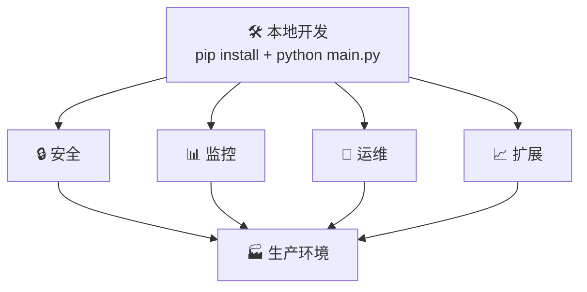
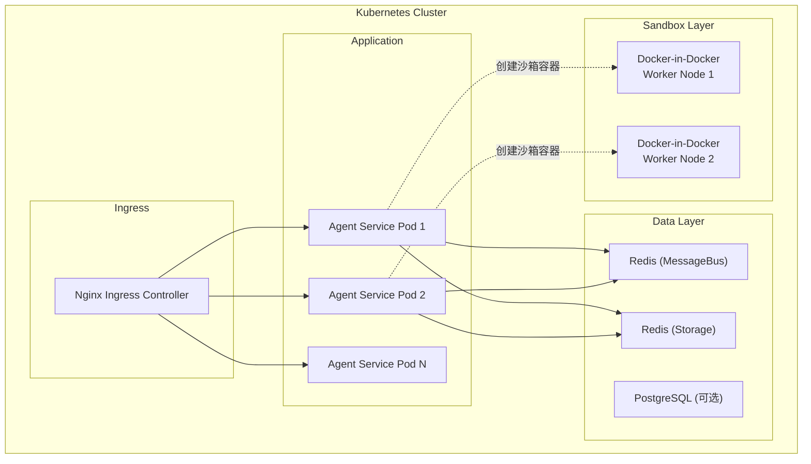

## 前置知识：从开发到生产的鸿沟

在本地跑通一个 Agent Demo 和在生产环境稳定运行，中间隔着这些工程化难题：



AgentScope 2.0 通过 Runtime 层（Agent Service、MessageBus、Storage、Workspace）解决了这些鸿沟。

---

## 一、Kubernetes 部署

### 最小化部署架构



### Helm Chart 部署（推荐）

> [!note] Helm Chart 可用性
> 以下 Helm 仓库地址为预期地址。截至 2026 年 7 月，AgentScope 的官方 Helm Chart 可能仍在开发中。如果 `helm repo add` 失败，请使用下方的 Docker Compose 方式或手动编写 K8s 部署清单。

```bash
# 添加 AgentScope Helm 仓库
helm repo add agentscope https://agentscope-ai.github.io/charts
helm repo update

# 安装（最小配置）
helm install my-agentscope agentscope/agentscope-runtime \
  --set redis.messageBus.host=redis-mb.default.svc.cluster.local \
  --set redis.storage.host=redis-store.default.svc.cluster.local \
  --set workspace.mode=docker \
  --set replicas=3

# 自定义配置
helm install my-agentscope agentscope/agentscope-runtime -f values.yaml
```

### values.yaml 关键配置

```yaml
# values.yaml
replicas: 3

image:
  repository: agentscope/agentscope-runtime
  tag: "2.0-latest"
  pullPolicy: IfNotPresent

service:
  type: ClusterIP
  port: 8000

ingress:
  enabled: true
  host: agentscope.example.com
  tls:
    enabled: true
    secretName: agentscope-tls

# Redis 配置
redis:
  messageBus:
    host: redis-mb.default.svc.cluster.local
    port: 6379
    db: 0
  storage:
    host: redis-store.default.svc.cluster.local
    port: 6379
    db: 0

# Workspace 沙箱配置
workspace:
  mode: docker  # local | docker | e2b
  docker:
    dindEnabled: true
    defaultImage: python:3.12-slim
    resourceLimits:
      cpu: "1"
      memory: "512Mi"
    networkPolicy: "none"  # none | internal | external

# 自动扩缩容
autoscaling:
  enabled: true
  minReplicas: 2
  maxReplicas: 10
  targetCPUUtilizationPercentage: 70

# 监控
monitoring:
  prometheus:
    enabled: true
    path: /metrics
  grafana:
    enabled: true
    dashboards:
      - agentscope-overview
      - agentscope-agent-detail
```

### Docker Compose 部署（小规模 / 自托管）

```yaml
# docker-compose.yml
# (Docker Compose V2 已废弃 version 字段，无需声明)

services:
  redis-mb:
    image: redis:7-alpine
    ports:
      - "6379:6379"
    command: redis-server --appendonly no
    volumes:
      - redis-mb-data:/data

  redis-store:
    image: redis:7-alpine
    ports:
      - "6380:6379"
    command: redis-server --appendonly yes
    volumes:
      - redis-store-data:/data

  agentscope-runtime:
    image: agentscope/agentscope-runtime:2.0-latest
    ports:
      - "8000:8000"
    environment:
      - REDIS_MB_HOST=redis-mb
      - REDIS_MB_PORT=6379
      - REDIS_STORE_HOST=redis-store
      - REDIS_STORE_PORT=6379
      - WORKSPACE_MODE=docker
      - DASHSCOPE_API_KEY=${DASHSCOPE_API_KEY}
    volumes:
      - /var/run/docker.sock:/var/run/docker.sock
      - agentscope-workspaces:/workspaces
    depends_on:
      - redis-mb
      - redis-store

volumes:
  redis-mb-data:
  redis-store-data:
  agentscope-workspaces:
```

```bash
# 启动
DASHSCOPE_API_KEY=sk-xxxxx docker-compose up -d

# 查看日志
docker-compose logs -f agentscope-runtime

# 停止
docker-compose down
```

---

## 二、监控与可观测性

### Prometheus Metrics

AgentScope 内置了 Prometheus metrics 端点（`/metrics`）：

| Metric | 类型 | 含义 |
|--------|------|------|
| `agentscope_agent_replies_total` | Counter | Agent 回复总数 |
| `agentscope_agent_reply_duration_seconds` | Histogram | Agent 回复耗时分布 |
| `agentscope_model_calls_total` | Counter | 模型调用次数 |
| `agentscope_model_call_duration_seconds` | Histogram | 模型调用耗时 |
| `agentscope_model_tokens_total` | Counter | Token 消耗总量 |
| `agentscope_tool_calls_total` | Counter | 工具调用次数 |
| `agentscope_tool_call_errors_total` | Counter | 工具调用错误数 |
| `agentscope_active_sessions` | Gauge | 活跃会话数 |
| `agentscope_sandbox_containers` | Gauge | 沙箱容器数 |

### Grafana Dashboard 关键面板

```python
# 在你的监控脚本中获取核心指标
import requests

# Agent 调用统计
resp = requests.get("http://localhost:8000/metrics")
# 关注:
# - agentscope_agent_reply_duration_seconds (P50/P95/P99)
# - agentscope_model_tokens_total (成本监控)
# - agentscope_tool_call_errors_total (错误率)

# 告警规则示例（PrometheusRule）
"""
groups:
  - name: agentscope
    rules:
      - alert: HighErrorRate
        expr: rate(agentscope_tool_call_errors_total[5m]) > 0.1
        for: 5m
        labels:
          severity: warning
        annotations:
          summary: "Agent tool call error rate > 10%"

      - alert: HighTokenUsage
        expr: rate(agentscope_model_tokens_total[1h]) > 100000
        for: 10m
        labels:
          severity: info
        annotations:
          summary: "Token usage exceeded 100k per hour"

      - alert: SlowReplies
        expr: histogram_quantile(0.95, agentscope_agent_reply_duration_seconds) > 60
        for: 5m
        labels:
          severity: warning
        annotations:
          summary: "P95 Agent reply time > 60s"
"""
```

---

## 三、安全最佳实践

### 安全清单

| 层级 | 措施 | 说明 |
|------|------|------|
| **网络** | TLS 加密 | Ingress 配置 TLS，内部服务间 mTLS |
| **认证** | API Key / OAuth2 | Agent Service 的所有 API 需要认证 |
| **授权** | 多租户隔离 | Agent 实例跨租户不可见 |
| **沙箱** | Docker / E2B 隔离 | 代码执行在独立容器中 |
| **权限** | 三层决策引擎 | 敏感路径始终保护，即使 BYPASS 模式 |
| **密钥** | 环境变量 / Secret | API Key 通过 K8s Secret 注入 |
| **审计** | 事件日志 | 所有工具调用和权限决策可追溯 |

### 关键安全配置

```yaml
# K8s Secret 管理 API Key
apiVersion: v1
kind: Secret
metadata:
  name: agentscope-credentials
type: Opaque
stringData:
  dashscope-api-key: "sk-xxxxxxxx"
  openai-api-key: "sk-xxxxxxxx"
---
# 在 Deployment 中挂载
env:
  - name: DASHSCOPE_API_KEY
    valueFrom:
      secretKeyRef:
        name: agentscope-credentials
        key: dashscope-api-key
```

```python
# 代码中禁止硬编码密钥
# ❌
credential = DashScopeCredential(api_key="sk-xxxxx")

# ✅
credential = DashScopeCredential(api_key=os.environ["DASHSCOPE_API_KEY"])
```

### 网络策略

```yaml
# 限制沙箱容器的网络访问
apiVersion: networking.k8s.io/v1
kind: NetworkPolicy
metadata:
  name: sandbox-isolation
spec:
  podSelector:
    matchLabels:
      app: agentscope-sandbox
  policyTypes:
    - Egress
  egress:
    # 只允许访问 Agent Service
    - to:
        - podSelector:
            matchLabels:
              app: agentscope-runtime
    # 拒绝所有其他出站流量
    - to:
        - ipBlock:
            cidr: 0.0.0.0/0
          ports:
            - port: 53
              protocol: UDP  # 仅允许 DNS
```

---

## 四、实战项目 1：RAG 知识库 Agent

### 项目目标

构建一个能检索本地文档并回答问题 RAG Agent。

### 核心代码

```python
import asyncio
import os
from agentscope.agent import Agent
from agentscope.model import DashScopeChatModel
from agentscope.credential import DashScopeCredential
from agentscope.tool import Toolkit, Bash, Read, Glob
from agentscope.message import UserMsg
from agentscope.event import EventType

# ⚠️ RAG 相关 import 为示意路径
# AgentScope 的 RAG 功能可能需要额外安装: pip install agentscope[rag]
# 实际 import 路径以官方文档为准: https://doc.agentscope.io
from agentscope.rag import RAGTool, VectorStore      # 示意路径


async def rag_agent_demo():
    model = DashScopeChatModel(
        credential=DashScopeCredential(api_key=os.environ["DASHSCOPE_API_KEY"]),
        model="qwen-plus",
    )

    # 配置 RAG：向量数据库 + 文档库
    vector_store = VectorStore(
        persist_directory="./chroma_db",
        embedding_model="text-embedding-v3",
    )

    rag_tool = RAGTool(
        vector_store=vector_store,
        docs_directory="./docs",  # 要检索的文档目录
        top_k=5,                  # 每次检索返回 5 个最相关片段
    )

    agent = Agent(
        name="knowledge_assistant",
        system_prompt="""You are a knowledge base assistant. 
When answering questions:
1. Use the RAG tool to search for relevant documents
2. Cite the document source when answering
3. If no relevant documents found, say so honestly""",
        model=model,
        toolkit=Toolkit(tools=[rag_tool, Read()]),
    )

    async for event in agent.reply_stream(
        UserMsg("user", "AgentScope 的 Permission System 有几层？每层做什么？")
    ):
        if event.type == EventType.TEXT_BLOCK_DELTA:
            print(event.text, end="", flush=True)

asyncio.run(rag_agent_demo())
```

---

## 五、实战项目 2：多Agent辩论系统

### 项目目标

实现 3 个 Agent 的辩论系统：正方、反方、裁判。

```python
import asyncio
import os
from agentscope.agent import Agent
from agentscope.model import DashScopeChatModel
from agentscope.credential import DashScopeCredential
from agentscope.tool import Toolkit
from agentscope.team import TeamTools, SubagentDeclaration
from agentscope.message import UserMsg
from agentscope.event import EventType


async def debate_demo(topic: str, rounds: int = 2):
    model = DashScopeChatModel(
        credential=DashScopeCredential(api_key=os.environ["DASHSCOPE_API_KEY"]),
        model="qwen-plus",
    )

    # 正方
    pro = Agent(
        name="pro",
        system_prompt=f"""You are arguing FOR the proposition: "{topic}"
After hearing the opponent, refute their strongest points and present new evidence.
Be logical and evidence-based. Use Chinese.""",
        model=model,
    )

    # 反方
    con = Agent(
        name="con",
        system_prompt=f"""You are arguing AGAINST the proposition: "{topic}"
Identify logical flaws in the opponent's reasoning and provide counter-examples.
Be logical and evidence-based. Use Chinese.""",
        model=model,
    )

    # 裁判
    judge = Agent(
        name="judge",
        system_prompt="""You are an impartial judge. After hearing both sides:
1. Summarize the strongest arguments from each side
2. Identify which arguments withstood scrutiny
3. Give your verdict with reasoning. Use Chinese.""",
        model=model,
    )

    # 主持人（协调辩论流程）
    host = Agent(
        name="host",
        system_prompt=f"""You are hosting a debate on: "{topic}"
Speakers: pro (for), con (against), judge (arbiter).

Debate format ({rounds} rounds):
1. PRO opens with main argument
2. CON rebuts and presents counter-argument
3. PRO rebuts CON
4. CON final rebuttal
5. JUDGE delivers verdict

After the verdict, present the final result to the user.""",
        model=model,
        toolkit=Toolkit(tools=[
            TeamTools(subagents=[
                SubagentDeclaration(agent=pro, description="正方辩手"),
                SubagentDeclaration(agent=con, description="反方辩手"),
                SubagentDeclaration(agent=judge, description="裁判"),
            ]),
        ]),
        max_rounds=10,
    )

    print(f"🎯 辩论题目: {topic}\n")
    print("=" * 60)

    async for event in host.reply_stream(
        UserMsg("audience", f"请开始辩论，主题是: {topic}")
    ):
        match event.type:
            case EventType.TEXT_BLOCK_DELTA:
                print(event.text, end="", flush=True)
            case EventType.TOOL_CALL_START:
                print(f"\n--- 📢 发言人: {event.tool_input.get('agent_name', '?')} ---")

    print("\n" + "=" * 60)
    print("🏁 辩论结束")

# 运行
asyncio.run(debate_demo("AI 应该被严格监管", rounds=2))
```

---

## 六、实战项目 3：深度研究 Agent

### 项目目标

实现一个能自动搜索、分析、综合信息的研究 Agent：

```python
import asyncio
import os
from agentscope.agent import Agent
from agentscope.model import DashScopeChatModel
from agentscope.credential import DashScopeCredential
from agentscope.tool import Toolkit, Bash, Read, Write, WebSearch, WebFetch
from agentscope.team import TeamTools, SubagentDeclaration
from agentscope.message import UserMsg
from agentscope.event import EventType

async def deep_research_demo(question: str):
    """深度研究：自动搜索 → 分析 → 综合 → 报告"""
    model = DashScopeChatModel(
        credential=DashScopeCredential(api_key=os.environ["DASHSCOPE_API_KEY"]),
        model="qwen-max",  # 研究任务用更强的模型
    )

    # Researcher: 搜索资料
    researcher = Agent(
        name="researcher",
        system_prompt="""You are a research specialist. For each sub-topic:
1. Search for relevant information
2. Extract key facts and data
3. Note sources
Output in structured format with citations.""",
        model=model,
        toolkit=Toolkit(tools=[WebSearch(), WebFetch()]),
    )

    # Analyst: 深度分析
    analyst = Agent(
        name="analyst",
        system_prompt="""You are an analytical thinker. Given research findings:
1. Identify patterns and connections
2. Evaluate source credibility
3. Note contradictions between sources
4. Draw evidence-based conclusions""",
        model=model,
    )

    # Writer: 综合报告
    writer = Agent(
        name="writer",
        system_prompt="""You are a technical writer. Given analysis:
1. Write a comprehensive, well-structured report
2. Include executive summary, methodology, findings, conclusions
3. Cite all sources properly
4. Use markdown formatting""",
        model=model,
    )

    # Director: 协调流程
    director = Agent(
        name="director",
        system_prompt=f"""You are a research director. Research question: "{question}"

Workflow:
1. Decompose the question into 3-5 sub-topics
2. Assign each sub-topic to the researcher (parallel)
3. Send all findings to the analyst
4. Send analysis to the writer for final report
5. Present the report to the user""",
        model=model,
        toolkit=Toolkit(tools=[
            TeamTools(subagents=[
                SubagentDeclaration(agent=researcher, description="资料研究员"),
                SubagentDeclaration(agent=analyst, description="深度分析师"),
                SubagentDeclaration(agent=writer, description="报告撰写者"),
            ]),
        ]),
    )

    async for event in director.reply_stream(UserMsg("client", question)):
        if event.type == EventType.TEXT_BLOCK_DELTA:
            print(event.text, end="", flush=True)
```

---

## 七、实战项目 4：代码审查流水线

```python
import asyncio
import os
from agentscope.agent import Agent
from agentscope.model import DashScopeChatModel
from agentscope.credential import DashScopeCredential
from agentscope.tool import Toolkit, Bash, Read, Glob, Grep
from agentscope.team import TeamTools, SubagentDeclaration
from agentscope.message import UserMsg
from agentscope.event import EventType

async def code_review_pipeline(repo_path: str):
    """代码审查流水线：静态分析 → 安全审查 → 性能分析 → 综合报告"""

    model = DashScopeChatModel(
        credential=DashScopeCredential(api_key=os.environ["DASHSCOPE_API_KEY"]),
        model="qwen-plus",
    )

    # Static Analyzer
    static_analyzer = Agent(
        name="static_analyzer",
        system_prompt="""You analyze code structure:
- File organization and module dependencies
- Code duplication and dead code
- Naming conventions and code style
- Type annotations and docstrings""",
        model=model,
        toolkit=Toolkit(tools=[Glob(), Grep(), Read()]),
    )

    # Security Auditor
    security_auditor = Agent(
        name="security_auditor",
        system_prompt="""You audit code security. Check for:
- SQL injection, XSS, CSRF
- Hardcoded secrets (API keys, tokens)
- Unsafe deserialization
- Path traversal vulnerabilities
- Insecure dependencies""",
        model=model,
        toolkit=Toolkit(tools=[Read(), Grep(), Bash()]),
    )

    # Performance Reviewer
    perf_reviewer = Agent(
        name="perf_reviewer",
        system_prompt="""You review performance. Check for:
- N+1 queries and inefficient database access
- Missing caching opportunities
- Blocking I/O in async code
- Memory leaks and resource management
- Inefficient algorithms/data structures""",
        model=model,
        toolkit=Toolkit(tools=[Read(), Grep()]),
    )

    # Lead: coordinates and synthesizes
    lead = Agent(
        name="tech_lead",
        system_prompt=f"""Review codebase at: {repo_path}

Workflow:
1. Spawn static_analyzer, security_auditor, perf_reviewer in PARALLEL
2. Wait for all three to complete
3. Synthesize findings, deduplicate, prioritize by severity
4. Produce final review report with:
   - 🔴 Critical issues (must fix)
   - 🟡 Warnings (should fix)
   - 🔵 Suggestions (nice to have)""",
        model=model,
        toolkit=Toolkit(tools=[
            TeamTools(subagents=[
                SubagentDeclaration(agent=static_analyzer, description="静态代码分析"),
                SubagentDeclaration(agent=security_auditor, description="安全审计"),
                SubagentDeclaration(agent=perf_reviewer, description="性能分析"),
            ]),
        ]),
    )

    async for event in lead.reply_stream(
        UserMsg("user", f"请审查 {repo_path} 的代码")
    ):
        if event.type == EventType.TEXT_BLOCK_DELTA:
            print(event.text, end="", flush=True)
```

---

## 八、实战项目 5：多Agent狼人杀游戏

AgentScope Samples 中已有完整的狼人杀示例——通过不同角色 Agent 扮演村民、狼人、预言家等，展示多角色社交推理的实现。

```bash
# 运行官方示例
git clone https://github.com/agentscope-ai/agentscope-samples.git
cd agentscope-samples/game_werewolves
pip install -r requirements.txt
python main.py
```

---

## 新手练习路线图

```
阶段 1️⃣  RAG Agent（1 天）
  ├── 搭建本地向量数据库
  ├── 导入文档，测试检索质量
  └── 完成 RAG Agent 的问答闭环

阶段 2️⃣  Docker Compose 部署（1 天）
  ├── 用 docker-compose 启动完整服务
  ├── 通过 API 创建 Agent 并发起对话
  └── 观察 SSE 事件流

阶段 3️⃣  完整项目（2-3 天）
  ├── 选一个项目：辩论 / 代码审查 / 深度研究
  ├── 实现完整的多Agent协作流程
  └── 添加日志、错误处理、重试机制

阶段 4️⃣  K8s 部署（2 天）
  ├── 搭建本地 K8s 环境（minikube / kind）
  ├── 通过 Helm 部署 AgentScope Runtime
  └── 配置监控和告警
```

---

## 常见易错点

> [!warning] **坑 1：Docker-in-Docker 需要特权模式**
> ```yaml
> # K8s Pod 中使用 Docker Workspace 必须挂载 docker.sock
> # 或使用 DinD sidecar
> securityContext:
>   privileged: true  # 仅 DinD 场景
> ```

> [!warning] **坑 2：Redis 单点故障**
> ```yaml
> # 生产环境 Redis 必须配置 Sentinel 或 Cluster
> # 单机 Redis 故障 → 所有 Agent Service 不可用
> ```

> [!warning] **坑 3：沙箱资源限制不当**
> ```python
> # ❌ 没有资源限制，一个 Agent 跑死循环把机器拖垮
> workspace = DockerWorkspace(image="python:3.12")
>
> # ✅ 设置合理的资源限制
> workspace = DockerWorkspace(
>     image="python:3.12",
>     memory_limit="256m",
>     cpu_limit=0.5,
>     timeout=300,  # 5 分钟超时
> )
> ```

> [!warning] **坑 4：忽略 Token 成本**
> ```python
> # 一个复杂的多Agent任务可能消耗 100K+ tokens
> # 建议：
> # 1. 在 Leader 的 system_prompt 中限制 spawn 次数
> # 2. 用 ContextCompactionMiddleware 控制上下文大小
> # 3. 监控 agentscope_model_tokens_total 指标
> ```

---

## 🎯 本文学完自检

| 层次 | 检查项 |
|------|--------|
| 🟢 基础 | 能用 Docker Compose 本地启动 Agent Service 和监控依赖 |
| 🟡 进阶 | 能配置 Prometheus + Grafana 监控 Agent 的核心指标（延迟、Token、成功率） |
| 🔴 挑战 | 能在 K8s 集群中用 Helm 完成最小化 AgentScope 生产部署 |

---

## 相关笔记

- [[AgentScope 基础概念与环境搭建]] -- 环境搭建、第一个 Agent
- [[AgentScope 2.0 核心架构]] -- Event System、Permission、Agent Service 深度解析
- [[AgentScope 多Agent协作]] -- Orchestrator+Workers 协作机制
- [[AgentScope 单Agent开发]] -- Toolkit、Memory、Middleware 基础
- [[AgentScope 调试与评估]] -- 生产环境的监控指标与调试
- [[AgentScope 1.0 到 2.0 迁移指南]] -- 从 1.0 迁移的完整指南

---

*最后更新：2026-07-16*
