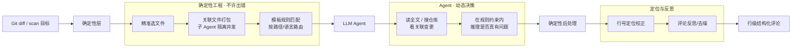

# open-code-review 项目笔记

> 创建：2026-09-21  
> 仓库：[alibaba/open-code-review](https://github.com/alibaba/open-code-review)  
> 官网：[open-codereview.ai](https://open-codereview.ai)  
> npm：`@alibaba-group/open-code-review`  
> 来源：2026.9.14–9.21 AI 情报清单「GitHub 热门」→ Summer 要求深挖（选项 2+3，**未安装**）

---

## 〇、一句话结论

**值得记档、暂不装。** 对 Summer 最贴的不是「再买一个评审工具」，而是 **Delegation 模式**：OCR 只做确定性编排（选文件/打包/配规则），评审本体仍用现有 Claude Code / agent-skills。与 `/review` 是**互补硬约束层**，不是替换关系。

| 维度 | 结论 |
|------|------|
| 匹配度 | ★★★（全栈/DevOps 高；QuantV1 生产中低） |
| 状态 | **已分析·未安装**（2026-09-21 拍板只写笔记） |
| 优先动作 | 需要时在非敏感仓库试 `ocr delegate preview`；生产勿默认扫含 `.env` 路径 |

---

## 一、项目事实（官方仓库核对，2026-09-21）

| 项 | 值 |
|----|-----|
| 维护方 | 阿里（内部官方 AI 代码审查助手孵化开源） |
| 语言 / 协议 | **Go** / Apache-2.0 |
| Stars（抓取） | **38.5k**（情报清单写「本周 +1,796」为周增量快照；旧文 1.1 万已过时） |
| Fork | ~2.7k |
| 安装 | `npm i -g @alibaba-group/open-code-review` → 命令 **`ocr`** |
| 其他安装 | install.sh / install.ps1 / GitHub Release 二进制 / 源码构建 |
| 平台 | Windows / macOS / Linux（官方 Windows badge） |
| 前置 | **Git ≥ 2.41**（diff / 搜库 / merge-base） |
| 模型 | OpenAI / Anthropic / Gemini / Bedrock / Azure 等，不锁厂商 |
| 集成 | Claude Code / Codex / Cursor / Kimi / OpenCode + GitHub Actions / GitLab / Gerrit + MCP |
| 生产史 | 官方称内部两年、数万开发者、识别数百万缺陷 |
| 定位 | **审查助手**，不自动改代码；Roadmap 明确无自动合并 |

内置规则偏工程安全：NPE、线程安全、XSS、SQL 注入等；多语言可跑，Java/Go/TS/Py 等更成熟。

---

## 二、架构：确定性工程 × Agent



**分工**

| 层 | 负责 | 解决通用 Agent 的什么坑 |
|----|------|-------------------------|
| 确定性 | 选文件、关联文件打包（如 i18n properties 捆一包）、规则路由、行号定位、评论反思 | 大 diff 漏文件、行号漂移、prompt 微调质量抖 |
| Agent | 场景化 prompt + 从生产轨迹沉淀的工具集；读全文、搜库、看关联变更 | 只贴 diff 片段导致的误判 |

**原则**：软件管流程纪律，模型管需要理解的语义判断。

---

## 三、命令速查（本机尚未安装）

```bash
# 前置
git --version   # 需 ≥ 2.41
npm i -g @alibaba-group/open-code-review
ocr version

# 路径 A：OCR 自己审（要配 LLM API）
ocr config provider
ocr config model
ocr review                              # 工作区 staged/unstaged/untracked
ocr review --from main --to feature     # 分支 merge-base
ocr review --commit abc123
ocr scan --path <dir-or-file>           # 全量扫，无 git 历史也可
ocr review --format json --output result.json
ocr session list
ocr review --resume <session-id>

# 路径 B：Delegation（推荐先试；无需 OCR API Key）
ocr delegate preview
ocr delegate rule path/a.py path/b.py
# OCR 只出「看哪些文件 + 用哪些规则」；宿主 Agent（如 Claude Code）执行评审
```

---

## 四、基准 AACR-Bench

| 项 | 官方口径 |
|----|----------|
| 数据 | 50 热门开源仓 · 200 真实 PR · 10 语言 |
| 标注 | 80+ 资深工程师交叉验证，**1,505** 个 ground-truth 缺陷 |
| 数据集 | [Hugging Face Alibaba-Aone/aacr-bench](https://huggingface.co/datasets/Alibaba-Aone/aacr-bench) |
| vs Claude Code（同底层模型） | **Precision / F1 显著更高**，token 约 **1/9**，更快 |
| Recall | **故意更低** — 精准优先、降噪声 |

**诚实边界**：Recall 低 ⇒ 适合当「第二双眼睛」，不能当全量质量门。与 QuantV1「TimesFM 未过准入门就不进生产」同一逻辑：指标选偏会误判。

---

## 五、对照：OCR vs 本机已有评审路径（选项 3，未安装实测）

本机已装（记忆/技能目录）：`agent-skills`（Addy Osmani，含 `/review`）、`mattpocock-skills`（含 `code-review`）、Claude 官方 marketplace `code-review` 插件（`/code-review` 打 PR）。以下为**纸面对照**，非 OCR 实跑数据。

### 5.1 总表

| 维度 | **OpenCodeReview** | **agent-skills `/review`** | **mattpocock `code-review`** | **Claude 官方 `code-review` 插件** |
|------|--------------------|----------------------------|-------------------------------|-------------------------------------|
| 形态 | Go CLI + 规则引擎 + 可选插件 | Markdown skill / slash 命令 | Markdown skill（Standards/Spec 双轴） | Slash 命令，驱动 gh + 多 Agent |
| 谁执行推理 | OCR 自配 LLM，**或 Delegation 交给宿主 Agent** | 当前会话的 Claude / Agent | 同左；两轴并行 sub-agent | Haiku 预筛 + 5× Sonnet 并行审 + 置信度过滤 |
| 流程硬约束 | **有**：选文件/打包/规则匹配/行号定位/反思，工程代码保证 | **弱**：五轴 checklist 靠 prompt 纪律 | **中**：固定 git 锚点 + 双轴不合并；无文件打包/规则引擎 | **中**：多 Agent 流水线 + 分数 ≥80 才评论；仍依赖模型自觉 |
| 评审框架 | 内置规则（NPE/线程安全/XSS/SQLi…）+ 可 path 定制 | 五轴：Correctness / Readability / Architecture / Security / Performance | 双轴：**Standards**（仓库规范+Fowler smell）vs **Spec**（是否实现需求） | 大 bug + CLAUDE.md 合规 + git 历史 + 旧 PR 评论 + 代码注释指引 |
| 输出 | 行级结构化评论；可 JSON | Critical / Important / Suggestion + file:line + Verification Story | 两块报告分列，不混排 | PR 评论；无问题则写 No issues；过滤误报 |
| 覆盖控制 | 确定性「一个不漏」进流水线 | 靠 Agent 读 diff，大变更可能偷懒 | 先 `rev-parse` 锚定再审；Spec 无 spec 会明说跳过 | 先资格检查；仅改过的行上的问题 |
| Token 成本 | 官方称约通用 Agent 的 1/9 | 全量上下文，成本随 diff 涨 | 双 sub-agent，中等 | 多 Agent 并行，**成本偏高** |
| 锁模型 | 否（多厂商） | 否（跟宿主） | 否 | 强绑定 Claude Code + gh |
| 领域规则 | 通用工程安全；**无量化 PIT/前视/复权规则** | 无领域规则，靠人补 | Spec 轴可挂 issue/spec | 靠 CLAUDE.md |
| 本机状态 | **未安装** | **已部署**（workspace `skills/agent-skills`） | **已部署** | 已在 `.claude` marketplace |

### 5.2 本机 `/review` 原文要点（agent-skills）

路径：`C:\Users\Turn-\.claude\commands\review.md`（与 workspace 抽取版一致）

- 调用 `agent-skills:code-review-and-quality`
- 五轴：正确性 / 可读性 / 架构 / 安全 / 性能
- 分级：Critical / Important / Suggestion
- 要求具体 `file:line` + 修复建议

配套 persona `code-reviewer.md`：Staff Engineer 框架，输出含 Verdict（APPROVE | REQUEST CHANGES）、What's Done Well、Verification Story；规则含「先看测试」「不确定就写不确定」。

### 5.3 mattpocock `code-review` 要点

- 审 `HEAD` 与固定点（commit/branch/merge-base）之间的 diff
- **Standards 与 Spec 两轴永不合并**——「做对了」和「做了对的事」分开答
- Spec 轴依赖 issue/spec 路径；找不到则明确跳过，不编造需求
- 与 OCR 差异：OCR 管「评审流水线可重复」；matt 管「评审问题意识正交」

### 5.4 Claude 官方插件要点

- 面向 **GitHub PR**：资格检查 → 找 CLAUDE.md → 摘要 → 5 路并行审 → 置信度 0–100 → **&lt;80 丢弃** → `gh` 回帖
- 五路：CLAUDE.md 合规 / diff 浅扫大 bug / git blame 历史 / 历史 PR 评论 / 代码注释指引
- 明确列出误报过滤（linter 能抓的、既存问题、非本 PR 改动行等）
- **成本高、强依赖 gh + 云端 PR**；本地 QuantV1 工作流不完全对口

### 5.5 裁决（Summer 栈）

| 场景 | 建议 |
|------|------|
| 日常本地 diff / 工程纪律 | 继续用 **agent-skills `/review`**（已装、五轴够用） |
| 「做对了 vs 做了对的事」 | 需要时叠 **mattpocock code-review** 双轴 |
| 大变更要「文件不漏 + 行级可落点 + 可 CI」 | **OCR 值得试**；优先 Delegation，编排给 OCR、推理给现有 Agent |
| GitHub PR 自动评论 | 官方插件或 OCR CI 集成；QuantV1 个人仓优先级低 |
| QuantV1 生产规则（PIT/前视/复权/频控） | **四者都不自动懂** — 仍以 `AGENTS.md` / 预注册表 / 人工审查为准 |

**关系一句话**：agent-skills/matt = **方法论剧本（HOW）**；OCR = **可执行评审 harness（硬约束流水线）**；官方插件 = **PR 多 Agent 流水线**。可叠加，不必互斥。

---

## 六、对 Summer 的相关性

### 高

1. **全栈 / DevOps**：行级评论、规则路由、CI 挂 PR，正是「AI 评审可控化」。
2. **已有 Claude Code + agent-skills**：Delegation 是对现有栈补硬约束，不是推倒重来。
3. **AI 研究**：确定性 vs 模型职责切分的好样本；与 HarnessX（可训练 harness）不同层——OCR 是**生产评审 harness**。AACR-Bench 公开可研究 precision/recall 取舍。

### 中低（QuantV1）

- 代码是 Python，工具能跑；内置规则**无**量化域（PIT 泄漏、前视偏差、复权口径、东财频控纪律）。
- 默认模式 diff 进外部 LLM；QuantV1 有 `.env`、密钥、持仓路径 — **先只扫无敏感目录或用 Delegation**。
- 生产纪律已在 AGENTS.md / 预注册表，OCR 不会自动继承。

---

## 七、风险与数字纠偏

1. **Recall 偏低** — 第二双眼，非全量门禁。
2. **数据出境** — 默认模式代码进配置的 LLM；可自托管 Ollama/vLLM。
3. **规则债** — 不写 path 规则则产出偏通用安全，与量化真实风险错位。
4. **清单数字勿照搬** — 「+1,796 stars」是周增量；当前体量 38k+ 级。选型看能力与协议，不看热榜周增。
5. **未实测** — 本笔记对比均为官方文档 + 本机 skill 原文纸面推演；安装前勿当实测结论。

---

## 八、与其他已跟踪项目

| 项目 | 关系 |
|------|------|
| agent-skills / mattpocock | 方法论 HOW；OCR 补流程硬约束（见 §五） |
| cloudflare/security-audit-skill | 安全审计流水线；OCR 更偏 PR 日常评审 |
| CodeGraph | 代码图谱降 token / 影响面；**不同层可并存** |
| Impeccable | 前端确定性质检 skill；同「确定性规则」思路，领域不同 |
| HarnessX | 可训练 harness vs 生产评审 harness |

能力槽（见 [[04-GitHub研究总览索引]]）：归入 **Skills / 方法论剧本（HOW）** 邻域，定位「代码评审硬约束 CLI」。

---

## 九、待办

- [ ] 状态维持 **未安装**，直至 Summer 明确要试装
- [ ] 若试装：先非敏感小仓 `ocr version` + `ocr delegate preview`；再考虑默认模式
- [ ] QuantV1 若要用：单独写 path 规则（排除 `.env`/holdings/密钥路径），Delegation 优先
- [ ] 实测后回填 §五（Token 实耗、误报率、与 `/review` 并跑感受）

---

## 十、来源

- GitHub README（EN/Zh-CN）：alibaba/open-code-review
- 官网：open-codereview.ai
- 解读：silenceper.com（2026-07-31 OpenCodeReview 架构文）；coddykit（数字偏旧，仅作背景）
- 本机 skill：`workspace/skills/agent-skills/`、`mattpocock-skills`、`.claude/commands/review.md`、Claude marketplace `code-review`
- 情报清单：本周 AI 情报精选（2026.9.14–9.21）

---

*笔记状态：已分析·未安装 · 2026-09-21 · Summer 选项 2+3*
