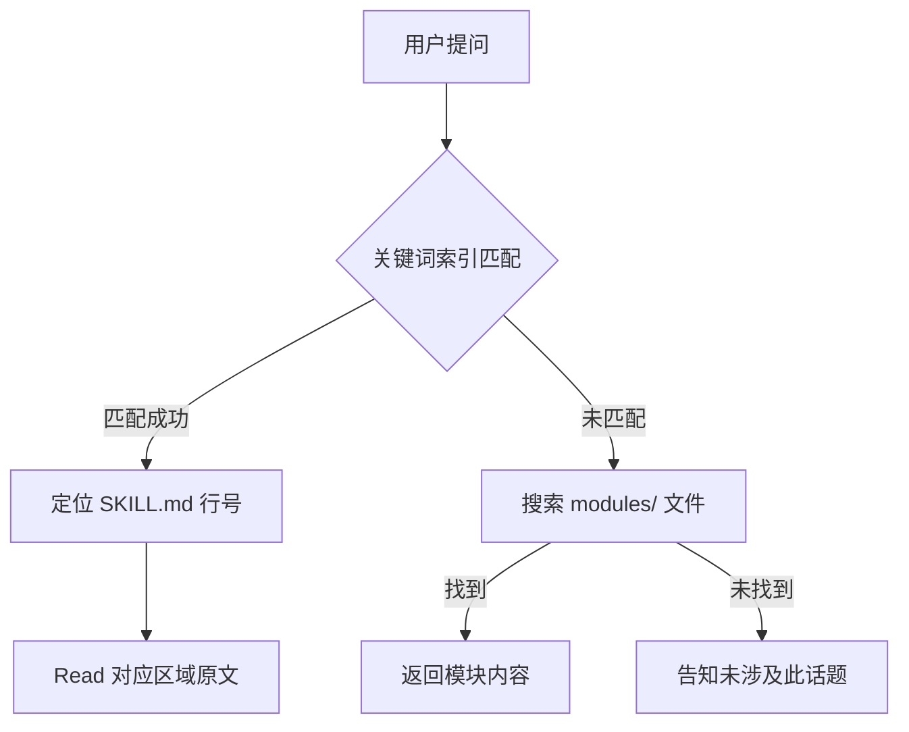

---
tags:
  - AI-Skill
  - 中医
  - 倪海厦
  - 经方
  - 六经辨证
  - 使用手册
created: 2026-07-23
version: v2.1.1
source: https://github.com/jangviktor-web/nihaixia
status: 已配置
lark_doc_url: https://my.feishu.cn/docx/AVsFdlZTqoyhsSx3MMSc5puynse
---

# 倪海厦 Skill · 经方中医 AI 使用手册

> 「中医很简单，就是阴阳气血。你搞懂了，一通百通。」—— 倪海厦

---

## 一、项目概览

「倪海厦 Skill」是一个将经方大师**倪海厦**（1954-2012）的完整中医思维体系蒸馏为 AI Agent 技能的知识库项目。它基于倪海厦人纪系列教学资料开发，使 AI 能以倪师视角进行**六经辨证、经方选药、症状解读、医案查询**。

| 指标 | 数值 |
|------|:----:|
| 伤寒论条文 | 129 条全量 |
| 金匮要略 | 23 篇 |
| 黄帝内经 | 71 篇 |
| 神农本草经 | 345 种药物 |
| 临床医案 | 849 例 |
| 讲义页数 | 2,452 页 |
| 精萃字数 | 3.5M 字 |
| 当前版本 | v2.1.1（ClawHub）/ v2.1.0（GitHub） |

### 数据来源

| 讲义 | 页数 | 提取字符 | 状态 |
|------|------|----------|------|
| 伤寒论讲义 | 209 | 277K | 全量蒸馏 |
| 金匮要略讲义 | 419 | 626K | 全量蒸馏 |
| 黄帝内经讲义 | 461 | 227K | 全量蒸馏 |
| 针灸教程讲义 | 216 | 347K | 全量蒸馏 |
| 神农本草经文稿 | 339 | 843K | 全量蒸馏 |
| 天机道（紫微斗数） | 75 | 85K | 全量蒸馏 |
| 人间道（易经） | 146 | 164K | 全量蒸馏 |
| 地脉道（风水） | 65 | 52K | 全量蒸馏 |
| 汉唐文章集锦 | 383 | 670K | 10 篇蒸馏 |
| 倪海厦文集 | 139 | 234K | 8 则医案蒸馏 |
| **合计** | **2,452** | **3.5M** | |

---

## 二、安装与配置

### 2.1 当前配置状态

本系统已通过 ClawHub 社区源完成安装：

```
安装路径：C:\Users\Turn-\.opensquilla\skills\nihaixia\
配置入口：C:\Users\Turn-\.opensquilla\workspace\skills\nihaixia\SKILL.md
知识库总大小：~4.2MB
```

| 步骤 | 状态 | 说明 |
|------|------|------|
| ClawHub 安装 | ✅ | 文件已落盘到 `~/.opensquilla/skills/nihaixia/` |
| `config.toml` 配置 | ✅ | 已添加 `extra_dirs` 指向 workspace skills |
| 轻量入口文件 | ✅ | `workspace/skills/nihaixia/SKILL.md`（1.6KB） |
| 原版 SKILL.md 重命名 | ✅ | 887KB → `SKILL.full.md`，避开 256KB 限制 |

> [!info] 最终生效
> 当前 gateway 由 OpenSquilla Desktop 持有。**重启 Desktop 应用**后，`nihaixia` 会完全注册到技能目录，触发词即可自动激活。
> 
> 即使不重启，也可直接让 AI 查阅知识库文件回答问题——AI 可直接 `read_file` / `grep_search` 知识库中的任意内容。

### 2.2 其他平台安装方式

| 平台 | 命令 |
|------|------|
| ClawHub（推荐） | `clawhub install nihaixia` |
| SkillHub（腾讯云） | `skillhub install nihaixia-pro` |
| OpenClaw | `openclaw skills install nihaixia` |
| 手动 | `git clone https://github.com/jangviktor-web/nihaixia.git` |
| 手机端 | 腾讯 IMA APP 搜索「倪海厦」导入知识码 |

> ⚠️ 安全扫描标记 4 个 `hidden_unicode` 发现，全部为 OCR 零宽字符残留（无害），已确认安全后强制安装。

---

## 三、如何激活

在对话中使用以下**触发词**即可激活倪海厦视角：

| 触发词 | 示例提问 |
|--------|----------|
| `倪海厦` / `倪师` | 「倪师，失眠怎么治？」 |
| `海厦视角` | 「从海厦视角看，这个高血压怎么辨证？」 |
| `经方思维` | 「用经方思维分析这个感冒。」 |
| `倪海厦会怎么看` | 「倪海厦会怎么看糖尿病？」 |
| `中医倪海厦` | 「中医倪海厦对牛奶的观点」 |
| `六经辨证` | 「六经辨证，但热不寒是什么情况？」 |

### 核心心智模型

| 原则 | 含义 |
|------|------|
| **六经辨证** | 先辨病在何经（太阳→阳明→少阳→太阴→少阴→厥阴），再选方 |
| **阳气论** | 阳气是生命根本，阳气不足先扶阳 |
| **经典至上** | 伤寒论/金匮原方最可靠，不随意加减 |
| **经方为主** | 以张仲景经方为治疗核心，时方为辅 |

### 决策启发式

```
先辨六经 → 再选方剂
阳气不足 → 先扶阳
经典原方 → 最可靠
```

---

## 四、能力矩阵

| 能力 | 说明 |
|:------|:------|
| 六经辨证 | 太阳/阳明/少阳/太阴/少阴/厥阴，传变规律 + 欲解时 |
| 六经辨证诊断公式 | 8 个诊断公式 + 快速诊断流程图 + 脉舌速查 + 七步走思维模式 |
| 经方选药 | 伤寒论 129 条 + 金匮 23 篇，含组成/剂量/煎服法/禁忌 |
| 药物性味 | 神农本草经 345 种，三品分类 + 五味归经 + 炮制要点 |
| 临床医案 | 849 例倪师真实医案，按癌症/心血管/代谢病等 6 类分类 |
| 针灸穴位 | 十二经络 + 井荣俞经合 + 任督要穴 + 中风急救七大穴 |
| 黄帝内经 | 71 篇完整蒸馏，中医基础理论核心 |
| 天纪命理 | 紫微斗数 + 易经六十四卦 + 阳宅风水 |
| 梁冬对话 | 2009 年 7 期完整录音蒸馏，饮食养生/现代话题观点 |
| 闭门课 | 7 大重病专题 + 7 堂弟子课，血癌/乳癌/脑瘤等 |
| 口述表达 | 倪海厦口语风格模块，回复"像"倪师 |

---

## 五、六经辨证体系

### 5.1 六经传变规律

```
太阳（表）→ 阳明（里热）→ 少阳（半表半里）
         ↓ 失治误治
太阴（脾寒）→ 少阴（心肾阳虚）→ 厥阴（阴阳逆乱 / 上热下寒）
```

### 5.2 六经提纲速查

| 经 | 病位 | 核心症状 | 代表方剂 |
|----|------|----------|----------|
| **太阳** | 表 | 头项强痛、恶寒、脉浮 | 桂枝汤 / 麻黄汤 |
| **阳明** | 里热 | 不恶寒反恶热、胃家实、大汗 | 白虎汤 / 承气汤 |
| **少阳** | 半表半里 | 口苦咽干目眩、往来寒热 | 小柴胡汤 |
| **太阴** | 脾寒 | 腹满自利、不渴、时腹自痛 | 理中汤 / 四逆汤 |
| **少阴** | 心肾阳虚 | 脉微细、但欲寐、四肢厥冷 | 四逆汤 / 真武汤 |
| **厥阴** | 阴阳逆乱 | 寒热错杂、饥不欲食、上热下寒 | 乌梅丸 |

### 5.3 快速诊断三步法

1. **看有无恶寒** → 有恶寒：太阳或少阴（脉浮选太阳，脉沉选少阴）
2. **看有无恶热** → 不恶寒反恶热：阳明
3. **看有无往来寒热** → 往来寒热：少阳
4. **看里证** → 腹满自利不渴：太阴；脉微细但欲寐：少阴；寒热错杂饥不欲食：厥阴

### 5.4 八大诊断公式（v2.1.0 新增）

每个公式含 IF-THEN 辨证规则 + 分型鉴别表 + 代表方剂：

1. **太阳病诊断公式** — 恶寒 + 脉浮 → 太阳（中风/伤寒/温病分型）
2. **阳明病诊断公式** — 不恶寒反恶热 + 胃家实 → 阳明（经证 vs 腑证）
3. **少阳病诊断公式** — 往来寒热 + 口苦咽干目眩 → 少阳（但见一证便是）
4. **太阴病诊断公式** — 腹满自利 + 不渴 → 太阴（脾虚寒湿）
5. **少阴病诊断公式** — 脉微细 + 但欲寐 → 少阴（寒化 vs 热化）
6. **厥阴病诊断公式** — 寒热错杂 + 饥不欲食 → 厥阴（厥热胜复）
7. **少阴热化证公式** — 心烦不得眠 + 黄连阿胶汤
8. **合病并病公式** — 11 种组合 + 治疗先后原则

### 5.5 七步走辨证思维模式

```
① 定表里 → ② 分阴阳 → ③ 辨寒热 → ④ 判传变 → ⑤ 审体质 → ⑥ 选方剂 → ⑦ 精细加减
```

### 5.6 脉舌速查

**脉诊**（8 种单脉 + 8 种复合脉象）：

| 脉象 | 主病 |
|------|------|
| 浮 | 表证（太阳） |
| 沉 | 里证（太阴/少阴） |
| 迟 | 寒证 |
| 数 | 热证 |
| 微细 | 少阴病 |
| 弦 | 少阳病 / 肝病 |
| 滑 | 痰湿 / 实热 |
| 涩 | 血瘀 / 精血不足 |

**舌诊**（5 种舌象 + 6 种复合舌象）：

| 舌象 | 主病 |
|------|------|
| 淡白舌 | 虚寒（太阴/少阴） |
| 红舌 | 热证（阳明/少阴热化） |
| 青紫舌 | 瘀血 / 厥阴 |
| 胖大舌 | 脾虚湿盛（太阴） |
| 裂纹舌 | 阴虚（少阴热化） |

> **脉舌矛盾决策树**：脉象和舌象不一致时，**以舌为准**。

### 5.7 真寒假热八维鉴别法

| 维度 | 真寒假热 | 真热假寒 |
|:------|:------|:------|
| 面色 | 颧红如妆、浮于表面 | 满面通红、里外一致 |
| 口鼻气 | 气冷 | 气热 |
| 舌形 | 舌淡胖有齿痕 | 舌红绛苔黄燥 |
| 脉象 | 脉沉微欲绝 | 脉沉实有力 |
| 胸腹 | 胸腹冷 | 胸腹灼热 |
| 小便 | 清长 | 短赤 |
| 口渴 | 渴不欲饮 | 渴喜冷饮 |
| 大便 | 下利清谷 | 便秘燥结 |

---

## 六、倪氏六健康标准

这是倪海厦判断健康状态的六个核心指标：

| # | 标准 | 说明 |
|---|------|------|
| 1 | 一觉到天亮 | 无失眠，睡眠安稳 |
| 2 | 胃口正常 | 三餐有饱饿感 |
| 3 | 每天晨起大便 | 一天一次，成型不硬，色黄 |
| 4 | 一天小便 5-7 次 | 淡清黄色 |
| 5 | 头面冷、手足温热 | 四季皆然 |
| 6 | 晨起阳反应 | 正常人生理指标 |

> 倪师观点：六个标准全部达标 = 健康。任何一项异常 = 需要调理。

---

## 七、经方速查

### 核心方剂

| 方剂 | 适用六经 | 组成 | 主治 |
|------|----------|------|------|
| 桂枝汤 | 太阳中风 | 桂枝、芍药、生姜、大枣、甘草 | 有汗恶风、脉浮缓 |
| 麻黄汤 | 太阳伤寒 | 麻黄、桂枝、杏仁、甘草 | 无汗恶寒、身疼痛 |
| 小柴胡汤 | 少阳 | 柴胡、黄芩、人参、半夏、甘草、姜、枣 | 口苦咽干、往来寒热 |
| 白虎汤 | 阳明 | 石膏、知母、甘草、粳米 | 大热大汗大渴 |
| 承气汤类 | 阳明 | 大黄、芒硝、枳实、厚朴 | 便秘腹满、潮热 |
| 理中汤 | 太阴 | 人参、白术、干姜、甘草 | 腹满自利、不渴 |
| 四逆汤 | 少阴 | 附子、干姜、甘草 | 四肢厥冷、脉微细 |
| 真武汤 | 少阴 | 附子、茯苓、白术、白芍、生姜 | 头眩心悸、肢体浮肿 |
| 乌梅丸 | 厥阴 | 乌梅、细辛、干姜、黄连、当归、附子等 | 寒热错杂、饥不欲食 |
| 黄连阿胶汤 | 少阴热化 | 黄连、黄芩、芍药、阿胶、鸡子黄 | 心烦不得眠 |

### 附子分类要点

| 类型 | 应用场景 |
|------|----------|
| 生附子 | 阴寒在里，四逆证（四肢厥冷） |
| 炮附子 | 表阳不固，汗出恶风 |
| 生硫磺 | 真寒假热，回阳救逆 |

### 热极生寒（倪师独创心法）

> 人是圆形的，太极是圆的，热到极限会回头。
> 白虎汤石膏用到十二两还退不了热 → 换生附子三钱 → 一剂下去冷得要死。
> 「你没有到极限的时候它不生，你非要让它到极限，所以你的药要加重。」

### 用药铁律

**7 条禁忌**：
1. 汗家不可发汗
2. 淋家不可发汗
3. 疮家虽身疼痛不可发汗
4. 衄家不可发汗
5. 亡血家不可发汗
6. 咽干者不可发汗
7. 尺中脉微者不可发汗

**5 条急救方案**：误汗/误下/误吐/火逆/烧针后的救治方法。

---

## 八、常见问题速查（FAQ）

### 失眠怎么治？

看六经定位：
- 太阴脾虚 → 归脾汤
- 少阴心肾阳虚 → 黄连阿胶汤
- 厥阴寒热错杂 → 乌梅丸
- 阳明胃不和 → 调胃承气汤

> 倪海厦六健康标准第一条：一觉到天亮。

### 便秘怎么办？

阳明病范畴：
- 热秘 → 承气汤（调胃/小/大承气汤）
- 寒秘 → 大黄附子细辛汤
- 虚秘 → 麻子仁丸

> 正常标准：大便一天一次，成型不硬，色黄。

### 手脚出汗怎么办？

分寒热：
- 手脚冷 + 出汗 → 四逆汤/当归四逆汤（少阴/厥阴）
- 手脚温热 + 出汗 + 无便秘 → 桂枝汤加龙骨牡蛎潜阳
- 手脚温热 + 出汗 + 便秘 → 承气汤攻下

### 感冒发烧怎么治？

先辨六经：
- 有汗 + 怕风 → 桂枝汤（太阳中风）
- 无汗 + 怕冷 → 麻黄汤（太阳伤寒）
- 忽冷忽热 → 小柴胡汤（少阳）
- 但热不寒 → 白虎汤（阳明）

### 牛奶能不能喝？

❌ 倪师明确反对。原因：①牛奶是给小牛喝的，不是给人喝的；②牛奶性寒，会伤阳气；③现代牛奶含激素、抗生素；④中医认为牛奶会导致痰湿。替代：豆浆、米浆。

### 怎么判断一味药的药性？

倪海厦"以意得之"五步法：
1. **看颜色** → 定归经（青→肝，赤→心，黄→脾，白→肺，黑→肾）
2. **尝味道** → 定功能（酸收，苦泻燥坚，甘补和缓，辛散润行，咸下软坚）
3. **掂重量** → 定走向（质轻走上表，质重走下里）
4. **看形状** → 定部位（中空发表，内实攻里）
5. **看质地** → 定气血（枯燥入气分，润泽入血分）

> "不要被名称锁住，用悟的方式去了解。"

### 甘草为什么要炙过？

生甘草 → 黄色 → 入脾脏；蜜炙甘草 → 烧焦变苦 → 入心脏。经方中甘草多炙用，因为要入心脏强心。

---

## 九、使用示例

### 示例 1：感冒辨证

> **问**：我感冒了，怕冷，没有汗，脖子后面疼
>
> **倪师视角**：太阳伤寒，麻黄汤证。无汗恶寒、体痛——寒束于表。麻黄开毛孔，桂枝解肌，杏仁降气，炙甘草和中。麻黄汤主之。

### 示例 2：方剂查询

> **问**：小柴胡汤什么时候用？
>
> **倪师视角**：少阳病主方。**但见一证便是，不必悉具。** 口苦、咽干、目眩、往来寒热、胸胁苦满、默默不欲饮食、心烦喜呕——七证中见一即可使用。

### 示例 3：药物性味

> **问**：生附子和炮附子有什么区别？
>
> **倪师视角**：生附子——阴寒在里，用于四逆汤证，四肢厥冷、下利清谷。炮附子——表阳不固，用于桂枝加附子汤证，汗出恶风、四肢微急。生附子逐里寒，炮附子固表阳。

### 示例 4：医案查询

> **问**：有没有肝癌的医案？
>
> **倪师视角**：有，`cases/01_cancer.md` 收录 147 个癌症医案。肝癌案例常用攻坚处方配合疏肝理气，倪师强调"肝病实脾"。

### 示例 5：饮食养生

> **问**：倪师怎么看喝牛奶？
>
> **倪师视角**：倪海厦明确反对喝牛奶。①牛奶是给小牛喝的，不是给人的；②牛奶性寒，会伤阳气；③现代牛奶含激素、抗生素；④中医认为牛奶导致痰湿，是许多过敏、哮喘、鼻炎的根源。建议改喝豆浆、米浆。

---

## 十、知识库结构与检索

### 10.1 文件总览

```
nihaixia/                          总计 ~4.2MB
├── SKILL.md                       887KB   主索引 + 六经辨证 + 诊断公式 + 脉舌速查
├── expression_style.md             7KB    倪师口述风格 DNA
├── distilled_cases.md             135KB   蒸馏医案合集
├── modules/                       3.1MB   9 个深度知识模块
│   ├── 01_shanghan_sun.md         265KB   伤寒论太阳篇（条文1-129）
│   ├── 02_shanghan_other.md        29KB   阳明/少阳/太阴/少阴/厥阴
│   ├── 03_yian.md                 968KB   医案集（849例）
│   ├── 04_jingui.md               1.18MB  金匮要略23篇完整解读
│   ├── 05_huangdi_neijing.md      213KB   黄帝内经71篇
│   ├── 06_liangdong.md             38KB   梁冬对话7期精华
│   ├── 07_bimen_hantang.md          44KB   闭门课+汉唐文章
│   ├── 08_huangdi_detail.md        212KB   黄帝内经详注
│   └── 09_zhenjiu_bencao.md        252KB   针灸+神农本草经345种+天纪
├── cases/                         245例精选医案
│   ├── 01_cancer.md                87KB   147个癌症医案
│   ├── 02_cardiovascular.md        12KB    22个心血管
│   ├── 03_metabolic.md              6KB    12个代谢病
│   ├── 04_autoimmune.md             1KB     2个自身免疫
│   ├── 05_neurological.md           2KB     3个神经精神
│   └── 06_other.md                 31KB    59个其他
└── references/research/            研究资料
```

### 10.2 检索流程



**检索优先级：**
1. `SKILL.md` 关键词索引 → 行号定位
2. `modules/` 深度模块 → 文件级搜索
3. `cases/` 医案库 → 按疾病分类查找
4. 以上均无 → 诚实告知"讲义中没有涉及"

### 10.3 关键词速查表

#### 饮食/养生
| 关键词 | 搜索位置 | 说明 |
|--------|----------|------|
| 牛奶 | SKILL.md + `modules/06_liangdong.md` | 六经总结+医案+梁冬对话 |
| 羊奶/豆浆/水果/咖啡/味精 | `modules/06_liangdong.md` | 梁冬对话中的饮食讨论 |
| 糖尿病/减肥 | SKILL.md「诊病十问」+ `modules/06_liangdong.md` | 十问+梁冬对话 |

#### 常见症状
| 关键词 | 搜索位置 | 说明 |
|--------|----------|------|
| 手汗/出汗 | SKILL.md「龙骨牡蛎」+「少阴病」 | 附子分类+少阴病 |
| 失眠 | SKILL.md「六健康标准」+「黄连阿胶汤」 | 健康标准+少阴/厥阴 |
| 便秘 | SKILL.md「阳明病」+「承气汤」 | 阳明病篇 |
| 腹泻/下利 | SKILL.md「太阴病」+「理中汤」 | 太阴病篇 |
| 咳嗽 | SKILL.md「咳嗽」+ `modules/04_jingui.md`「肺痿」 | 六经+金匮 |
| 头痛 | SKILL.md「头项强痛」 | 太阳病条文1 |
| 月经/痛经/不孕 | SKILL.md「妇人」+ `modules/04_jingui.md` | 速查+金匮妇人篇 |
| 水肿 | SKILL.md「水气」+ `modules/04_jingui.md` | 速查+金匮水气篇 |
| 胸痹/心绞痛 | SKILL.md「胸痹」+ `modules/04_jingui.md` | 速查+金匮胸痹篇 |
| 风湿/关节痛 | SKILL.md「痉湿暍」+ `modules/04_jingui.md` | 速查+金匮详文 |

#### 方剂/药物
| 关键词 | 搜索位置 | 说明 |
|--------|----------|------|
| 桂枝汤 | SKILL.md「桂枝汤」 | 速查表+条文15-23详解 |
| 麻黄汤 | SKILL.md「麻黄汤」 | 速查+条文39 |
| 小柴胡汤 | SKILL.md「小柴胡汤」 | 速查+少阳病篇 |
| 四逆汤 | SKILL.md「四逆汤」 | 速查+少阴病篇 |
| 白虎汤 | SKILL.md「白虎汤」 | 速查+阳明病篇 |
| 真武汤 | SKILL.md「真武汤」 | 速查+少阴病篇 |
| 乌梅丸 | SKILL.md「乌梅丸」 | 速查+厥阴病篇 |
| 附子 | SKILL.md「生附子」 | 生附子/炮附子/生硫磺 |

### 10.4 关键文件速查表

| 想查什么 | 看哪个文件 | 怎么搜 |
|----------|-----------|--------|
| 感冒发烧/表证 | `modules/01_shanghan_sun.md` | 搜条文号或方剂名 |
| 里证/半表半里 | `modules/02_shanghan_other.md` | 搜经名（阳明/少阳等） |
| 特定疾病医案 | `cases/` 目录下对应文件 | 搜病名 |
| 杂病（胸痹/水气/妇人等） | `modules/04_jingui.md` | 搜病名 |
| 中医基础理论 | `modules/05_huangdi_neijing.md` | 搜篇名 |
| 饮食养生/现代话题 | `modules/06_liangdong.md` | 搜话题关键词 |
| 重病专题（血癌/乳癌等） | `modules/07_bimen_hantang.md` | 搜病名 |
| 穴位/药物性味 | `modules/09_zhenjiu_bencao.md` | 搜穴名/药名 |
| 紫微斗数/风水/易经 | `modules/09_zhenjiu_bencao.md` | 搜"天纪"/"紫微"/"地脉道" |

---

## 十一、医案库索引

### 按疾病分类（cases/ 目录）

| 文件 | 疾病覆盖 | 案例数 |
|------|----------|--------|
| `01_cancer.md` | 肝癌/乳癌/肺癌/脑瘤/血癌/淋巴癌/大肠癌/胰脏癌/骨癌/舌癌 | 147 |
| `02_cardiovascular.md` | 心脏病/高血压/中风/动脉阻塞 | 22 |
| `03_metabolic.md` | 糖尿病/肾衰竭/腹水/肝硬化 | 12 |
| `04_autoimmune.md` | 类风湿/红斑狼疮 | 2 |
| `05_neurological.md` | 癫痫/帕金森/忧郁 | 3 |
| `06_other.md` | 痛经/鼻炎/不孕/皮肤病等 | 59 |

> [!tip] 重病深度内容
> 血癌/红斑狼疮/脑瘤/肾衰竭/乳癌/肝癌的专题闭门课讲义在 `modules/07_bimen_hantang.md`，含病因机理、完整处方、真实案例，比 `cases/` 更深入。

---

## 十二、倪师口述风格 DNA

Skill 内置 `expression_style.md` 模块，提取了倪海厦的口语表达模式，使回复"像"倪师：

| 模式 | 句式模板 | 示例 |
|------|----------|------|
| 门诊日记开场 | `[日期],[天气],[地点] 今天一位…` | "04/06/2005,晴,上次住在佛罗里达州…" |
| 案例引入 | `我一看[病例/气色]，就知道…` | "我一看病例上写着舌癌…" |
| 望诊为主 | `我只看一眼/一望而知` | "我只看一眼，再出去翻一下黄历，全案就结束了" |
| 问答引导 | `[问题]，对不？（点头）` | "你双脚一定是冷的，对不？" |
| 日常比喻 | `就像…一样` | "就像你去找补锅匠补一个破洞…" |
| 因果链条 | `因为…所以…于是…因此…` | "因为心火不够旺，所以连带小肠火也衰…" |
| 批评西医 | `西医误人至深/根本在瞎搞` | "西医使用抗生素治疗肺炎只会越治越坏…" |
| 讽刺语气 | `读者认为呢？/读者觉得呢？` | "读者看看，像不像名侦探福尔摩斯在办案" |

---

## 十三、针灸速查

### 中风急救七大穴

倪师传授的中风急救穴位（十宣放血法）：

1. **百会** — 督脉，升阳开窍
2. **人中** — 督脉，急救要穴
3. **十宣** — 经外穴，放血泻热
4. **涌泉** — 肾经井穴，引气回归
5. **颊车** — 胃经，治面瘫
6. **地仓** — 胃经，治面瘫
7. **合谷** — 大肠经原穴，通经活络

### 其他常用穴位

| 类别 | 穴位 | 说明 |
|------|------|------|
| 八会穴 | 骨会大杼/髓会绝骨/血会膈俞等 | 腑会中脘/脏会章门/筋会阳陵泉/脉会太渊 |
| 背俞穴 | 五脏六腑12穴 | 三步诊断法 |
| 原穴 | 十二经各一原穴 | 脏腑原气经过留止之处 |
| 子午流注 | 十二时辰→脏腑对应 | 寅时肺经/卯时大肠经… |

---

## 十四、天纪命理（附加功能）

Skill 还包含倪海厦《天纪》系列内容：

| 模块 | 内容 | 搜索位置 |
|------|------|----------|
| 紫微斗数 | 天纪体系 | `modules/09` 搜「紫微斗数」或「天纪」 |
| 风水地理 | 地脉道·地理五要 | `modules/09` 搜「地脉道」 |
| 易经卦象 | 人间道·六十四卦 | `modules/09` 搜「人间道」 |

---

## 十五、使用边界

| ✅ 可以问 | ❌ 不可以依赖 |
|----------|--------------|
| 中医理论学习 | 临床诊断 |
| 经方组成与性味 | 处方用药 |
| 医案分析与参考 | 急救处理 |
| 养生保健 | 自行调整现有治疗方案 |

---

## 十六、故障排查

| 现象 | 原因 | 处理 |
|------|------|------|
| 技能无法识别 | gateway 未重启 | 重启 OpenSquilla Desktop |
| 知识库过大提示 | 原版 SKILL.md 887KB | 已重命名为 `SKILL.full.md`，使用轻量入口 |
| 触发词不生效 | 未正确命中触发词 | 使用「倪师」「倪海厦会怎么看」等明确词汇 |

---

## 十七、相关资源

- **GitHub 仓库**：[jangviktor-web/nihaixia](https://github.com/jangviktor-web/nihaixia)
- **ClawHub 技能页**：[clawhub.ai/jangviktor-web/nihaixia](https://clawhub.ai/jangviktor-web/nihaixia)
- **配套安卓 APP**：[nihaixia-app](https://github.com/jangviktor-web/nihaixia-app)（离线可用，完全免费）
- **姊妹项目（李可skill）**：[likeskill](https://github.com/jangviktor-web/likeskill)（急危重症方向，与倪海厦skill互补）
- [[跨技术栈学习路径总览]] — 本 Obsidian 库中的其他学习路径

---

## 十八、版本历史

| 版本 | 日期 | 要点 |
|------|------|------|
| v2.1.0 | 2026-06-08 | 新增 8 个诊断公式 + 流程图 + 脉舌速查 + 七步走思维 + 用药铁律 |
| v2.0.1 | 2026-05-26 | 新增分类医案库 `cases/`（245例）+ 研究资料 `references/` |
| v2.0.0 | 2026-05-25 | 仓库精简（110MB→4MB），仅保留运行必需文件 |
| v1.1.0 | 2026-05-23 | 神农本草经药性体系深度蒸馏 |
| v1.0.0 | 2026-04-14 | 初版发布 |

---

## 十九、免责声明

> [!warning] 重要提醒
> 本技能为**历史/教育性中医学习参考**，不可替代专业医疗诊断。
>
> - **不用于**：临床诊断、处方、用药、针灸、急救等医疗决策
> - **不用于**：孕期、儿童、重症、急症等场景的医疗建议
> - **所有健康问题**请务必咨询持牌临床医师
> - 任何用药、剂量、治疗方案的调整必须在执业医师指导下进行
> - 本内容反映的是倪海厦个人中医观点，部分观点与现代医学存在分歧

---

*文档创建时间：2026-07-23 | 由 OpenSquilla 🦐 生成*
