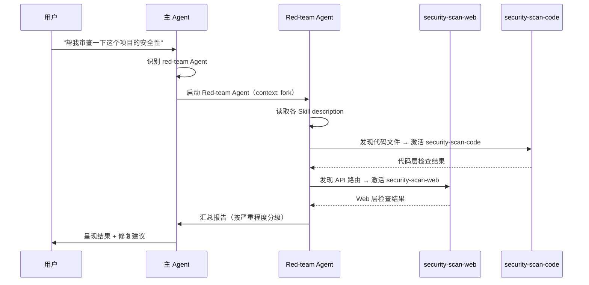

## 做什么

构建一个专门用于安全测试的 SubAgent（red-team），模拟攻击者视角对项目进行主动安全审查。Agent 本身定义"谁来执行"，关联的 Skills 定义"怎么做"和"有什么规则约束"。

## 为什么是 Agent + Skill 的组合

参考 [[Claude的使用/09｜触类旁通：SKILL.md 结构与触发机制|第 9 讲]] 的企业本体论：
- **Agent = 执行分工**（"谁来做"）→ red-team 是一个专职岗位
- **Skill = 可操作知识**（"怎么做"）→ 具体攻击面、检查清单、工具用法

red-team 适合作为 Agent 而非纯 Skill 的理由：
- 需要**隔离上下文**——安全测试可能产生大量中间结果，不该污染主对话
- 需要**受限工具集**——只给 Read/Grep/Bash(安全子集)，不该有 Write/Edit 权限
- 需要**独立判断**——主 Agent 做开发，red-team 做审查，职责分离

## Agent 设计

```yaml
# 在 CLAUDE.md 或 .claude/agents/ 中定义
name: red-team
description: Adversarial security reviewer. Simulates attacker techniques to find vulnerabilities in code, configurations, and infrastructure. Use when the user wants a security audit, penetration test, or vulnerability assessment.
tools:
  - Read
  - Grep
  - Glob
  - Bash(git:*)      # 只读 Git 操作
  - Bash(curl:*)      # 发 HTTP 请求做探测
  - Bash(nmap:*)      # 端口扫描
model: sonnet          # 用 sonnet 足矣，不需要 opus
context: fork          # 隔离上下文，不污染主 Agent
```

## 关联的 Skills

### Skill 1：`security-scan-web`

```yaml
name: security-scan-web
description: Scan a web application for common vulnerabilities (OWASP Top 10). Checks for XSS, SQL injection, CSRF, insecure headers, exposed secrets, and misconfigured CORS. Use when auditing a web app, reviewing API security, or checking a deployed service.
allowed-tools:
  - Read
  - Grep
  - Bash(curl:*)
  - WebFetch
```

**检查清单：**
- [ ] HTTP 安全头（CSP、HSTS、X-Frame-Options）
- [ ] CORS 配置是否过于宽松
- [ ] 敏感信息是否暴露在响应中
- [ ] 输入校验（XSS / SQL 注入入口）
- [ ] 依赖库已知漏洞（package.json / requirements.txt）

### Skill 2：`security-scan-code`

```yaml
name: security-scan-code
description: Static analysis of source code for security vulnerabilities. Checks hardcoded secrets, unsafe deserialization, command injection, path traversal, and insecure crypto. Use when reviewing code changes for security issues, auditing a codebase, or before deploying to production.
allowed-tools:
  - Read
  - Grep
  - Glob
```

**检查清单：**
- [ ] 硬编码密钥 / token / 密码
- [ ] `eval()` / `exec()` / `os.system()` 等危险调用
- [ ] SQL 拼接（无参数化查询）
- [ ] 路径遍历风险（`../` 拼接文件路径）
- [ ] 弱加密算法（MD5 / SHA1 / DES）
- [ ] 反序列化未校验数据

### Skill 3：`security-scan-config`

```yaml
name: security-scan-config
description: Audit infrastructure and deployment configuration for security issues. Checks Dockerfiles, CI/CD pipelines, Kubernetes manifests, and cloud configs for privilege escalation, exposed ports, and misconfigured secrets management. Use when reviewing infrastructure-as-code, deployment configs, or DevOps pipelines.
allowed-tools:
  - Read
  - Grep
  - Glob
```

**检查清单：**
- [ ] Dockerfile 是否以 root 运行
- [ ] CI 脚本是否泄露密钥到日志
- [ ] K8s 是否用了 `privileged: true`
- [ ] 环境变量中是否有明文密钥
- [ ] 端口暴露是否必要

## Agent + Skills 的协作流程



## 触发场景

| 场景 | 用户可能说的话 |
|------|-------------|
| 代码审查 | "帮我看看这段代码有没有安全问题" |
| 全面审计 | "对整个项目做一次安全审计" |
| 部署前检查 | "部署之前，帮我做一次安全检查" |
| 配置审查 | "review 一下 Dockerfile 和 CI 配置" |

## 为什么需要 disable-model-invocation？

red-team Agent 不应被 Claude 自动触发——安全审查是有明确意图的行动，不是"顺便做"的参考型知识。应该在 CLAUDE.md 权限中配：

```yaml
# deny 自动触发，只允许用户显式调用
Skill(red-team): deny
```

但用户可以通过 `/red-team` 手动触发。

## 当前状态

- [ ] 三个 Skill 的检查清单需要补充（尤其是 OWASP 具体测试用例）
- [ ] 需要决定：是做成一个 Agent 自动分发到子 Skill，还是三个独立的 Agent？
  - 一个 Agent + 多个 Skill：审查报告统一，但 Skill description 区分要精细
  - 三个 Agent：各自独立，但用户需要分别调用（用 `/security-scan-web` 等）
  - **倾向方案一**：一个 Agent、多个 Skill，用户只需说一次"做安全审计"
- [ ] `Bash(nmap:*)` 等网络安全工具权限的安全边界需要谨慎
- [ ] 报告输出格式需要模板（严重程度分级 + 修复建议 + CVE 引用）

## 备注

- red-team 概念来自安全领域，企业实践中通常是独立团队。Agent 化后保持了"职责隔离"的设计原则
- 这和"只读审计 SubAgent"（[[Claude的使用/05｜明察秋毫：构建只读型安全审计子代理|第 5 讲]]）互补：
  - 第 5 讲的审计 Agent → 关注**流程合规**（代码改动是否符合规范）
  - red-team Agent → 关注**攻击面**（系统是否存在可利用漏洞）
- 更进一步的构想：blue-team Agent（自动化修复 + 加固），形成 red/blue 对抗闭环
