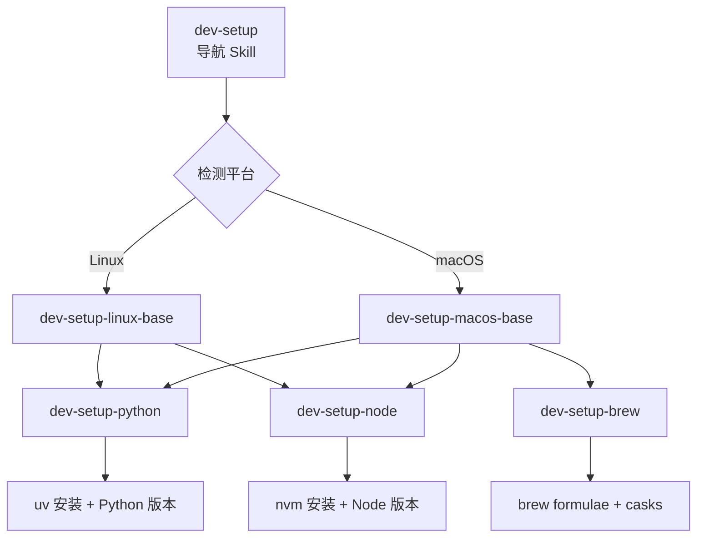

## 做什么

让 Claude 在新机器上自动完成开发环境初始化——从基础组件到语言运行时，按需加载对应的"环境配置知识"。

核心思路：**不是一个大而全的 Skill，而是"导航页 + 按需详情页"的分层结构。**（参考 [[Claude的使用/09｜触类旁通：SKILL.md 结构与触发机制|第 9 讲]] 的渐进式加载设计）

## 为什么做

每换一台机器（云服务器、新笔记本、CI 环境），都要重复安装 gcc、git、zsh、python、node……这些操作有固定模式但细节容易遗漏。封装成 Skill 后，Claude 能：
- 自动识别当前平台（Linux / macOS）
- 知道每个组件正确的安装方式
- 按需加载，不浪费 context

## Skill 拆分设计

### 导航 Skill：`dev-setup`

```yaml
name: dev-setup
description: Set up a development environment on a new machine. Detects OS platform, installs base tools (git, zsh, gcc, cmake, tmux), and dispatches to language-specific setup skills. Use when setting up a new computer, configuring a CI runner, or initializing a dev container.
```

职责：
- 检测平台（`uname -s`）
- 安装基础组件（所有平台通用的那一层）
- 按需引用下级 Skill

### 按需加载的子 Skill

#### `dev-setup-linux-base`

```yaml
name: dev-setup-linux-base
description: Install essential development tools on Linux (apt-based). Covers gcc, CMake, Git, Zsh, Oh-My-Zsh, tmux, build-essential, curl, and common system libraries. Use when setting up a Linux dev machine from scratch.
```

**基础组件清单：**

| 组件 | 用途 | apt 包名 |
|------|------|---------|
| gcc | C/C++ 编译器 | `build-essential` |
| CMake | 构建系统 | `cmake` |
| Git | 版本控制 | `git` |
| Zsh | Shell | `zsh` |
| Oh-My-Zsh | Zsh 配置框架 | curl 安装脚本 |
| tmux | 终端复用 | `tmux` |
| curl / wget | 下载工具 | `curl wget` |
| jq | JSON 处理 | `jq` |
| ripgrep | 高效搜索 | `ripgrep` |

#### `dev-setup-macos-base`

```yaml
name: dev-setup-macos-base
description: Install essential development tools on macOS via Homebrew. Covers Xcode CLI tools, Git, Zsh, Oh-My-Zsh, tmux, and common Unix utilities. Use when setting up a Mac for development.
```

#### `dev-setup-python`

```yaml
name: dev-setup-python
description: Set up Python development environment using uv (fast Python package manager). Installs uv, configures Python versions, sets up virtual environments, and installs common tools (ruff, mypy, pytest). Use when the user needs Python development setup.
```

#### `dev-setup-node`

```yaml
name: dev-setup-node
description: Set up Node.js development environment using nvm (Node Version Manager). Installs nvm, manages Node.js versions, configures npm/yarn/pnpm. Use when the user needs Node.js or frontend development setup.
```

#### `dev-setup-brew`

```yaml
name: dev-setup-brew
description: Manage macOS packages via Homebrew. Handles brew installation, formulae management, cask applications, and Brewfile for reproducible setups. Use when installing or managing software on macOS.
```

### 架构图



## 触发场景

| 场景 | 用户可能说的话 | 激活的 Skill |
|------|-------------|-------------|
| 新机器初始化 | "帮我把这台机器配好开发环境" | `dev-setup` → 检测平台 → 加载对应子 Skill |
| 只装 Python | "帮我装一下 Python 开发环境" | `dev-setup-python` |
| 只装前端 | "我要写 React，帮我配环境" | `dev-setup-node` |
| CI 环境 | "给这个 Dockerfile 写个环境初始化脚本" | `dev-setup-linux-base` |

## 当前状态

- [ ] 确认 Skill 拆分粒度是否合理（可能太细？合并 linux-base + macos-base？）
- [ ] 需要实际在新机器上测试触发路径
- [ ] 考虑要不要加一个 `dev-setup-docker` 子 Skill
- [ ] description 需要实测调优，避免与其他 Skill 冲突
- [ ] 基础组件的具体版本号需要维护（还是"装最新稳定版就好"？）

## 备注

- 这个 Skill 的 description 关键差异化点：**"set up a new machine"** 这个语义场景很独特，不容易和其他 Skill 冲突
- 参考型 Skill 的思路：它不执行具体安装命令，而是告诉 Claude **在这个环境下应该怎么装、用哪个包管理器、有哪些坑**
- 和 CLAUDE.md 的关系：CLAUDE.md 只需要一句话 `环境配置见 dev-setup Skill`，不需要把安装清单塞进全局上下文
